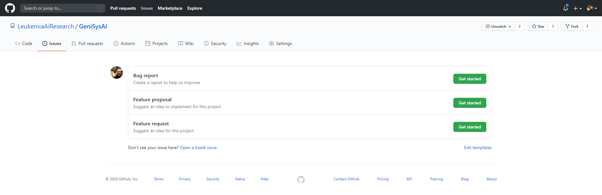
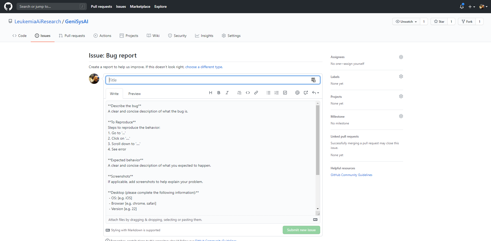
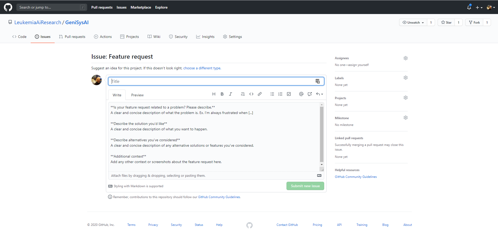
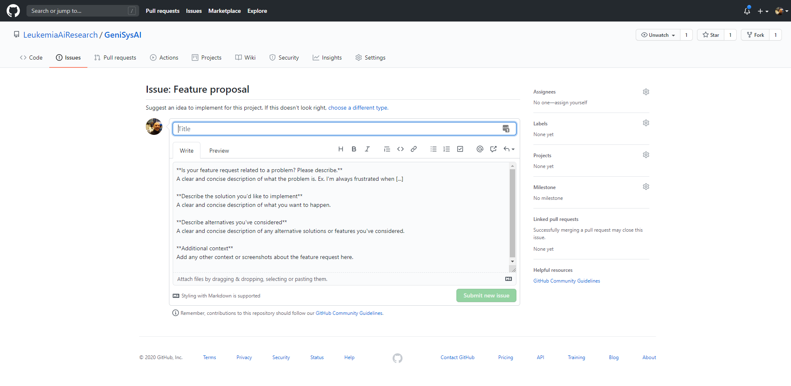
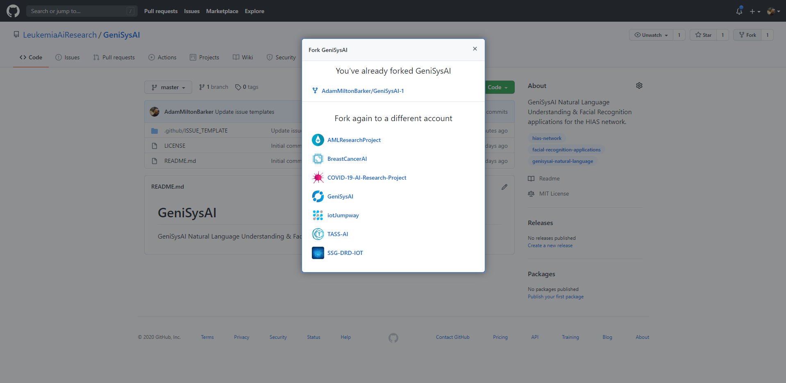
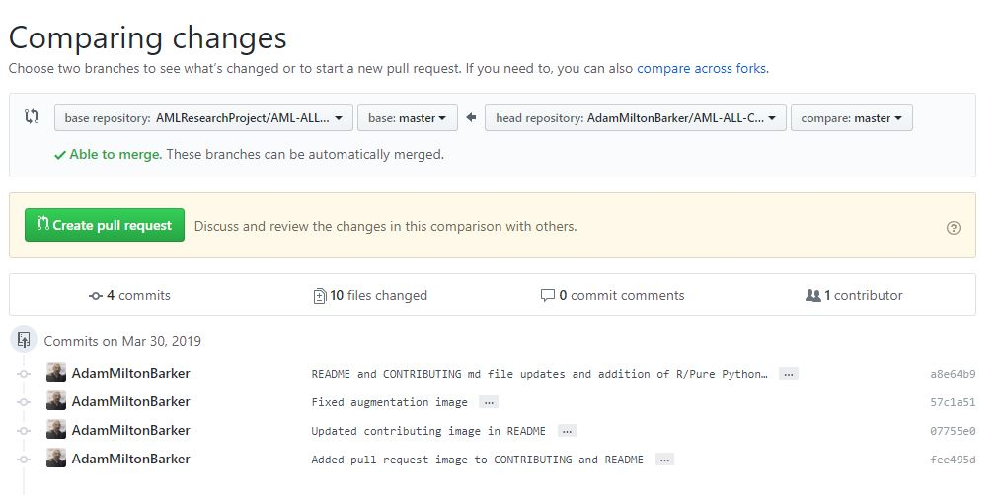

# Peter Moss Leukemia AI Research
## Contributing to the Hospital Intelligent Automation System project

We encourage bug fixes and enhancements submitted by the community and there are a number of ways you can contribute towards this repository.

The first step is to head to our repository issues tab and decide how you would like to contribute.



# Bug reports


If you would like to contribute bug fixes or make the team aware of bugs you have identified in the project, please raise a **Bug report** issue in the [Issues](issues/new/choose) section. A template is provided that will allow you to provide your suggestions for your bug report / bug fix(es) which will be reviewed by the team who will communicate with you through your issue.

Bug fix issues are the first step to creating a pull request for bug fixes, once you have created your issue and it has been approved you can proceed with your bug fixes.

&nbsp;

# Feature requests


If you would like to suggest a new feature/ new features for this project, please raise a **Feature request** issue in the [HIAS - Hospital Intelligent Automation System](issues/new) section. A template is provided that will allow you to provide your suggestions for your feature request which will be reviewed by the team who will communicate through your issue.

&nbsp;

# Feature proposals


If you would like to contribute new features to the project, please raise a **Feature proposal** issue in the [HIAS - Hospital Intelligent Automation System](issues/new) section. A template is provided that will allow you to provide your suggestions for your feature proposal which will be reviewed by the team who will communicate through your issue.

Feature proposals are the first step to creating a pull request for new features, once you have created your issue and it has been approved you can proceed with your feature proposal.

&nbsp;

# Creating a fork of the repository


If you are going to be contributing code or documentation to the repository you will need to make a fork of the current development branch. The current development branch will always be the highest branch or master. Once you have created a fork of the repository, you will be able to clone the repository to a location on your development machine using terminal and Git or Github Desktop if using Windows.

&nbsp;

# Repository Structures

We have two main types of repository layouts: single projects and multiple project repositories.

In a multiple project repository the file structure for AI projects is as follows:

```
- Project Root (Directory)
    - Project README (File)
    - Projects (Directory)
        - Project 1 (Directory)
            - Classes (Directory)
                - Helpers (File)
                - Data (File)
                - Model (File)
            - Documentation (Directory)
                - Installation
            - Logs (Directory)
                - Logfiles
            - Media
                - Images (Directory)
                - Videos (Directory)
            - Model
                - Model (File)
                - Weights (File)
            - Scripts
                - Installation (File)
            - Project README (File)
        - Project 2 (Directory)
            - Classes (Directory)
                - Helpers (File)
                - Data (File)
                - Model (File)
            - Documentation (Directory)
                - Installation
            - Logs (Directory)
                - Logfiles
            - Media
                - Images (Directory)
                - Videos (Directory)
            - Model
                - Model (File)
                - Weights (File)
            - Scripts
                - Installation (File)
            - Project README (File)
```

In a single project repository the file structure for AI projects is as follows:

```
- Project Root (Directory)
    - Classes (Directory)
        - Helpers (File)
        - Data (File)
        - Model (File)
    - Documentation (Directory)
        - Installation
    - Logs (Directory)
        - Logfiles
    - Media
        - Images (Directory)
        - Videos (Directory)
    - Model
        - Model (File)
        - Weights (File)
    - Scripts
        - Installation (File)
    - Project README (File)
```

# Documentation

All projects should have documentation, changes you make to the code in the repository or new projects that you make should also have documentation. In the structures above you can see the **Documentation** directories, and the **Installation** file. This installation file should contain a step by step guide to how to install your project, while directions of use will be a high level tutorial in your project README. If you are contributing an existing repository you will ensure that these documents are updated to reflect your changes.

# Installation Scripts

You will notice the **Scripts** directory above, this is home to any scripts that make it easier for the end use to set up and / or use your project. By default every project must have an installation script when installations are required. If you are contributing an existing repository you will ensure that these scripts are updated to reflect your changes.

# Naming

We use CamelCase for our directory and file names (except images), we would like this to stay uniform across all of our projects. Please use descriptive but short names where possible, and make sure you do not use spaces in directory and file names.

# Attribution

Whenever relevant you should add yourself to the contributors section of the READMEs. If you have a public profile on the Peter Moss Leukemia AI Research website, you should use this in your link. Please see the contributing section of any of our READMEs for examples.

# .md Files

Each .md file in the repository should use the same header. An example of this is as follows:

```
# Peter Moss Acute Myeloid & Lymphoblastic Leukemia AI Research Project
## Acute Lymphoblastic Leukemia Detection System 2019


```

Each .md file in the repository should also use the same footer, with the excpetions of the contributors. If you contribute directly to the code or documentation you should update this area with your details. Below is an example of how the contributing list should be.

```
&nbsp;

# Contributing

The Peter Moss Acute Myeloid & Lymphoblastic Leukemia AI Research project encourages and welcomes code contributions, bug fixes and enhancements from the Github.

Please read the [CONTRIBUTING](CONTRIBUTING.md "CONTRIBUTING") document for a full guide to forking our repositories and submitting your pull requests. You will also find information about our code of conduct on this page.

## Contributors

- [Adam Milton-Barker](https://www.leukemiaairesearch.com/team/adam-milton-barker "Adam Milton-Barker") - [Asociacion De Investigation En Inteligencia Artificial Para La Leucemia Peter Moss](https://www.leukemiaairesearch.com "Asociacion De Investigation En Inteligencia Artificial Para La Leucemia Peter Moss") President & Lead Developer, Sabadell, Spain

&nbsp;

# Versioning

We use SemVer for versioning. For the versions available, see [Releases](releases "Releases").

&nbsp;

# License

This project is licensed under the **MIT License** - see the [LICENSE](LICENSE "LICENSE") file for details.

&nbsp;

# Bugs/Issues

We use the [repo issues](issues "repo issues") to track bugs and general requests related to using this project.
```

The project README contributors should contain a list of all contributors in the entire repository.

&nbsp;

# Push changes to forked repository


When you have made your changes, you need to push them to your forked repository. This process requires a commit with a message about what your commit is, and then finally a push to the repository which will place your changes or created files to your forked repository.

Show the status of all changed/added files.

```
git status
```

You may want to do check the differences between changed files, you can do this using the following command.

```
git diff
```

Add all changes ready to commit. (You may not want to add all changed files, in this case please follow instructions to add single files to commit that you were shown using git status). To repeat, the following will add all changes shown by using git status to your commit.

```
git add .
```

Commit your changes.

```
git commit -m "Your descriptive commit message"
```

Push changes to your fork.

```
git push
```

You can also Github Desktop if on Windows as shown in the image above.


&nbsp;

# Pull requests


When you are satisfied with your changes you can submit a pull request that will request that your changes be pulled into the latest development branch.

## Pull Request Process

1. Ensure all documentation has been updated and matches the style of our repository layouts, including repository directory structures etc.
2. Ensure any install or build dependencies are removed before the end of the layer when doing a build.
3. Add new README.md files for new directories / __ init __.py files for empty directories.
4. Ensure that your READMEs, documentation and code match the format/design of the rest of the repoistory.
5. Include the project header banner on all documentation pages / READMEs.
6. Incude the Contributing, Versioning, Licensing, Bugs/Issues information in all READMEs and documentation.
7. Submit your Pull Request with an accurate descrription of the changes you have made.
8. Your Pull Request will be reviewed by the team.

&nbsp;

# Code of conduct

Please note we have a code of conduct, please follow it in all your interactions with the project.

## Our Pledge

In the interest of fostering an open and welcoming environment, we as contributors and maintainers pledge to making participation in our project and our community a harassment-free experience for everyone, regardless of age, body size, disability, ethnicity, gender identity and expression, level of experience, nationality, personal appearance, race, religion, or sexual identity and orientation.

## Our Standards

Examples of behavior that contributes to creating a positive environment include:

- Using welcoming and inclusive language
- Being respectful of differing viewpoints and experiences
- Gracefully accepting constructive criticism
- Focusing on what is best for the community
- Showing empathy towards other community members

Examples of unacceptable behavior by participants include:

- The use of sexualized language or imagery and unwelcome sexual attention or advances
- Trolling, insulting/derogatory comments, and personal or political attacks
- Public or private harassment
- Publishing others' private information, such as a physical or electronic address, without explicit permission
- Other conduct which could reasonably be considered inappropriate in a professional setting

## Our Responsibilities

Project maintainers are responsible for clarifying the standards of acceptable behavior and are expected to take appropriate and fair corrective action in response to any instances of unacceptable behavior.

Project maintainers have the right and responsibility to remove, edit, or reject comments, commits, code, wiki edits, issues, and other contributions that are not aligned to this Code of Conduct, or to ban temporarily or
permanently any contributor for other behaviors that they deem inappropriate, threatening, offensive, or harmful.

## Scope

This Code of Conduct applies both within project spaces and in public spaces when an individual is representing the project or its community. Examples of representing a project or community include using an official project e-mail address, posting via an official social media account, or acting as an appointed representative at an online or offline event. Representation of a project may be further defined and clarified by project maintainers.

## Enforcement

Instances of abusive, harassing, or otherwise unacceptable behavior may be reported by contacting the project team at github@leukemiaairesearch.com All complaints will be reviewed and investigated and will result in a response that is deemed necessary and appropriate to the circumstances. The project team is obligated to maintain confidentiality with regard to the reporter of an incident. Further details of specific enforcement policies may be posted separately.

Project maintainers who do not follow or enforce the Code of Conduct in good faith may face temporary or permanent repercussions as determined by other members of the project's leadership.

&nbsp;

# Attribution

This Code of Conduct is adapted from the [Contributor Covenant](http://contributor-covenant.org/version/1/4), version 1.4.