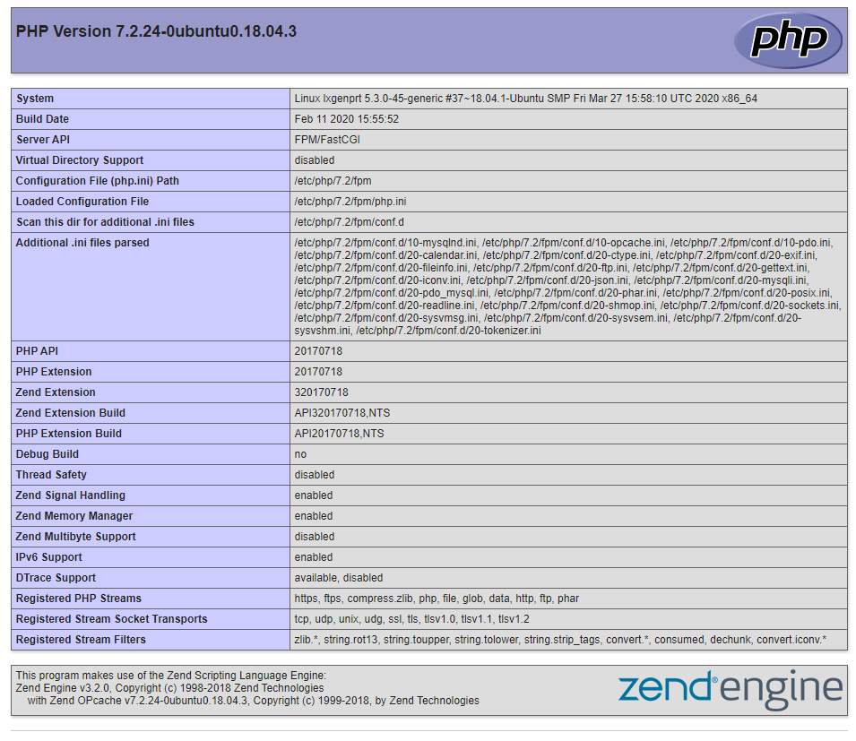
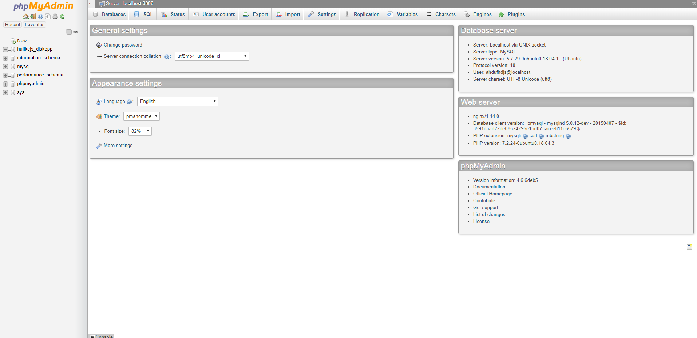
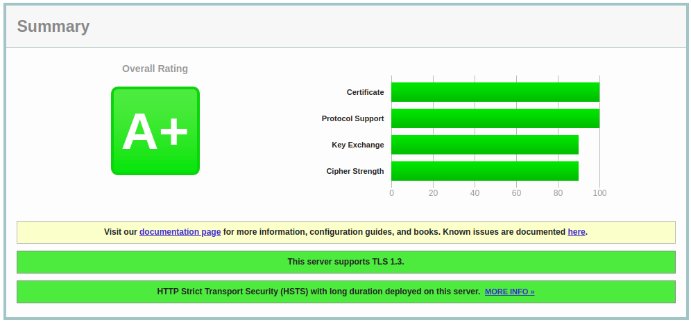
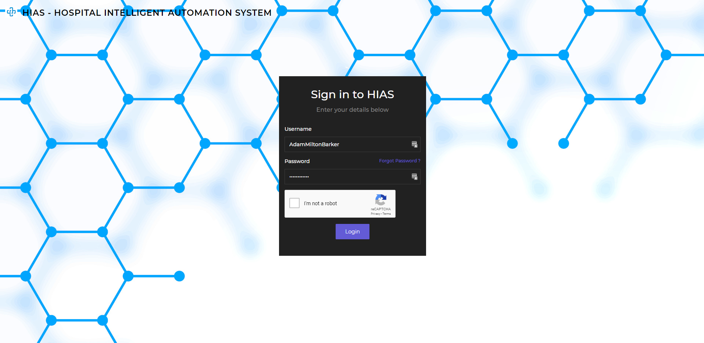

# Asociacion De Investigacion En Inteligencia Artificial Para La Leucemia Peter Moss
## Hospital Intelligent Automation System
[](https://github.com/LeukemiaAiResearch/HIAS)

# Table Of Contents

- [Introduction](#introduction)
- [Required Hardware](#required-hardware)
- [Prerequisites](#prerequisites)
  - [Ubuntu Server 18.04.4 LTS](#ubuntu-server-18044-lts)
  - [OpenVINO 2020.3](openvino-20203)
  - [Domain Name](#domain-name)
  - [Port Forwarding](#port-forwarding)
  - [Server Security](#server-security)
    - [Remote User](#remote-user)
    - [SSH Access](#ssh-access)
      - [Tips](#tips)
    - [UFW Firewall](#ufw-firewall)
    - [Fail2Ban](#fail2ban)
  - [Attach Hard-Drive](#attach-hard-drive)
  - [Clone The Repository](#clone-the-repository)
    - [Developer Forks](#developer-forks)
- [Installation](#installation)
  - [Easy Install (Recommended)](#easy-install-recommended)
  - [Manual Install](#manual-install)
    - [NGINX](#nginx)
    - [Let's Encrypt](#lets-encrypt)
    - [PHP](#php)
    - [MySql](#mysql)
    - [phpMyAdmin](#phpmyadmin)
    - [Mongo Database](#mongo-database)
    - [SSL Security](#ssl-security)
    - [File Server](#file-server)
    - [iotJumpWay Broker](#iotjumpway-broker)
    - [iotJumpWay Location and Application](#iotjumpway-location-and-application)
    - [GeniSysAI (Computer Vision)](#genisysai-computer-vision)
    - [Create Admin User](#create-admin-user)
    - [Finalize Server Settings](#finalize-server-settings)
    - [Install COVID-19 Data Analysis System](#install-covid-19-data-analysis-system)
- [Login To Your Server UI](#login-to-server-ui)
- [HIAS IoT Network](hias-iot-network)
    - [iotJumpWay Finalization](#iotjumpway-finalization)
    - [HIAS Server Services](#hias-server-services)
- [Contributing](#contributing)
    - [Contributors](#contributors)
- [Versioning](#versioning)
- [License](#license)
- [Bugs/Issues](#bugs-issues)

# Introduction
The following guide will take you through setting up and installing the  [Hospital Intelligent Automation System](https://github.com/LeukemiaAiResearch/HIAS " Hospital Intelligent Automation System").

&nbsp;

# Required Hardware
For this tutorial I am using a [UP2 AI Vision Devkit](https://up-board.org/upkits/up-squared-ai-vision-kit/ "UP2 AI Vision Devkit") and a 1.5TB hard-drive for the core server hardware, but you can use any linux machine and hard-drive. For real-world usage in medical centers and hospitals it is suggested to use a device with more resources.


- 1 x Linux machine (Server)
- 1 x 1TB (Or more) HDD
- 1 x Webcam

&nbsp;

# Prerequisites
Before you can continue with this tutorial. Please ensure you have completed all of the following prerequisites.

## Ubuntu Server 18.04.4 LTS
For this project, the operating system of choice is [Ubuntu Server 18.04.4 LTS](https://ubuntu.com/download/server "Ubuntu Server 18.04.4 LTS"). To get your operating system installed you can follow the [Create a bootable USB stick on Ubuntu](https://tutorials.ubuntu.com/tutorial/tutorial-create-a-usb-stick-on-ubuntu#0 "Create a bootable USB stick on Ubuntu") tutorial.

**__The server installation can be run on an existing installation of Ubuntu, however we recommend using a fresh installation.__**

## OpenVINO 2020.3
You will use the Intel® Distribution of OpenVINO™ toolkit for your server camera software. OpenVINO™ is used to optimize and accelerate edge AI applications allowing lower powered devices to run fast applications without the need for cloud services.

To install the Intel® Distribution of OpenVINO™ toolkit on your device, please follow [this guide](https://docs.openvinotoolkit.org/2020.3/_docs_install_guides_installing_openvino_linux.html)

## Domain Name
Now is as good a time as any to sort out and configure a domain name. You need to have your domain already hosted on a hosting account, from there edit the DNS zone by adding an A record to your public IP, for this you need a static IP or IP software that will update the IP in the DNZ Zone each time it changes. You add your IP as an A record and save your DNS Zone.

## Port Forwarding
Now you have your domain pointing to your public IP, it is time to add a port forward, traffic to your network will be coming from port 80 (insecure) and secure. Although Nginx will bounce the insecure traffic to port 443, you still need to add a port forward for port 80 as well as 443.

How you will do this will vary, but you need to find the area of your router that allows you to add port forwards. Then add one port forward for incoming insecure traffic (port 80) to port 80 on your server's IP, and one for secure traffic (port 443) to port 443 on server's IP. Both incoming ports should be forwarded to the same port on your server.

This will open the HTTP/HTTPS ports on your router and forward the traffic to your server. In the case someone tries to access using insecure protocol (http - port 80) they will be automatically be sent to the secure port of the server (https - 443)

## Server Security
First you will harden your server security.

### Remote User
You will create a new user for accessing your server remotely. Use the following commands to set up a new user for your machine. Follow the instructions provided and make sure you use a secure password.
```
sudo adduser YourUsername
```
Now grant sudo priveleges to the user:
```
usermod -aG sudo YourUsername
```
Now open a new terminal and login to your server using the new credentials you set up.
```
ssh YourNewUser@YourServerIP
```

### SSH Access
Now let's beef up server secuirty. Use the following command to set up your public and private keys. Make sure you carry out this step on your development machine, **not** on your server.

#### Tips
- Hit enter to confirm the default file.
- Hit enter twice to skip the password (Optionalm, you can use a password if you like).
```
ssh-keygen
```
You should end up with a screen like this:
```
Generating public/private rsa key pair.
Enter file in which to save the key (/home/genisys/.ssh/id_rsa):
Enter passphrase (empty for no passphrase):
Enter same passphrase again:
Your identification has been saved in /home/genisys/.ssh/id_rsa.
Your public key has been saved in /home/genisys/.ssh/id_rsa.pub.
The key fingerprint is:
SHA256:5BYJMomxATmanduT3/d1CPKaFm+pGEIqpJJ5Z3zXCPM genisys@genisyslprt
The key's randomart image is:
+---[RSA 2048]----+
|.oooo..          |
|o .o.o . .       |
|.+..    +        |
|o o    o .       |
|  .o .+ S . .    |
| =..+o = o.o . . |
|= o =oo.E .o..o .|
|.. + ..o.ooo+. . |
|        .o++.    |
+----[SHA256]-----+
```
Now you are going to copy your key to the server:
```
ssh-copy-id YourNewUser@YourServerIP
```
Once you enter your password for the new user account, your key will be saved on the server. Now try and login to the server again in a new terminal, you should log straight in without having to enter a password.
```
ssh YourNewUser@YourServerIP
```
Finally you will turn off password authentication for login. Use the following command to edit the ssh configuration.
```
sudo nano /etc/ssh/sshd_config
```
Change the following:
```
#PasswordAuthentication yes
```
To:
```
PasswordAuthentication no
```
Then restart ssh:
```
sudo systemctl restart ssh
```
_If you are using ssh to do the above steps keep your current terminal connected._ Open a new terminal, attempt to login to your server. If you can login then the above steps were successful.

The remainder of this tutorial assumes you are logged into your server. From your development machine, connect to your server using ssh or open your local terminal if working directly on your server machine.

```
ssh YourUser@YourServerIP
```

### UFW Firewall
Now you will set up your firewall:

```
sudo ufw enable
sudo ufw disable
```
Now open the required ports, these ports will be open on your server, but are not open to the outside world:
```
sudo ufw allow 22
sudo ufw allow 80
sudo ufw allow 443
sudo ufw allow 8883
sudo ufw allow 8545
sudo ufw allow 9001
sudo ufw allow 27017
sudo ufw allow 30303/udp
sudo ufw allow 30303/tcp
sudo ufw allow OpenSSH
sudo ufw allow Samba
```
Finally start and check the status:
```
sudo ufw enable
sudo ufw status
```
You should see the following:
```
Status: active

To                         Action      From
--                         ------      ----
OpenSSH                    ALLOW       Anywhere
22                         ALLOW       Anywhere
80                         ALLOW       Anywhere
443                        ALLOW       Anywhere
Samba                      ALLOW       Anywhere
9001                       ALLOW       Anywhere
8883                       ALLOW       Anywhere
8080                       ALLOW       Anywhere
27017                      ALLOW       Anywhere
30303/udp                  ALLOW       Anywhere
30303/tcp                  ALLOW       Anywhere
8545                       ALLOW       Anywhere
OpenSSH (v6)               ALLOW       Anywhere (v6)
22 (v6)                    ALLOW       Anywhere (v6)
80 (v6)                    ALLOW       Anywhere (v6)
443 (v6)                   ALLOW       Anywhere (v6)
Samba (v6)                 ALLOW       Anywhere (v6)
9001 (v6)                  ALLOW       Anywhere (v6)
8883 (v6)                  ALLOW       Anywhere (v6)
8080 (v6)                  ALLOW       Anywhere (v6)
27017 (v6)                 ALLOW       Anywhere (v6)
30303/udp (v6)             ALLOW       Anywhere (v6)
30303/tcp (v6)             ALLOW       Anywhere (v6)
8545 (v6)                  ALLOW       Anywhere (v6)
```
**Shell Script**  [UFW.sh](../../Scripts/Installation/Shell/UFW.sh "UFW.sh")

### Fail2Ban
Fail2Ban adds an additional layer of security, by scanning server logs and looking for unusal activity. Fail2Ban is configured to work with IPTables by default, so we will do some reconfiguration to make it work with our firewall, UFW.

```
sudo apt install fail2ban
sudo mv /etc/fail2ban/jail.conf /etc/fail2ban/jail.local
sudo rm /etc/fail2ban/action.d/ufw.conf
sudo touch /etc/fail2ban/action.d/ufw.conf
echo "[Definition]" | sudo tee -a /etc/fail2ban/action.d/ufw.conf
echo "  enabled  = true" | sudo tee -a /etc/fail2ban/action.d/ufw.conf
echo "  actionstart =" | sudo tee -a /etc/fail2ban/action.d/ufw.conf
echo "  actionstop =" | sudo tee -a /etc/fail2ban/action.d/ufw.conf
echo "  actioncheck =" | sudo tee -a /etc/fail2ban/action.d/ufw.conf
echo "  actionban = ufw insert 1 deny from <ip> to any" | sudo tee -a /etc/fail2ban/action.d/ufw.conf
echo "  actionunban = ufw delete deny from <ip> to any" | sudo tee -a /etc/fail2ban/action.d/ufw.conf
sudo nano /etc/fail2ban/action.d/ufw.conf
sudo sed -i -- "s#banaction = iptables-multiport#banaction = ufw#g" /etc/fail2ban/jail.local
sudo nano /etc/fail2ban/jail.local
sudo fail2ban-client restart
sudo fail2ban-client status
```
You should see the following:
```
Shutdown successful
Server ready
```
```
Status
|- Number of jail:      1
`- Jail list:   sshd
```

**Shell Script**  [Fail2Ban.sh](../../Scripts/Installation/Shell/Fail2Ban.sh "Fail2Ban.sh")

## Attach Hard-Drive
Now you will attach the hard-drive to your server so that you can use it for the database and file system for your server.

First off, make sure you have plugged your hard-drive into the server machine, then use the following commands:
```
sudo fdisk -l
```
For me this gives the following output:
```
Disk /dev/loop1: 93.8 MiB, 98336768 bytes, 192064 sectors
Units: sectors of 1 * 512 = 512 bytes
Sector size (logical/physical): 512 bytes / 512 bytes
I/O size (minimum/optimal): 512 bytes / 512 bytes


Disk /dev/loop2: 93.9 MiB, 98484224 bytes, 192352 sectors
Units: sectors of 1 * 512 = 512 bytes
Sector size (logical/physical): 512 bytes / 512 bytes
I/O size (minimum/optimal): 512 bytes / 512 bytes


Disk /dev/mmcblk0: 58.2 GiB, 62537072640 bytes, 122142720 sectors
Units: sectors of 1 * 512 = 512 bytes
Sector size (logical/physical): 512 bytes / 512 bytes
I/O size (minimum/optimal): 512 bytes / 512 bytes
Disklabel type: gpt
Disk identifier: 077E0353-99FE-4490-AEDA-040F34765A69

Device           Start       End   Sectors  Size Type
/dev/mmcblk0p1    2048   1050623   1048576  512M EFI System
/dev/mmcblk0p2 1050624   3147775   2097152    1G Linux filesystem
/dev/mmcblk0p3 3147776 122140671 118992896 56.8G Linux filesystem


Disk /dev/mmcblk0boot1: 4 MiB, 4194304 bytes, 8192 sectors
Units: sectors of 1 * 512 = 512 bytes
Sector size (logical/physical): 512 bytes / 512 bytes
I/O size (minimum/optimal): 512 bytes / 512 bytes


Disk /dev/mmcblk0boot0: 4 MiB, 4194304 bytes, 8192 sectors
Units: sectors of 1 * 512 = 512 bytes
Sector size (logical/physical): 512 bytes / 512 bytes
I/O size (minimum/optimal): 512 bytes / 512 bytes


Disk /dev/mapper/dm_crypt-0: 56.8 GiB, 60922265600 bytes, 118988800 sectors
Units: sectors of 1 * 512 = 512 bytes
Sector size (logical/physical): 512 bytes / 512 bytes
I/O size (minimum/optimal): 512 bytes / 512 bytes


Disk /dev/mapper/ubuntu--vg-ubuntu--lv: 4 GiB, 4294967296 bytes, 8388608 sectors
Units: sectors of 1 * 512 = 512 bytes
Sector size (logical/physical): 512 bytes / 512 bytes
I/O size (minimum/optimal): 512 bytes / 512 bytes


Disk /dev/sda: 1.4 TiB, 1500267937792 bytes, 2930210816 sectors
Units: sectors of 1 * 512 = 512 bytes
Sector size (logical/physical): 512 bytes / 512 bytes
I/O size (minimum/optimal): 512 bytes / 512 bytes
Disklabel type: gpt
Disk identifier: 1DEAF6E4-963A-42E9-BFB9-00B3CD018497

Device     Start        End    Sectors  Size Type
/dev/sda1   2048 2930208767 2930206720  1.4T Microsoft basic data
```
Here you can see that my 1.5TB hard-drive partition is called **/dev/sda1**. Now you need to find the UUID of the partition:
```
sudo blkid
```
Should give you a similar output to:
```
/dev/mapper/dm_crypt-0: UUID="OLgaQg-GIKS-H7zM-U8iY-z3XQ-3JBS-0QWnk1" TYPE="LVM2_member"
/dev/mapper/ubuntu--vg-ubuntu--lv: UUID="8e379584-4ce3-4bf2-a81f-2cc5cfb919e6" TYPE="ext4"
/dev/mmcblk0p1: UUID="29BD-DE91" TYPE="vfat" PARTUUID="1555a088-82fb-4a55-af71-518011e32c8d"
/dev/mmcblk0p2: UUID="8568e49f-2bc9-4f00-ab65-40a8fe073662" TYPE="ext4" PARTUUID="bcd6fc23-5ce5-4057-bab2-1fced3066285"
/dev/mmcblk0p3: UUID="05355535-ad22-4979-98fd-13e585639c4e" TYPE="crypto_LUKS" PARTUUID="835c6449-5ad8-4993-84a1-f2f25d93eb71"
/dev/loop1: TYPE="squashfs"
/dev/loop2: TYPE="squashfs"
/dev/mmcblk0: PTUUID="077e0353-99fe-4490-aeda-040f34765a69" PTTYPE="gpt"
/dev/sda1: LABEL="GeniSys Data" UUID="B470EB4570EB0CC4" TYPE="ntfs" PARTLABEL="Elements" PARTUUID="07a78460-f599-4e31-a8ce-0b5b8b03811f"
```
If you look for my partition name, **/dev/sda1**, you will find the UUID. In this case: **B470EB4570EB0CC4**.

Now create a mount point, a user group and then add the user you want to belong to this group:
```
sudo mkdir /fserver
sudo groupadd fserver
sudo usermod -aG YourUsername
```
Now you need to edit **/etc/fstab** and add the rule to mount your hard-drive.
```
sudo nano /etc/fstab
```
And add the following line, make sure your use your own UUID.
```
UUID=YourUUID /fserver auto nosuid,nodev,nofail,x-gvfs-show 0 0
```

## Clone the repository
Clone the [HIAS](https://github.com/LeukemiaAiResearch/HIAS "HIAS") repository from the [Asociacion De Investigacion En Inteligencia Artificial Para La Leucemia Peter Moss](https://github.com/LeukemiaAiResearch "Asociacion De Investigacion En Inteligencia Artificial Para La Leucemia Peter Moss") Github Organization.

To clone the repository and install this project, make sure you have Git installed. Now navigate to the home directory on your device using terminal/commandline, and then use the following command.

```
  git clone https://github.com/LeukemiaAiResearch/HIAS.git
```

Once you have used the command above you will see a directory called **HIAS** in your home directory.

```
  ls
```

Using the ls command in your home directory should show you the following.

```
  HIAS
```

The HIAS directory is your project root directory for this tutorial.

### Developer Forks
Developers from the Github community that would like to contribute to the development of this project should first create a fork, and clone that repository. For detailed information please view the [CONTRIBUTING](../../CONTRIBUTING.md "CONTRIBUTING") guide. You should pull the latest code from the development branch.

```
  git clone -b "1.0.1" https://github.com/LeukemiaAiResearch/HIAS.git
```

The **-b "1.0.1"** parameter ensures you get the code from the latest master branch. Before using the below command please check our latest development branch in the button at the top of the project README.

&nbsp;

# Installation
Now you need to install the HIAS server.

## Easy Install (Recommended)
The easiest way to install the HIAS Server is to use the installation scripts. You will find Shell, PHP & Python scripts designed for modular installation of the server. If one part of the installation fails during an easy installation, you can find it's related shell file in the **Scripts/Installation/Shell** directory and then execute it. To do an easy install, use the following command from the project root:

```
sh Scripts/Installation/Shell/Install.sh
```

**Shell Script** [Install.sh](../../Scripts/Installation/Shell/Install.sh "Install.sh")

**PLEASE NOTE** Once you have completed an easy install, you have to take the following steps:

- Update all of the configuration files with the credentials created during the installation. You will find the configuration files mentioned in the manual installation guide below.
- You will find information that will help you debug and/or understand the auto installation process below in the manual installation guide.
- Continue to [Login To Your Server UI](#login-to-server-ui) to continue the tutorial.

## Manual Install
If you would like to manually install everything for more understanding, you can use the following guides.

### NGINX

Use the following commands to install NGINX. Change **YourSubdomain.YourDomain.TLD** to your full server domain name.

```
sudo apt-get install nginx
sudo cp /etc/nginx/sites-available/default /etc/nginx/sites-available/default.backup
sudo mkdir -p /fserver/var
sudo cp -a Root/var/www/ /fserver/var/
sudo chown -R www-data:www-data /fserver/var/www/html
sudo sed -i -- "s/server_name _;/server_name YourSubdomain.YourDomain.TLD;/g" /etc/nginx/sites-available/default
sudo nginx -t
sudo systemctl reload nginx
```
- Installs Nginx
- Makes a copy of the default Nginx configuration named default.backup
- Makes the **var** directory on the mounted hard-drive.
- Copies the HIAS files structure to the var directory from the cloned repository.
- Changes the server name to your domain name. replace **YourSubdomain.YourDomain.TLD**.
- Checks the NGINX confirguration.
- Reloads NGINX

You can check the Nginx logs by using the following command:

```
cat /var/log/nginx/error.log
```

**Shell Script**  [NGINX.sh](../../Scripts/Installation/Shell/NGINX.sh "NGINX.sh")

### Let's Encrypt
Security is everything, and it is even better when security is free ;) To encrypt your network you are going to use SSL provided by [Let’s Encrypt](https://letsencrypt.org/ "Let’s Encrypt"). Follow the commands below to set up Let’s Encrypt.

Make sure to choose 2 to redirect http (non-secure) to https (secure).

```
sudo add-apt-repository ppa:certbot/certbot
sudo apt-get update
sudo apt-get install python-certbot-nginx
sudo certbot --nginx
```

If you have followed above correctly you should now be able to access your website, but only using the secure protocol, 443, ie: https. If you visit your site you should now see the default Nginx page.

**Shell Script**  [letsEncrypt.sh](../../Scripts/Installation/Shell/letsEncrypt.sh "letsEncrypt.sh")

### PHP
Now you will install PHP on your server. Follow the commands below and complete any required steps for the installation to accomplish this. You may need to swap 7.2 in the second command depending on what version of php-fpm is installed. Remember to change $YourDomain to your server domain, $ip to your server IP, and $port to the port you would like to use for the server camera stream before executing these commands.

You need to change the following:

- **YourSubdomain.YourDomain.TLD** The full HIAS Server domain name including subdomain or www.
- **YourSecurityApiIP** The IP of your HIAS Server.
- **YourSecurityApiPort** The port you will use for your Facial Recognition Security API.

```
sudo apt-get install php-fpm php-mysql
sudo sed -i -- 's/;cgi.fix_pathinfo=1/cgi.fix_pathinfo=0/g' /etc/php/7.2/fpm/php.ini
sudo systemctl restart php7.2-fpm
sudo cp Root/etc/nginx/sites-available/default /etc/nginx/sites-available/default
sudo sed -i -- "s#root /var/www/html;#root /fserver/var/www/html;#g" /etc/nginx/sites-available/default
sudo sed -i -- "s#YourSubdomain.YourDomain.TLD#$domain#g" /etc/nginx/sites-available/default
sudo apt install apache2-utils
sudo touch /etc/nginx/security/htpasswd
sudo chown www-data:www-data /etc/nginx/security/htpasswd
sudo touch /etc/nginx/security/patients
sudo chown www-data:www-data /etc/nginx/security/patients
sudo touch /etc/nginx/security/beds
sudo chown www-data:www-data /etc/nginx/security/beds
sudo sed -i -- "s#proxy_pass http://YourSecurityApiIP:YourSecurityApiPort#proxy_pass http://$ip:$port#g" /etc/nginx/sites-available/default
sudo nginx -t
sudo systemctl reload nginx
```
If you now visit the info page your website ie: https://www.YourDomain.com/info you should see the PHP configuration of your server.



**Shell Script**  [PHP.sh](../../Scripts/Installation/Shell/PHP.sh "PHP.sh")

### MySql
Now it is time to install MySql on your server. Follow the commands below and complete any required steps for the installation to accomplish this. This will install MySQL on your hard-drive.

**Make sure you keep note of all passwords etc you create.**

**Hints:**

- Do not set up VALIDATE PASSWORD plugin
- Remove anonymous users
- Root restricted to local host
- Remove test database

```
sudo apt-get install python-dev libmysqlclient-dev
sudo install mysqlclient
```

Now create a user and password that you will use for phpMyAdmin, first login in with the root MySql username you created earlier and then enter the password when prompted, this will log you into MySql as that user.

```
 mysql -u YourMySqlRootUser -p
```

Now you can create a user with the required permissions to manage phpMyAdmin, make sure you remember the credentials you create with the below command.

```
 mysql> GRANT ALL ON *.* TO 'YourNewUsername'@'localhost' IDENTIFIED BY 'YourNewPassword';
```

Also create a user for your application database.

```
 mysql> GRANT SELECT, INSERT, DELETE  ON *.* TO 'YourNewUsername'@'localhost' IDENTIFIED BY 'YourNewPassword';
```

Create the required database:

```
 mysql> CREATE DATABASE YourDatabaseName
```

Finally, create the required database:

```
 mysql> YourDatabaseName < Scripts/Installation/SQL.sql
```

Now move MySQL to your hard-drive:
```
sudo systemctl stop mysql
sudo systemctl status mysql
sudo rsync -av /var/lib/mysql /fserver
sudo sed -i -- "s#/var/lib/mysql#/fserver/mysql#g" /etc/mysql/mysql.conf.d/mysqld.cnf
sudo sed -i -- "s+# alias /var/lib/mysql/ -> /home/mysql/,+alias /var/lib/mysql/ -> /fserver/mysql/,+g" /etc/apparmor.d/tunables/alias
sudo systemctl restart apparmor
sudo mkdir /var/lib/mysql/mysql -p
sudo systemctl start mysql
sudo systemctl status mysql
sudo rm -Rf /var/lib/mysql
sudo systemctl start mysql
sudo systemctl status mysql
```

Now you need to update your core configuration file with the application database credentials you created above, and a secure key that the server will use for encryption.

```
sudo nano /var/www/Classes/Core/confs.json
```

```
  "dbname": "YourMySqlDatabaseName",
  "dbusername": "YourMySqlDatabaseUser",
  "dbpassword": "YourMySqlDatabasePass",
  "key": "YourEncryptionKey"
```
Now you need to update the related settings in the Python configuration. Assuming you are in the project root:
```
sudo nano confs.json
```
And update the MySQL database related settings:
```
"dbname": "YourMySqlDatabaseName",
"dbuser": "YourMySqlDatabaseUser",
"dbpass": "YourMySqlDatabasePass"
```

**Shell Script**  [MySQL.sh](../../Scripts/Installation/Shell/MySQL.sh "MySQL.sh")

### phpMyAdmin



Now you should install phpMyAdmin.

```
sudo apt-get install phpmyadmin
```

Press tab -> enter -> yes -> password, then create a link to phpMyAdmin, if you want to home this in a place other than phpmyadmin you can simply rename phpmyadmin in the command below.

```
sudo ln -s /usr/share/phpmyadmin /fserver/var/www/html
```

To fix some issues with PHP 7.2 you need to use the following line:

```
sudo sed -i "s/|\s*\((count(\$analyzed_sql_results\['select_expr'\]\)/| (\1)/g" /usr/share/phpmyadmin/libraries/sql.lib.php
```

Now you should be able to visit phpMyAdmin by accessing the relevant directory on your website. IE: https://www.YourDomain.com/phpmyadmin/

**Shell Script**  [phpMyAdmin.sh](../../Scripts/Installation/Shell/phpMyAdmin.sh "phpMyAdmin.sh")

### Mongo Database
We will use [Mongo DB](https://docs.mongodb.com/manual/tutorial/install-mongodb-on-ubuntu/ "Mongo DB") to store the data from our sensors.

```
wget -qO - https://www.mongodb.org/static/pgp/server-4.2.asc | sudo apt-key add -
sudo apt-get install gnupg (If required)
echo "deb [ arch=amd64,arm64 ] https://repo.mongodb.org/apt/ubuntu bionic/mongodb-org/4.2 multiverse" | sudo tee /etc/apt/sources.list.d/mongodb-org-4.2.list
sudo apt-get update
sudo apt-get install -y mongodb-org
sudo apt-get install php-mongodb
sudo systemctl enable mongod.service
sudo systemctl start mongod
sudo systemctl status mongod
```
You should see the following:
```
● mongod.service - MongoDB Database Server
   Loaded: loaded (/lib/systemd/system/mongod.service; disabled; vendor preset: enabled)
   Active: active (running) since Sat 2020-05-02 05:11:02 CEST; 23s ago
     Docs: https://docs.mongodb.org/manual
 Main PID: 16833 (mongod)
   CGroup: /system.slice/mongod.service
           └─16833 /usr/bin/mongod --config /etc/mongod.conf

May 02 05:11:02 genisysai systemd[1]: Started MongoDB Database Server.
```

**Shell Script**  [phpMyAdmin.sh](../../Scripts/Installation/Shell/phpMyAdmin.sh "phpMyAdmin.sh")

You now need to start the Mongo client:
```
mongo
```
And create an admin database and user, replacing **username** and **password** with your desired username and password.

```
use admin
db.createUser(
    {
        user: "YourAdminUser",
        pwd: "YourAdminUserPass",
        roles: [ "root" ]
    }
 )
```
You should see:
```
Successfully added user: { "user" : "username", "roles" : [ "root" ] }
```
Now create a iotJumpWay database and user, change **YourMongoDatabaseName** to the name you want to use for the database:
```
use YourMongoDatabaseName
db.createUser(
    {
        user: "YourMongoDatabaseUser",
        pwd: "YourMongoDatabasePass",
        roles: [
            { role: "readWrite", db: "YourMongoDatabaseName" }
        ]
    }
)
```
Now you need to update the related settings in the Python configuration. Assuming you are in the project root:
```
sudo nano confs.json
```
And update the mongo related settings:
```
"mdb": "YourMongoDatabaseName",
"mdbu": "YourMongoDatabaseUser",
"mdbp": "YourMongoDatabasePass",
```
Now you need to update the related settings in the PHP configuration. Assuming you are in the project root:
```
sudo nano /fserver/var/www/Classes/Core/confs.json
```
And update the mongo related settings:
```
"mdbname": "",
"mdbusername": "",
"mdbpassword": ""
```

### SSL Security



You need to remove vulnerable versions TLS 1/TLS 1.1, and enable TLS 1.3. To do so, do the following:
```
sudo cp /etc/nginx/nginx.conf /etc/nginx/nginx.tls-old
sudo sed -i -- "s/ssl_protocols TLSv1 TLSv1.1 TLSv1.2;/ssl_protocols TLSv1.2 TLSv1.3;/g" /etc/nginx/nginx.conf
sudo sed -i -- "s/ssl_protocols TLSv1 TLSv1.1 TLSv1.2;/ssl_protocols TLSv1.2 TLSv1.3;/g" /etc/letsencrypt/options-ssl-nginx.conf
```
Now check the configuration and then reload the server.
```
sudo nginx -t
sudo service nginx reload
```
If everything went ok you will see:
```
nginx: the configuration file /etc/nginx/nginx.conf syntax is ok
nginx: configuration file /etc/nginx/nginx.conf test is successful
```
**Shell Script**  [SSL.sh](../../Scripts/Installation/Shell/SSL.sh "SSL.sh")

### File Server
We will use Samba to create a private network file share.

```
sudo apt install samba
sudo cp /etc/samba/smb.conf /etc/samba/smb.conf.backup
sudo sed -i -- "s/;   bind interfaces only = yes/bind interfaces only = yes/g" /etc/samba/smb.conf
testparm
sudo systemctl restart smbd
sudo systemctl status smbd
sudo mkdir -p /fserver/samba
sudo chgrp sambashare /fserver/samba
read -p "! Enter a new Samba username for your admin account: " sauser
sudo useradd -M -d /fserver/samba/users -s /usr/sbin/nologin -G sambashare "$sauser"
sudo smbpasswd -a "$sauser"
sudo smbpasswd -e "$sauser"
sudo groupadd -f smbadmins
sudo usermod -G smbadmins $sauser
sudo mkdir -p /fserver/samba/smbadmins
sudo chown "$sauser":smbadmins /fserver/samba/smbadmins
sudo chmod 2770 /fserver/samba/smbadmins
sudo mkdir -p /fserver/samba/users
sudo chown "$sauser":sambashare /fserver/samba/users
sudo chmod 2770 /fserver/samba/users
read -p "! Enter a new Samba username for yourself: " suser
sudo useradd -M -d /fserver/samba/"$suser" -s /usr/sbin/nologin -G sambashare "$suser"
sudo mkdir -p /fserver/samba/"$suser"
sudo chown "$suser":sambashare /fserver/samba/"$suser"
sudo chmod 2770 /fserver/samba/"$suser"
sudo smbpasswd -a "$suser"
sudo smbpasswd -e "$suser"
echo "" | sudo tee -a /etc/samba/smb.conf
echo "[users]" | sudo tee -a /etc/samba/smb.conf
echo "  path = /fserver/samba/users" | sudo tee -a /etc/samba/smb.conf
echo "  browseable = yes" | sudo tee -a /etc/samba/smb.conf
echo "  read only = no" | sudo tee -a /etc/samba/smb.conf
echo "  force create mode = 0660" | sudo tee -a /etc/samba/smb.conf
echo "  force directory mode = 2770" | sudo tee -a /etc/samba/smb.conf
echo "  valid users = @sambashare @smbadmins" | sudo tee -a /etc/samba/smb.conf
echo "" | sudo tee -a /etc/samba/smb.conf
echo "[smbadmins]" | sudo tee -a /etc/samba/smb.conf
echo "  path = /fserver/samba/smbadmins" | sudo tee -a /etc/samba/smb.conf
echo "  browseable = no" | sudo tee -a /etc/samba/smb.conf
echo "  read only = no" | sudo tee -a /etc/samba/smb.conf
echo "  force create mode = 0660" | sudo tee -a /etc/samba/smb.conf
echo "  force directory mode = 2770" | sudo tee -a /etc/samba/smb.conf
echo "  valid users = @smbadmins" | sudo tee -a /etc/samba/smb.conf
echo "" | sudo tee -a /etc/samba/smb.conf
echo "[$suser]" | sudo tee -a /etc/samba/smb.conf
echo "  path = /fserver/samba/$suser" | sudo tee -a /etc/samba/smb.conf
echo "  browseable = no" | sudo tee -a /etc/samba/smb.conf
echo "  read only = no" | sudo tee -a /etc/samba/smb.conf
echo "  force create mode = 0660" | sudo tee -a /etc/samba/smb.conf
echo "  force directory mode = 2770" | sudo tee -a /etc/samba/smb.conf
echo "  valid users = $suser @smbadmins" | sudo tee -a /etc/samba/smb.conf
sudo systemctl restart smbd
sudo systemctl status smbd
```

**Shell Script**  [Samba.sh](../../Scripts/Installation/Shell/Samba.sh "Samba.sh")

### Private Ethereum Blockchain
We will use Ethereum to set up a private Blockchain for the HIAS network. Start by installing Ethereum:

```
  sudo apt-get install software-properties-common
  sudo add-apt-repository -y ppa:ethereum/ethereum
  sudo apt-get update
  sudo apt-get install ethereum
```

Now you need to create three accounts, one for the core HIAS application, one for the iotJumpWay service and one for your own HIAS account.

You will now create the first of the 3 required HIAS Blockchain accounts. Follow the instructions given to create the account for your core HIAS Blockchain user. Make sure you save the information given to you and keep it safe. You will need this information for configuring your HIAS Blockchain and if you lose these details you will have to create a new installation.

```
  geth account new --datadir /fserver/ethereum/HIAS
```
You will be asked to enter a new password:
```
Your new account is locked with a password. Please give a password. Do not forget this password.
```
You should see something like the following output:
```
  Password:
  Repeat password:

  Your new key was generated

  Public address of the key:   0x9B3FEE4aa9A5B5F4422C6a2222A06FDE07Ad5513
  Path of the secret key file: HIAS/Data/keystore/UTC--2020-09-24T22-29-31.527923214Z--9b3fee4aa9a5b5f4422c6a2222a06fde07ad5513

  - You can share your public address with anyone. Others need it to interact with you.
  - You must NEVER share the secret key with anyone! The key controls access to your funds!
  - You must BACKUP your key file! Without the key, it's impossible to access account funds!
  - You must REMEMBER your password! Without the password, it's impossible to decrypt the key!
```
You will now create the second of the 3 required HIAS Blockchain accounts. Follow the instructions given to create the account for your iotJumpWay HIAS Blockchain user. Make sure you save the information given to you and keep it safe. You will need this information for configuring your HIAS Blockchain and if you lose these details you will have to create a new installation.
```
  geth account new --datadir /fserver/ethereum/HIAS
```
You will now create the third of the 3 required HIAS Blockchain accounts. Follow the instructions given to create the account for your personal HIAS Blockchain user. Make sure you save the information given to you and keep it safe. You will need this information for configuring your HIAS Blockchain and if you lose these details you will have to create a new installation.
```
  geth account new --datadir /fserver/ethereum/HIAS
```
Remember to save the information given to you.

You will now install Solidity:

```
  sudo apt-get install solc
```
You now need to update the smart contracts with your HIAS Blockchain user account address:

```
  read -p "! Enter your HIAS Blockchain user account address: " haddress
  sudo sed -i -- "s/address haccount = YourHiasApplicationAddress;/address haccount = $haddress;/g" /fserver/ethereum/Contracts/HIAS.sol
  sudo sed -i -- "s/address haccount = YourHiasApplicationAddress;/address haccount = $haddress;/g" /fserver/ethereum/Contracts/iotJumpWay.sol
  sudo sed -i -- "s/address haccount = YourHiasApplicationAddress;/address haccount = $haddress;/g" /fserver/ethereum/Contracts/HIASPatients.sol
```
You now need to compile the smart contracts, the overwrite parameter is provided by default incase you need to recompile:
```
  solc --abi /fserver/ethereum/Contracts/HIAS.sol -o /fserver/ethereum/Contracts/build --overwrite
  solc --bin /fserver/ethereum/Contracts/HIAS.sol -o /fserver/ethereum/Contracts/build --overwrite
  solc --abi /fserver/ethereum/Contracts/iotJumpWay.sol -o /fserver/ethereum/Contracts/build --overwrite
  solc --bin /fserver/ethereum/Contracts/iotJumpWay.sol -o /fserver/ethereum/Contracts/build --overwrite
  solc --abi /fserver/ethereum/Contracts/HIASPatients.sol -o /fserver/ethereum/Contracts/build --overwrite
  solc --bin /fserver/ethereum/Contracts/HIASPatients.sol -o /fserver/ethereum/Contracts/build --overwrite
```
Now you will update HIAS configuration file:
```
  read -p "! Enter your HIAS domain name: " domain
  sudo sed -i 's/\"bchost\":.*/\"bchost\": \"https://'$domain'/Blockchain/API/\",/g' "confs.json"
  habi=$(cat /fserver/ethereum/Contracts/build/HIAS.abi)
  sudo sed -i "s/\"authAbi\":.*/\"authAbi\": $habi,/g" "confs.json"
  iabi=$(cat /fserver/ethereum/Contracts/build/iotJumpWay.abi)
  sudo sed -i "s/\"iotAbi\":.*/\"iotAbi\": $iabi,/g" "confs.json"
  pabi=$(cat /fserver/ethereum/Contracts/build/HIASPatients.abi)
  sudo sed -i "s/\"patientsAbi\":.*/\"patientsAbi\": $pabi,/g" "confs.json"
  read -p "! Enter your HIAS Blockchain user account address: " haddress
  read -p "! Enter your HIAS Blockchain user account password: " hpass
  sudo sed -i 's/\"haddress\":.*/\"haddress\": \"'$haddress'\",/g' "confs.json"
  sudo sed -i 's/\"hpass\":.*/\"hpass\": \"'$hpass'\",/g' "confs.json"
  read -p "! Enter your iotJumpWay HIAS Blockchain user account address: " iaddress
  read -p "! Enter your iotJumpWay HIAS Blockchain user account password: " ipass
  sudo sed -i 's/\"iaddress\":.*/\"iaddress\": \"'$iaddress'\",/g' "confs.json"
  sudo sed -i 's/\"ipass\":.*/\"ipass\": \"'$ipass'\",/g' "confs.json"
  read -p "! Enter your personal HIAS Blockchain user account address: " paddress
```
Now you will update the Genesis file:
```
  read -p "! Enter your HIAS Blockchain chain ID: " chainid
  sudo sed -i 's/\"chainId\":.*/\"chainId\": '$chainid',/g' "/fserver/ethereum/genesis.json"
  sudo sed -i 's/\"YourHiasApplicationAddress\"/\"'$haddress'\",/g' "/fserver/ethereum/genesis.json"
  sudo sed -i 's/\"YourIoTJumpWayApplicationAddress\"/\"'$iaddress'\",/g' "/fserver/ethereum/genesis.json"
  sudo sed -i 's/\"YourUserAddress\"/\"'$paddress'\",/g' "/fserver/ethereum/genesis.json"
```
The Genesis file will allocate the highest amount of HIAS Ether possible. HIAS Ether is used on the HIAS Blockchain to reward automated and human users for actions they carry out on the HIAS network.

Now you will start your blockchain server so that you can deploy your contracts and complete the configuration. If you have been using the automatic installation, you will have been instructed to follow this tutorial for deploying the smart contracts. Follow these steps until you are told to return to the automatic installation:

```
  read -p "! Enter your HIAS Server IP: " ip
  geth --mine --http --networkid $chainid -datadir /fserver/ethereum/HIAS --http.addr $ip --http.corsdomain "*" --miner.etherbase $haddress --http.api "eth,net,web3,personal" --allow-insecure-unlock console
  miner.start()
```
You will now be in geth console. Now you will deploy the smart contracts. For this you need the contents of:

- **/fserver/ethereum/Contracts/build/HIAS.abi**
- **/fserver/ethereum/Contracts/build/HIAS.bin**
- **/fserver/ethereum/Contracts/build/iotJumpWay.abi**
- **/fserver/ethereum/Contracts/build/iotJumpWay.bin**
- **/fserver/ethereum/Contracts/build/HIASPatients.abi**
- **/fserver/ethereum/Contracts/build/HIASPatients.bin**

First deploy the HIAS Smart Contract. Note that **0x** in the hbin variable is crucial:
```
  var habi = ContentsOfHIAS.abi
  var hbin = "0xContentsOfHIAS.bin"
  var haddress = HiasUserAddress
  var hpass = HiasUserPassword
  personal.unlockAccount(haddress, hpass, 1200)
  var newContract = eth.contract(habi)
  var deploy = {from:haddress, data:hbin, gas: 2000000}
  var contractInstance = newContract.new(deploy)
```
Now you have started the deployment process, you can monitor the progress using the following command, keep doing this until the address field is not undefined, once you have the address of the contract, your smart contract has been deployed. Make sure to note down the smart contract address, you will need it in following steps.

```
  contractInstance
```
Repeat the process for the iotJumpWay Smart Contract:
```
  var iabi = ContentsOfiotJumpWay.abi
  var ibin = "0xContentsOfiotJumpWay.bin"
  var newContract = eth.contract(iabi)
  var deploy = {from:haddress, data:ibin, gas: 2000000}
  var contractInstance = newContract.new(deploy)
  contractInstance
```
Finally repeat the process for the Patients Smart Contract:
```
  var pabi = ContentsOfHIASPatients.abi
  var pbin = "0xContentsOfHIASPatients.bin"
  var newContract = eth.contract(pabi)
  var deploy = {from:haddress, data:pbin, gas: 2000000}
  var contractInstance = newContract.new(deploy)
  contractInstance
```
Now you can stop mining and exit geth:

```
miner.stop()
exit
```
If you were running the auto install it will now continue.

Now you will update the configuration and store the contract information in the HIAS MySQL database:

```
  read -p "! Enter your HIAS Smart Contract address: " hcaddress
  read -p "! Enter your HIAS Smart Contract transaction: " hctransaction
  read -p "! Enter your HIAS iotJumpWay Smart Contract address: " icaddress
  read -p "! Enter your HIAS iotJumpWay Smart Contract transaction: " ictransaction
  read -p "! Enter your HIAS Patients Smart Contract address: " pcaddress
  read -p "! Enter your HIAS Patients Smart Contract transaction: " pctransaction
  sudo sed -i 's/\"authContract\":.*/\"authContract\": \"'$hcaddress'\",/g' "confs.json"
  sudo sed -i 's/\"iotContract\":.*/\"iotContract\": \"'$icaddress'\",/g' "confs.json"
  php Scripts/Installation/PHP/Blockchain.php "Contract" "$hcaddress" "HIAS" "$haddress" "$hctransaction" "$habi"
  php Scripts/Installation/PHP/Blockchain.php "Contract" "$icaddress" "HIAS" "$haddress" "$ictransaction" "$iabi"
  php Scripts/Installation/PHP/Blockchain.php "Contract" "$pcaddress" "HIAS" "$haddress" "$pctransaction" "$pabi"
  php Scripts/Installation/PHP/Blockchain.php "Config" "$iaddress" "$ipass"
```
Now you will install composer and the web3 PHP and Python libraries:
```
  sudo apt install web3
  sudo apt install composer
  cd /fserver/var/www
  composer require sc0vu/web3.php dev-master
  cd ~/HIAS
  cp Scripts/Installation/PHP/Web3PHP/Web3.php /fserver/var/www/vendor/sc0vu/web3.php/src
  cp Scripts/Installation/PHP/Web3PHP/RequestManager.php /fserver/var/www/vendor/sc0vu/web3.php/src/RequestManagers
  cp Scripts/Installation/PHP/Web3PHP/HttpRequestManager.php /fserver/var/www/vendor/sc0vu/web3.php/src/RequestManagers
```

You now need to log directly into your HIAS server and start the HIAS Blockchain and miner. Ensuring you are in the HIAS server console, use the following commands:
```
  read -p "! Enter your HIAS Blockchain chain ID: " chainid
  read -p "! Enter your HIAS Blockchain user address: " haddress
  read -p "! Enter your HIAS Server IP: " ip
  geth --mine --http --networkid $chainid -datadir /fserver/ethereum/HIAS --http.addr $ip --http.corsdomain "*" --miner.etherbase $haddress --http.api "eth,net,web3,personal" --allow-insecure-unlock console
  miner.start()
```
This needs to be running at all times which is why you logged directly into your HIAS device, if you do not have your Blockchain running, you will not be able to log in to the HIAS UI, if the Blockchain goes down, you will be logged out instantly. Now you can go back to your remote terminal to continue the installation.

### iotJumpWay Broker
We will use the [iotJumpWay](https://www.iotjumpway.com/developers/getting-started "iotJumpWay") open source broker for this project. Originally the iotJumpWay was a device built on a Rapsberry Pi that powered my home IoT network locally. In 2015/16 I turned the device into an a Platform as a Service, PaaS, and in 2016 I made the platform free to developers.

For this project I am including a system based on the iotJumpWay PaaS that includes the iotJumpWay locations, zones, devices and applications functionality. This means that all of the machine to machine communication happens locally, and all data is stored locally, never leaving the server.

Now install the required MQTT software for our local iotJumpWay broker.

```
pip3 install paho-mqtt
sudo apt install mosquitto
sudo apt install libmosquitto-dev
sudo mkdir -p /fserver/libraries/mosquitto
cd /fserver/libraries/mosquittomys/
sudo git clone https://github.com/jpmens/mosquitto-auth-plug.git
cd mosquitto-auth-plug
sudo cp config.mk.in config.mk
sudo sed -i -- "s#MOSQUITTO_SRC =#MOSQUITTO_SRC = /usr/inlude#g" config.mk
sudo sed -i -- "s#OPENSSLDIR = /usr#OPENSSLDIR = /usr/include/openssl#g" config.mk
sudo nano config.mk
sudo make
sudo cp auth-plug.so /etc/mosquitto/auth-plug.so
sudo rm /etc/mosquitto/mosquitto.conf
sudo touch /etc/mosquitto/mosquitto.conf
echo "allow_anonymous false" | sudo tee -a /etc/mosquitto/mosquitto.conf
echo "autosave_interval 1800" | sudo tee -a /etc/mosquitto/mosquitto.conf
echo "connection_messages true" | sudo tee -a /etc/mosquitto/mosquitto.conf
echo "log_timestamp true" | sudo tee -a /etc/mosquitto/mosquitto.conf
echo "persistence_file mosquitto.db" | sudo tee -a /etc/mosquitto/mosquitto.conf
echo "persistent_client_expiration 1m" | sudo tee -a /etc/mosquitto/mosquitto.conf
echo "retained_persistence true" | sudo tee -a /etc/mosquitto/mosquitto.conf
echo "require_certificate false" | sudo tee -a /etc/mosquitto/mosquitto.conf
echo "listener 1883" | sudo tee -a /etc/mosquitto/mosquitto.conf
echo "user mosquitto" | sudo tee -a /etc/mosquitto/mosquitto.conf
echo "protocol mqtt" | sudo tee -a /etc/mosquitto/mosquitto.conf
echo "auth_plugin /etc/mosquitto/auth-plug.so" | sudo tee -a /etc/mosquitto/mosquitto.conf
echo "auth_opt_host localhost" | sudo tee -a /etc/mosquitto/mosquitto.conf
echo "auth_opt_port 3306" | sudo tee -a /etc/mosquitto/mosquitto.conf
read -p "! Enter your server database name: " sdn
read -p "! Enter your server database user name: " sdu
read -p "! Enter your server user password: " sdup
echo "auth_opt_dbname YourDatabaseName" | sudo tee -a /etc/mosquitto/mosquitto.conf
echo "auth_opt_user YourDatabaseUserName" | sudo tee -a /etc/mosquitto/mosquitto.conf
echo "auth_opt_pass YourDatabaseUserPassword" | sudo tee -a /etc/mosquitto/mosquitto.conf
echo "auth_opt_userquery SELECT pw FROM mqttu WHERE uname = '%s'" | sudo tee -a /etc/mosquitto/mosquitto.conf
echo "auth_opt_superquery SELECT COUNT(*) FROM mqttu WHERE uname = '%s' AND super = 1" | sudo tee -a /etc/mosquitto/mosquitto.conf
echo "auth_opt_aclquery SELECT topic FROM mqttua WHERE (uname = '%s') AND (rw >= %d)" | sudo tee -a /etc/mosquitto/mosquitto.conf
echo "listener 9001" | sudo tee -a /etc/mosquitto/mosquitto.conf
echo "protocol websockets" | sudo tee -a /etc/mosquitto/mosquitto.conf
nano /etc/mosquitto/mosquitto.conf
cd ../
sudo systemctl status mosquitto.service
```
You should see the following output:
```
● mosquitto.service - LSB: mosquitto MQTT v3.1 message broker
   Loaded: loaded (/etc/init.d/mosquitto; generated)
   Active: active (exited) since Fri 2020-04-24 20:42:49 CEST; 1h 23min ago
     Docs: man:systemd-sysv-generator(8)
    Tasks: 0 (limit: 4366)
   CGroup: /system.slice/mosquitto.service

Apr 24 20:42:48 genisysai systemd[1]: Starting LSB: mosquitto MQTT v3.1 message broker...
Apr 24 20:42:48 genisysai mosquitto[1398]:  * Starting network daemon: mosquitto
Apr 24 20:42:49 genisysai mosquitto[1398]:    ...done.
Apr 24 20:42:49 genisysai systemd[1]: Started LSB: mosquitto MQTT v3.1 message broker.
```

Now you need to add the MQTT broker host to the HIAS iotJumpWay configuration. Assuming you are in the project root:
```
sudo nano confs.json
```
And update the iotJumpWay host:
```
  "host": "YourSubdomain.YourDomain.YourTLD",
```

**Shell Script**  [iotJumpWay.sh](../../Scripts/Installation/Shell/iotJumpWay.sh "iotJumpWay.sh")

#### iotJumpWay Location and Applications
Now setup the local iotJumpWay location and application. Replace the **YourLocationName**, **YourApplicationName**, **YourApplicationIP** & **YourApplicationMac** with your chosen name for the server iotJumpWay location, your chose name for the server application and the local IP and MAC address of the device the application will run on.

```
  read -p "! Enter your default location name. This field represents the physical location that your server is installed in, ie: Home, Office, Hospital, Center etc: " location
  read -p "! Enter your HIAS Blockchain user address: " haddress
  read -p "! Enter the IP of your HIAS Server: " ip
  read -p "! Enter the MAC address of your HIAS Server: " mac
  read -p "! Enter your HIAS iotJumpWay Blockchain user address: " iaddress
  php Scripts/Installation/PHP/Location.php "$location" "HIAS" "$haddress" "$ip" "$mac" "iotJumpWay" "$iaddress" "$ip" "$mac"
```
You should see similar to the following:
```
! Location, HQ has been created with ID 1!!! NOTE THESE CREDENTIALS AND KEEP THEM IN A SAFE PLACE !!
! Application, HIAS, has been created with ID 1 !
!! Your application public key is: AppPublicKey !!
!! Your application private key is: AppPrivateKey !!
!! Your application MQTT username is: MqttUsername !!
!! Your application MQTT password is: MqttPassword !!
! Application, iotJumpWay, has been created with ID 2 !
!! Your application public key is: AppPublicKey !!
!! Your application private key is: AppPrivateKey !!
!! Your application MQTT username is: MqttUsername !!
!! Your application MQTT password is: MqttPassword !!
- Installed iotJumpWay location and applications!
```
Now you need to update the iotJumpWay application settings in the HIAS configuration. Assuming you are in the project root:
```
sudo nano confs.json
```
And update the GeniSysAI related settings:
```
  "paid": YourIotJumpWayApplicationID,
  "pan": "YourIotJumpWayApplicationName",
  "pun": "YourIotJumpWayMqttUser",
  "ppw": "YourIotJumpWayMqttPass",
```

**Shell Script**  [iotJumpWayLocation.sh](../../Scripts/Installation/Shell/iotJumpWayLocation.sh "iotJumpWayLocation.sh")

Now update the host field in the the iotJumpWay JS script with your HIAS domain name. You should not add the protocol when updating this field. The system will load the rest of the configuration for this script on page load, you only need to update the **host** field. Use the following command to open the file:

```
sudo nano /var/www/html/iotJumpWay/Classes/iotJumpWay.js
```
```
  client: null,
  connected: false,
  host: "YourHIASServerDomainName",
  port: 9001,
  useTLS: true,
  cleansession: true,
  bc: {
      id: "",
      addr: ""
  },
  mqttOptions: {
      lid: 0,
      aid: 0,
      an: "",
      un: "",
      uc: ""
  },
```

### TassAI (Computer Vision)
We will use the [HIAS TassAI](https://github.com/LeukemiaAiResearch/TassAI "HIAS TassAI") Facial Recognition Security System API to provide the ability for HIAS device and applications to carry out remote facial recognition requests using HTTP requests.

```
  sudo apt install python3-pip
  sudo apt install cmake
  sudo apt install python3-opencv
  sudo mkdir -p /fserver/models/TassAI
  pip3 install flask
  pip3 install requests
  pip3 install jsonpickle
  wget https://download.01.org/opencv/2020/openvinotoolkit/2020.3/open_model_zoo/models_bin/1/face-detection-retail-0004/FP16/face-detection-retail-0004.bin -P /fserver/models/TassAI/
  wget https://download.01.org/opencv/2020/openvinotoolkit/2020.3/open_model_zoo/models_bin/1/face-detection-retail-0004/FP16/face-detection-retail-0004.xml -P /fserver/models/TassAI/
  wget https://download.01.org/opencv/2020/openvinotoolkit/2020.3/open_model_zoo/models_bin/1/face-reidentification-retail-0095/FP16/face-reidentification-retail-0095.bin -P /fserver/models/TassAI/
  wget https://download.01.org/opencv/2020/openvinotoolkit/2020.3/open_model_zoo/models_bin/1/face-reidentification-retail-0095/FP16/face-reidentification-retail-0095.xml -P /fserver/models/TassAI/
  wget https://download.01.org/opencv/2020/openvinotoolkit/2020.3/open_model_zoo/models_bin/1/landmarks-regression-retail-0009/FP16/landmarks-regression-retail-0009.bin -P /fserver/models/TassAI/
  wget https://download.01.org/opencv/2020/openvinotoolkit/2020.3/open_model_zoo/models_bin/1/landmarks-regression-retail-0009/FP16/landmarks-regression-retail-0009.xml -P /fserver/models/TassAI/
  read -p "! Enter your zone name (No spaces or special characters). This field represents the zone that this device is installed in, ie: Office, Study, Lounge, Kitchen etc: " zone
  read -p "! Enter local IP address of the HIAS Server device (IE: 192.168.1.98): " ip
  read -p "! Enter MAC address of HIAS Server device: " mac
  php Scripts/Installation/PHP/TassAI.php "$zone" "$ip" "$mac"
```
You should see similar to the following:

```
!! NOTE THESE CREDENTIALS AND KEEP THEM IN A SAFE PLACE !!
! Device, Server Security API, has been created with ID 1 !
!! Your device public key is: DevicePublicKey !!
!! Your device private key is: DevicePrivateKey !!
!! Your device MQTT username is: MqttUsername !!
!! Your device MQTT password is: MqttPassword !!
```

**Shell Script**  [TassAI.sh](../../Scripts/Installation/Shell/TassAI.sh "TassAI.sh")

Now you need to update the related settings in the HIAS configuration. Assuming you are in the project root:
```
sudo nano confs.json
```
And update the TassAI related settings:
```
  "lid": YourLocationID,
  "zid": YourZoneID,
  "did": YourDeviceId,
  "dn": "YourDeviceName",
  "gun": "YourDeviceMqttUsername",
  "gpw": "YourDeviceMqttPass",
```

### Create Admin User
Now you should create your admin user that you will use to access the network, UI and the network TassAI streams. The following command executes a PHP script to add your chosen username as an admin user in the system.

The script will create an admin account and provide your with the password, make sure to copy and save the password and your username somewhere safe. Replace **YourUsername** with the username of your choice, no special characters or spaces.

The script will also save your password with the Apache HTPassword system that protects the camera streams and APIs.

The script will also create an iotJumpWay application, allowing you to authenticate to the broker as your self. This can be used with the HIAS Staff Android Application.

```
  read -p "! Enter your name: " name
  read -p "! Enter your email: " email
  read -p "! Enter your desired username (No spaces or special characters): " username
  read -p "! Enter your desired personal HIAS Blockchain account address: " paddress
  read -p "! Enter your desired personal HIAS Blockchain account password: " ppass
  read -p "! Enter local IP address of the device that the application will run on (IE: 192.168.1.98): " ip
  read -p "! Enter MAC address of the device that the application will run on: " mac
  sudo apt install apache2-utils
  sudo touch /etc/nginx/security/htpasswd
  sudo chown www-data:www-data /etc/nginx/security/htpasswd
  sudo touch /etc/nginx/security/patients
  sudo chown www-data:www-data /etc/nginx/security/patients
  sudo touch /etc/nginx/security/beds
  sudo chown www-data:www-data /etc/nginx/security/beds
  php Scripts/Installation/PHP/Admin.php "$name" "$email" "$username" "$paddress" "$ppass" "$ip" "$mac"
```
You should see something similar to the following:
```
!! NOTE THESE CREDENTIALS AND KEEP THEM IN A SAFE PLACE !!

!! Admin user, YourUsername, has been created with ID 1 !!
!! Your Username is: YourUsername !!
!! Your password is: YourPassword !!
!! THESE CREDENTIALS ARE ALSO USED FOR THE TASS STREAM AUTHENTICATION POP UP YOU WILL FACE WHEN YOU FIRST LOGIN !!

!! Application,  YourUsername,  has been created with ID 3 !!
!! Your application public key is: YourPublicKey !!
!! Your application private key is: YourPrivateKey !!
!! Your application MQTT username is: YourMqttUser !!
!! Your application MQTT password is: YourMqttPass !!
```

**Shell Script**  [Admin.sh](../../Scripts/Installation/Shell/Admin.sh "Admin.sh")

### Finalize Server Settings
Now you need to finalize your server settings, to do this you need your server URL, IE: https://www.YourDomain.com, you will need to register free [Google Maps](https://developers.google.com/maps/documentation/javascript/get-api-key "Google Maps") and [Google Recaptcha](https://www.google.com/recaptcha "Google Recaptcha") site/secret keys, and you will need to provide your default latitude and longitude settings. The latitude and longitude settings will be used for the default coordinates for Google Maps in HIAS, they must be correct.

```
  read -p "! Enter your server URL. IE: https://www.YourDomain.com. This should match the domain used in the NGINX configuration: " domain
  read -p "! Enter your site Recaptcha key: " pub
  read -p "! Enter your secret Recaptcha key: " prv
  read -p "! Enter your Google Maps key: " gmaps
  read -p "! Enter your default latitude: " lat
  read -p "! Enter your default longitude: " lng
  php Scripts/Installation/PHP/Finalize.php "$domain" "$pub" "$prv" "$gmaps" "$lat" "$lng"
```

**Shell Script**  [Finalize.sh](../../Scripts/Installation/Shell/Finalize.sh "Finalize.sh")

### Install COVID-19 Data Analysis System
Now you will install your COVID-19 Data Analysis System. This system collects data from the COVID-19 API, an free API that provides statistical data for COVID-19 cases, deaths and recoveries. Data is sourced from Johns Hopkins CSSE.

First of all you need to download the full dataset which contains all the COVID-19 data since data started to be recorded, at the time of writing this tutorial that included 383135 entries. Visit the following URL and save the file to the path **Scripts/Installation**, assuming you are in the project root.

Now run the following code to import the latest data to your database:

```
php Scripts/Installation/PHP/COVID19.php
```

You can update the system with the latest data by going to **Data Analysis -> COVID-19 -> Dashboard** and clicking on the refresh button. This will pull all data since the last time you refreshed.

**Shell Script**  [COVID19.sh](../../Scripts/Installation/Shell/COVID19.sh "COVID19.sh")

&nbsp;

# Login To Your Server UI


Congratulations, you have the basics of the server installed!! Visit your domain name and you should see the above page. You can then login with your username and password you created earlier.


The HIAS dashboard is your control panel for your encrypted intelligent and IoT connected  Hospital Intelligent Automation System.

&nbsp;

# HIAS IoT Network


The HIAS IoT network is powered by a new, fully open-source version of the [iotJumpWay](https://www.iotJumpWay.com "iotJumpWay"). The HIAS iotJumpway dashboard is your control panel for managing all of your network iotJumpWay zones, devices, sensors/actuators and applications. The modular systems that we build to be compatible with this network will all create their own iotJumpWay applications etc during installation, you will be able to manage all of these applications and devices through the iotJumpWay dashboard.

**PLEASE NOTE:** The camera view you see in this screen shot is on of the modular addons for the HIAS Network.

## HIAS Server Services
Now you will set up two services that will automatically run the iotJumpWay listener and camera stream.

```
read -p "! Enter the username you use to login to your device: " username
sudo touch /lib/systemd/system/iotJumpWay.service
echo "[Unit]" | sudo tee -a /lib/systemd/system/iotJumpWay.service
echo "Description=iotJumpWay Service" | sudo tee -a /lib/systemd/system/iotJumpWay.service
echo "After=multi-user.target" | sudo tee -a /lib/systemd/system/iotJumpWay.service
echo "" | sudo tee -a /lib/systemd/system/iotJumpWay.service
echo "[Service]" | sudo tee -a /lib/systemd/system/iotJumpWay.service
echo "User=$username" | sudo tee -a /lib/systemd/system/iotJumpWay.service
echo "Type=simple" | sudo tee -a /lib/systemd/system/iotJumpWay.service
echo "ExecStart=/usr/bin/python3 /home/$username/HIAS/iotJumpWay.py" | sudo tee -a /lib/systemd/system/iotJumpWay.service
echo "" | sudo tee -a /lib/systemd/system/iotJumpWay.service
echo "[Install]" | sudo tee -a /lib/systemd/system/iotJumpWay.service
echo "WantedBy=multi-user.target" | sudo tee -a /lib/systemd/system/iotJumpWay.service

sudo sed -i -- "s#YourUser#$username#g" Scripts/System/Security.sh
chmod u+x Scripts/System/Security.sh

sudo touch /lib/systemd/system/Security.service
echo "[Unit]" | sudo tee -a /lib/systemd/system/Security.service
echo "Description=Security Service" | sudo tee -a /lib/systemd/system/Security.service
echo "After=multi-user.target" | sudo tee -a /lib/systemd/system/Security.service
echo "" | sudo tee -a /lib/systemd/system/Security.service
echo "[Service]" | sudo tee -a /lib/systemd/system/Security.service
echo "User=$username" | sudo tee -a /lib/systemd/system/Security.service
echo "Type=simple" | sudo tee -a /lib/systemd/system/Security.service
echo "ExecStart=/home/$username/HIAS/Scripts/System/Security.sh" | sudo tee -a /lib/systemd/system/Security.service
echo "" | sudo tee -a /lib/systemd/system/Security.service
echo "[Install]" | sudo tee -a /lib/systemd/system/Security.service
echo "WantedBy=multi-user.target" | sudo tee -a /lib/systemd/system/Security.service

sudo touch /lib/systemd/system/Replenish.service
echo "[Unit]" | sudo tee -a /lib/systemd/system/Replenish.service
echo "Description=Replenish Service" | sudo tee -a /lib/systemd/system/Replenish.service
echo "After=multi-user.target" | sudo tee -a /lib/systemd/system/Replenish.service
echo "" | sudo tee -a /lib/systemd/system/Replenish.service
echo "[Service]" | sudo tee -a /lib/systemd/system/Replenish.service
echo "User=$username" | sudo tee -a /lib/systemd/system/Replenish.service
echo "Type=simple" | sudo tee -a /lib/systemd/system/Replenish.service
echo "ExecStart=/usr/bin/python3 /home/$username/HIAS/Replenish.py" | sudo tee -a /lib/systemd/system/Replenish.service
echo "" | sudo tee -a /lib/systemd/system/Replenish.service
echo "[Install]" | sudo tee -a /lib/systemd/system/Replenish.service
echo "WantedBy=multi-user.target" | sudo tee -a /lib/systemd/system/Replenish.service
```

**Shell Script**  [Services.sh](../../Scripts/Installation/Shell/Services.sh "Services.sh")

Now use the following command to restart the services daemon:

```
  sudo systemctl daemon-reload
```

Now enable, start and check your iotJumpWay service:

```
sudo systemctl enable iotJumpWay.service
sudo systemctl start iotJumpWay.service
sudo systemctl status iotJumpWay.service
```

You should see the following output.

```
● api.service - iotJumpWay Service
   Loaded: loaded (/lib/systemd/system/iotJumpWay.service; enabled; vendor preset: enabled)
   Active: active (running) since Mon 2020-08-24 19:45:31 CEST; 4s ago
 Main PID: 3481 (python3)
    Tasks: 4
   Memory: 46.3M
      CPU: 2.878s
   CGroup: /system.slice/iotJumpWay.service
           └─3481 /usr/bin/python3 /home/YourUser/HIAS/iotJumpWay.py
```

Now enable, start and check your Security service:

```
sudo systemctl enable Security.service
sudo systemctl start Security.service
sudo systemctl status Security.service
```

You should see the following output.

```
● api.service - Security Service
   Loaded: loaded (/lib/systemd/system/Security.service; enabled; vendor preset: enabled)
   Active: active (running) since Mon 2020-08-24 19:45:31 CEST; 4s ago
 Main PID: 3481 (python3)
    Tasks: 4
   Memory: 46.3M
      CPU: 2.878s
   CGroup: /system.slice/Security.service
           └─3481 /home/YourUser/HIAS/Scripts/System/Security.sh
```

Finally enable, start and check your Replenish service:

```
sudo systemctl enable Replenish.service
sudo systemctl start Replenish.service
sudo systemctl status Replenish.service
```

You should see the following output.

```
● api.service - Replenish Service
   Loaded: loaded (/lib/systemd/system/Replenish.service; enabled; vendor preset: enabled)
   Active: active (running) since Mon 2020-08-24 19:45:31 CEST; 4s ago
 Main PID: 3481 (python3)
    Tasks: 4
   Memory: 46.3M
      CPU: 2.878s
   CGroup: /system.slice/Replenish.service
           └─3481 /usr/bin/python3 /home/YourUser/HIAS/Replenish.py
```

Your services will now load every time your server boots up. To manage the services you can use:

```
sudo systemctl restart iotJumpWay.service
sudo systemctl start iotJumpWay.service
sudo systemctl stop iotJumpWay.service
sudo systemctl status iotJumpWay.service

sudo systemctl restart Security.service
sudo systemctl start Security.service
sudo systemctl stop Security.service
sudo systemctl status Security.service

sudo systemctl restart Replenish.service
sudo systemctl start Replenish.service
sudo systemctl stop Replenish.service
sudo systemctl status Replenish.service
```

&nbsp;

# Contributing
Asociacion De Investigacion En Inteligencia Artificial Para La Leucemia Peter Moss encourages and welcomes code contributions, bug fixes and enhancements from the Github community.

Please read the [CONTRIBUTING](../../CONTRIBUTING.md "CONTRIBUTING") document for a full guide to forking our repositories and submitting your pull requests. You will also find information about our code of conduct on this page.

## Contributors

- [Adam Milton-Barker](https://www.leukemiaresearchassociation.ai.com/team/adam-milton-barker "Adam Milton-Barker") - [Asociacion De Investigacion En Inteligencia Artificial Para La Leucemia Peter Moss](https://www.leukemiaresearchassociation.ai "Asociacion De Investigacion En Inteligencia Artificial Para La Leucemia Peter Moss") President/Founder & Intel Software Innovator, Sabadell, Spain

&nbsp;

# Versioning

You use SemVer for versioning. For the versions available, see [Releases](../../releases "Releases").

&nbsp;

# License

This project is licensed under the **MIT License** - see the [LICENSE](../../LICENSE "LICENSE") file for details.

&nbsp;

# Bugs/Issues

You use the [repo issues](../../issues "repo issues") to track bugs and general requests related to using this project. See [CONTRIBUTING](../../CONTRIBUTING.md "CONTRIBUTING") for more info on how to submit bugs, feature requests and proposals.