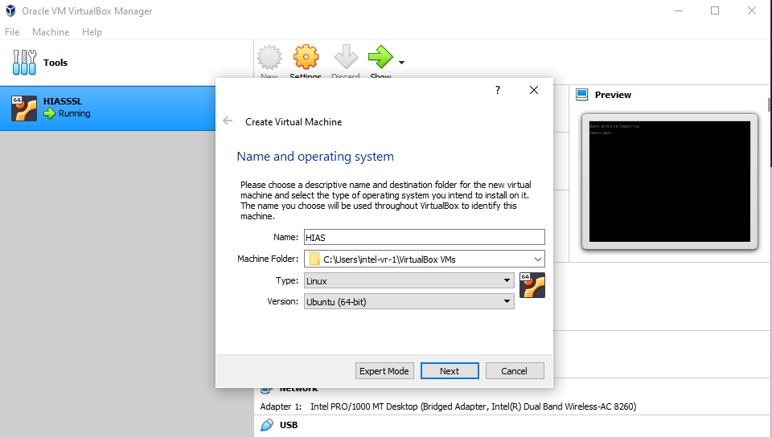
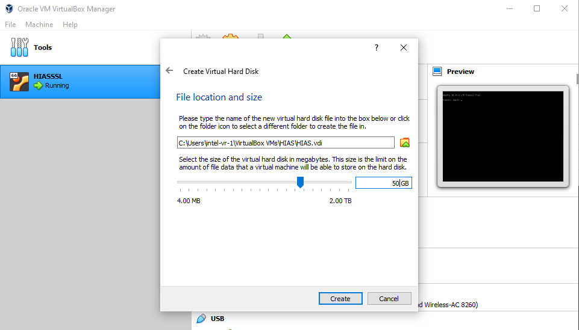
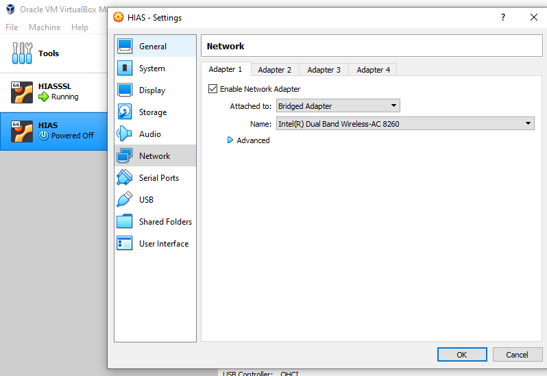

# Peter Moss Leukemia AI Research
## Hospital Intelligent Automation System
### VirtualBox Installation Guide

# Table Of Contents

- [Introduction](#introduction)
- [Download](#download)
- [Setup](#setup)

# Introduction
This guide will help you set up [VirtualBox](https://www.virtualbox.org/) so that you can run your HIAS Server on a Virtual Machine.

# Download
- Before you begin you should [download VirtualBox](https://www.virtualbox.org/wiki/Downloads).

- You will also need to download [Ubuntu Server 18.04 LTS 64 bit](https://releases.ubuntu.com/18.04/).

# Setup
This guide will help you set up VirtualBox for the HIAS Server.

## New VM

Open VirtualBox and click on the **New** button, name your VM and chose Linux and Ubuntu 64 bit in the options.

## New VM Memory

Next chose your memory.

## New VM Disk

Continue through with the default options until you come to **File location and size**. At this point you need to select at least 20GB for your virtual hard disk, then click create.

## New VM Network

Click **Settings** and select **Network**, from here you should select **Bridged Adapter**.

## New VM Image

Click start and you will see the above Window. Choose your Ubuntu iso and click start. From here you will be taken through the Ubuntu install process. Once your VM has started, you can connect to it via SHH for easy management.

&nbsp;

# Contributing
Peter Moss Leukemia AI Research encourages and welcomes code contributions, bug fixes and enhancements from the Github community.

Please read the [CONTRIBUTING](../CONTRIBUTING.md "CONTRIBUTING") document for a full guide to forking our repositories and submitting your pull requests. You will also find information about our code of conduct on this page.

## Contributors

- [Adam Milton-Barker](https://www.leukemiaairesearch.com/team/adam-milton-barker "Adam Milton-Barker") - [Peter Moss Leukemia AI Research](https://www.leukemiaairesearch.com.ai "Peter Moss Leukemia AI Research") President/Founder & Intel Software Innovator, Sabadell, Spain

&nbsp;

# Versioning

You use SemVer for versioning. For the versions available, see [Releases](../releases "Releases").

&nbsp;

# License

This project is licensed under the **MIT License** - see the [LICENSE](../LICENSE "LICENSE") file for details.

&nbsp;

# Bugs/Issues

You use the [repo issues](../issues "repo issues") to track bugs and general requests related to using this project. See [CONTRIBUTING](../CONTRIBUTING.md "CONTRIBUTING") for more info on how to submit bugs, feature requests and proposals.