# Peter Moss Leukemia AI Research
## HIAS - Hospital Intelligent Automation System

     

&nbsp;

# Table Of Contents

- [Introduction](#introduction)
- [Key Features](#key-features)
- [HIAS Hardware](#hias-hardware)
- [HIAS Network](#hias-network)
- [HIAS UI](#hias-ui)
- [HIAS Blockchain](#hias-blockchain)
- [HIAS IoT](#hias-iot)
    - [HIAS IoT Zones](#hias-iot-zones)
    - [HIAS IoT Devices](#hias-iot-devices)
    - [HIAS IoT Sensors/Actuators](#hias-iot-sensorsactuators)
    - [HIAS IoT Applications](#hias-iot-applications)
    - [HIAS IoT Data](#hias-iot-data)
    - [HIAS IoT Data Smart Contract](#hias-iot-data-smart-contract)
- [Installation](#installation)
- [HIAS Detection Systems](#hias-detection-systems)
    - [Acute Lymphoblastic Leukemia Detection System (CNN)](#acute-lymphoblastic-leukemia-detection-system-cnn)
    - [COVID-19 Detection System (CNN)](#covid-19-detection-system-cnn)
- [HIAS Data Analysis](#hias-data-analysis)
    - [HIAS COVID-19 Data Analysis](#hias-covid-19-data-analysis)
- [HIAS Facial Recognition API](#hias-facial-recognition-api)
- [HIAS Natural Language Understanding Engines](#hias-natural-language-understanding-engines)
- [EMAR / EMAR Mini](#emar--emar-mini)
- [Modular Addons](#modular-addons)
- [Acknowledgement](#acknowledgement)
- [Contributing](#contributing)
    - [Contributors](#contributors)
- [Versioning](#versioning)
- [License](#license)
- [Bugs/Issues](#bugs-issues)

&nbsp;

&nbsp;

# Introduction
The **Peter Moss Leukemia AI Research HIAS Network** is an open-source Hospital Intelligent Automation System. The HIAS server powers an intelligent network providing secure access to devices on the network via a proxy. These devices/applications and databases all run and communicate on the local network. This means that premises have more control and security when it comes to their hardware, data and storage.

Devices and applications on the HIAS network communicate with the server and each other using a local MQTT broker.

The server hosts a private Ethereum blockchain which is integrated with the UI and provides upholds network access permissions, provides data integrity and accountability.

__This project is a proof of concept, and is still a work in progress.__

&nbsp;

# Key Features

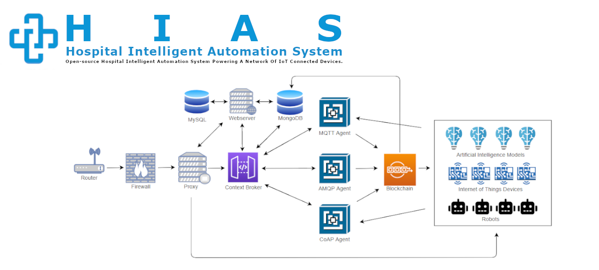

- **Local Web Server (Complete)**
    - Locally hosted webserver using NGINX.
- **High Grade SSL Encryption (Complete)**
    - High grade (A+) encryption for the web server, proxy and network.
- **Proxy (Complete)**
    - Secure access to local devices from the outside world.
- **Blockchain (Complete)**
    - Private Ethereum blockchain for access permissions, provides data integrity and accountability.
- **System Database (Complete)**
    - The system MySQL database powers the HIAS UI.
- **IoT Database (Complete)**
    - The network IoT database is a Mongo database that stores all data from the HIAS network devices and applications.
- **Local Samba Server (Complete)**
    - A local Samba file server allowing controlled individual and group access to files on your local network.
- **Local IoT Broker (Complete)**
    - Local and private MQTT/Websockets broker based on the  [iotJumpway Broker](https://github.com/iotJumpway/Broker "iotJumpway Broker").
- **Server UI (Work In Progress)**
    - A control panel to monitor and manage your HIAS network.
- **Facial Identification Systems (Complete)**
    - Facial identification systems based on [TassAI](https://github.com/TassAI/ "TassAI").
- **Natural Language Understanding (NLU) Server (Complete)**
    - Natural Language Understanding server based on [GeniSysAI](https://github.com/GeniSysAI/ "GeniSysAI").
- **COVID Data Analysis System (Complete)**
    - A data anaysis system for monitoring the COVID 19 pandemic. This system collects data from the [Johns Hopkins University COVID-19 Daily Reports](https://github.com/CSSEGISandData/COVID-19/) on Github.
- **AI Detection Systems (Complete)**
    - Detection systems for classsifying Acute Lymphoblastic Leukemia and COVID-19.
- **HIS/HMS (In Development)**
    - Hospital management system providing online tools for managing and running day to day activities and resources for the hospital.

&nbsp;

# HIAS Hardware

HIAS has been developed on an UP2 and a 1.5TB HDD to show the potential of lower powered devices for building IoT networks. In a real world scenario such as a being used to power a hospital network, it is likely that a device with more resources and storage will be required.

&nbsp;

# HIAS Network
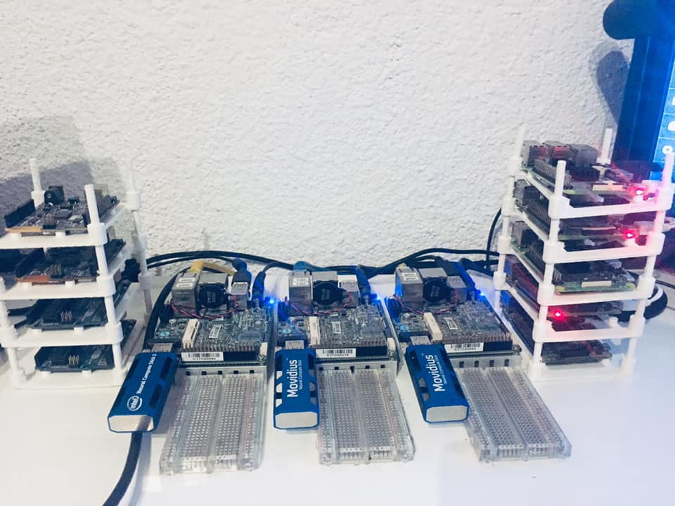

The HIAS Network consists of a range of open-source IoT devices and applications including data analysis systems, diagnosis systems, robots, facial recognition security systems and natural language understanding engines. The network devices are designed and optimized to run on low resource devices. Devices and applications can communicate autonomously using rules and the iotJumpWay MQTT broker.

&nbsp;

# HIAS UI
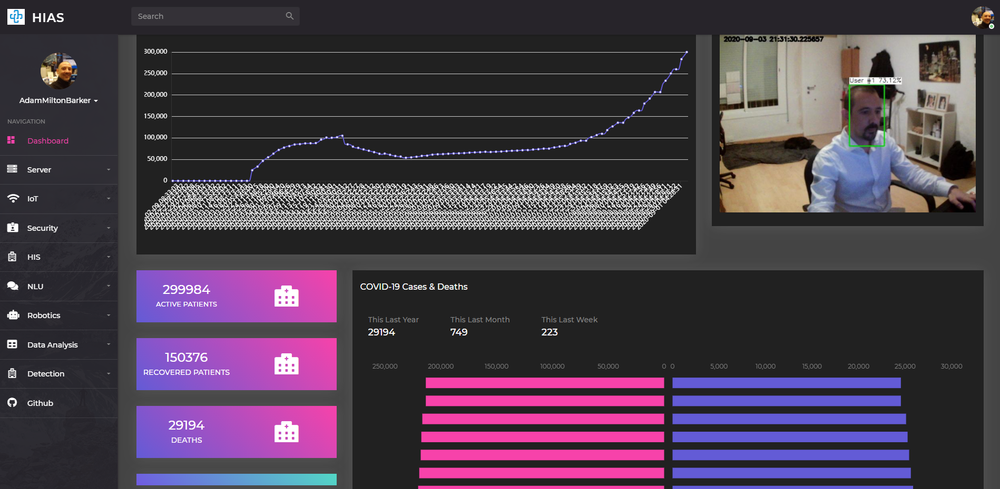

The HIAS UI is the central control panel for the server, and all of the modular devices and applications that can be installed on it. The server UI provides the capabalities to manage the network of open-soruce intelligent devices and applications.

&nbsp;

# HIAS Blockchain
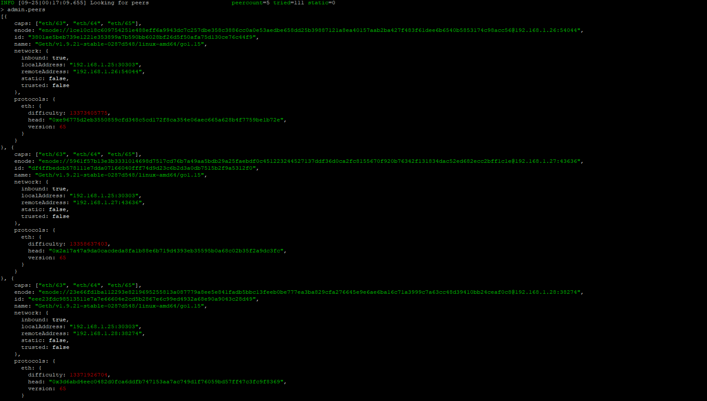

The HIAS Blockchain is a private Ethereum blockchain network that provides an immutable history of everything that happens on the HIAS network. Every user/device and application has a HIAS Blockchain address, meaning their actions can be recorded on the blockchain. Smart contracts provide additional security when it comes to verifying permissions, data hashes are stored on the blockchain providing data integrity. and each action made by staff members in the UI is recorded. The HIAS Blockchain network can be extended by installing additional full miner nodes which help to create blocks, seal transaction blocks, and also have a full copy of the entire HIAS Blockchain which remain synchronized.

&nbsp;

# HIAS IoT
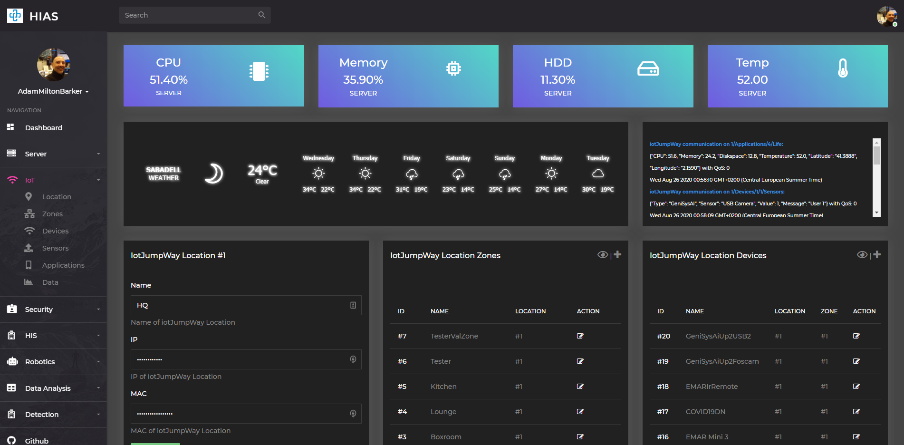

The HIAS IoT network is powered by a new, fully open-source version of the [iotJumpWay](https://www.iotJumpWay.com "iotJumpWay"). The HIAS iotJumpway dashboard is your control panel for managing all of your network iotJumpWay zones, devices, sensors/actuators and applications.

The iotJumpWay devices and applications that make up the HIAS network are connected to the HIAS network via the iotJumpWay. Each device and application has a unique identifier and credentials that allow communication with the server and devices behind the firewall and proxy.

A HIAS network is represented by an iotJumpWay location. Within each location you can have multiple zones, devices and applications.

## HIAS IoT Zones
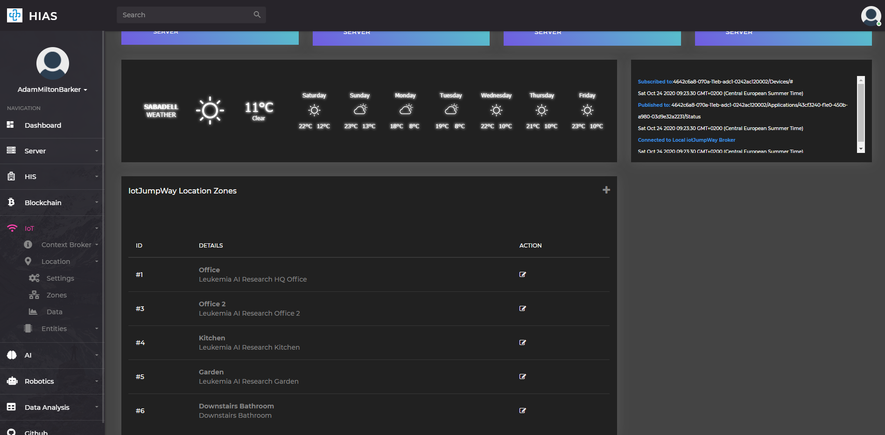

iotJumpWay Zones represent a room or area within a location. For instance, in a hospital you may have zones such as *Reception*, *Waiting Room*, *Operating Room 1* etc.

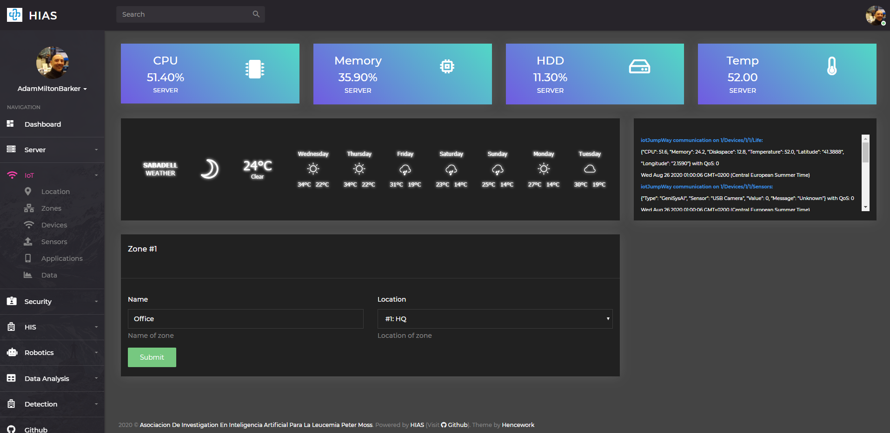

## HIAS IoT Devices
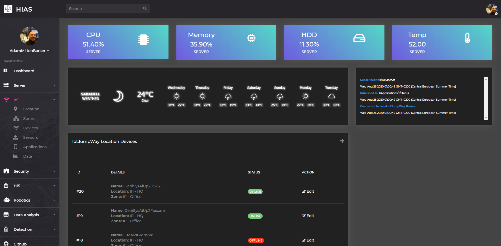

iotJumpWay Devices represent physical devices on the network. Each device is attached to a location and zone, allowing staff to know where each of their devices are, all devices publish their location to the network allowing for real-time tracking within the network.

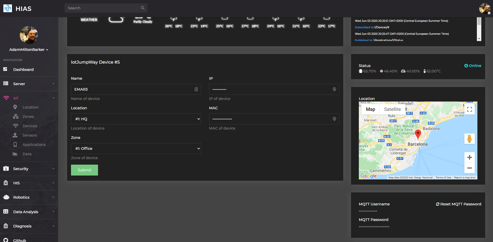

## HIAS IoT Sensors/Actuators
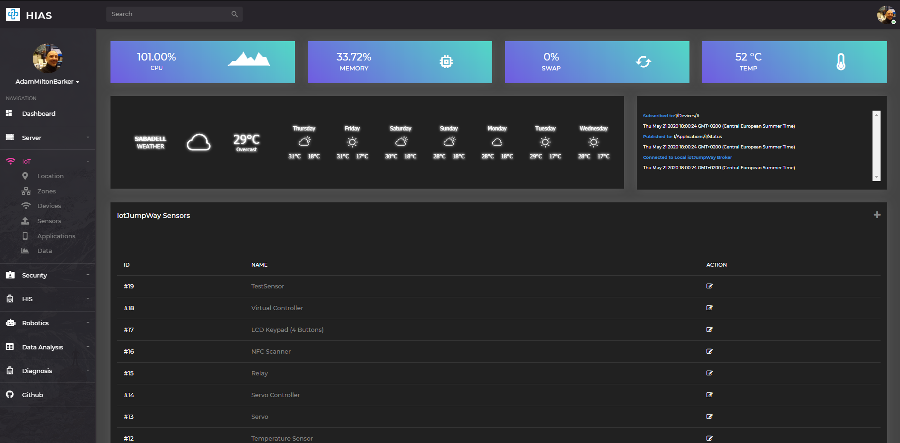

iotJumpWay Sensors & Actuators represent physical sensors and actuators included on network devices and allows direct communication with each sensor/actuator.

**This feature is still in development**

## HIAS IoT Applications
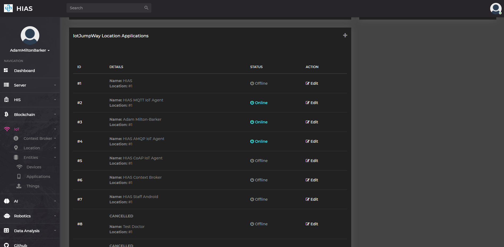

iotJumpWay Devices represent applications that can communicate with the  network. Each application is attached to a location, soon all applications will publish their location to the system allowing for real-time tracking.

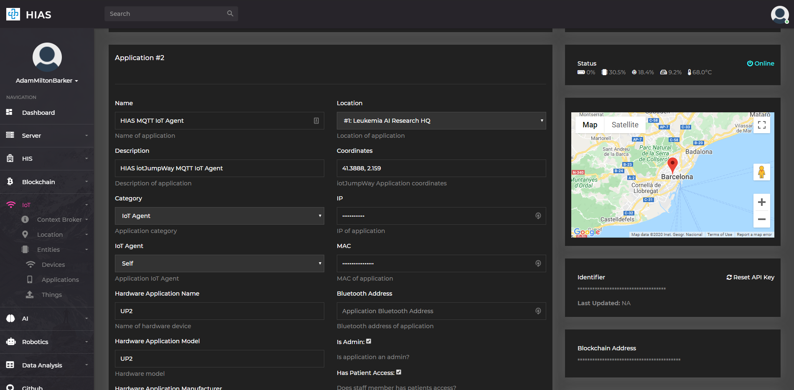

## HIAS IoT Data
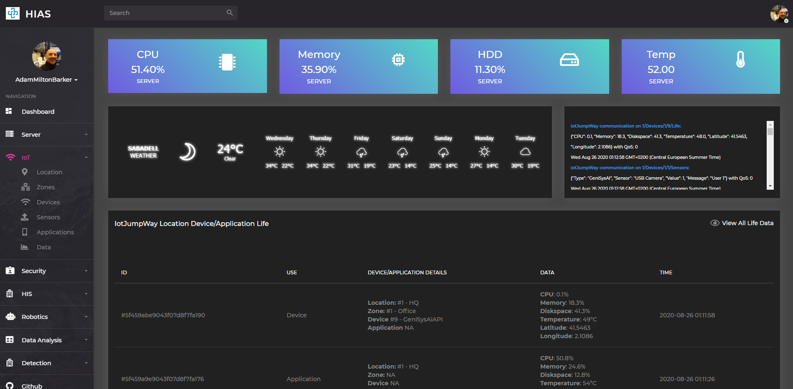

All data sent from devices and applications connected to the HIAS network is stored locally in a Mongo database (NoSQL). This means that staff can monitor all data on their network, and kall data stays on the network giving organizations total control of their data.

## HIAS IoT Data Smart Contract
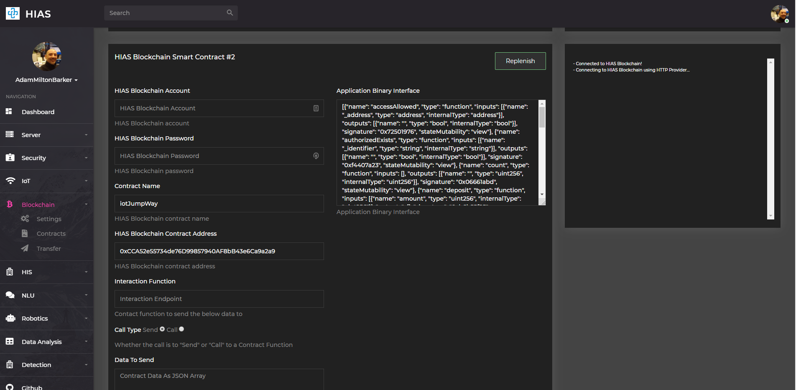

The HIAS Blockchain hosts an iotJumpWay smart contract responsible for veryifing read and write access for iotJumpWay devices and applications, and storing immutable records of hashes of the data that is stored in the IoT database. The hashes provide the ability to verify data integrity by comparing the data in the database with the hash on the blockchain. The HIAS IoT Data Dashboard provides the functionality for checking the existing data against the hash on the blockchain.

&nbsp;

# Installation
Installation scripts and tutorials for setting up your HIAS - Hospital Intelligent Automation System & UI are provided. To get started, please follow the installation guides provided below in the order they are given:

| ORDER | GUIDE | INFORMATION | AUTHOR |
| ----- | ----- | ----------- | ------ |
| 1 | [Main Installation Guide](Documentation/Installation.md "Main Installation Guide") | Primary installation guide covering most of the information needed to do the core installation |  [Adam Milton-Barker](https://www.leukemiaairesearch.com/team/adam-milton-barker "Adam Milton-Barker") |

&nbsp;

# HIAS Detection Systems
Using AI models on the HIAS network, the UI can be used to classify image based samples for diseases such as COVID-19 and Leukemia.

 ## Acute Lymphoblastic Leukemia Detection System (CNN)
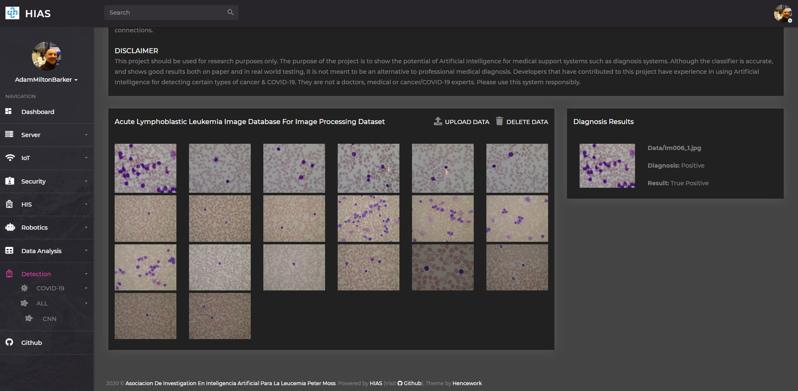

The HIAS Acute Lymphoblastic Leukemia Detection System (CNN) used the [oneAPI Acute Lymphoblastic Leukemia Classifier](https://github.com/AMLResearchProject/oneAPI-ALL-Classifier), based on the proposed architecture in the [Acute Leukemia Classification Using Convolution Neural Network In Clinical Decision Support System](https://airccj.org/CSCP/vol7/csit77505.pdf) paper and using the [Acute Lymphoblastic Leukemia Image Database for Image Processing dataset](https://homes.di.unimi.it/scotti/all). The classifier achieves 98% accuracy at detecting Acute Lymphoblastic Leukemia in unseen data.

## COVID-19 Detection System (CNN)
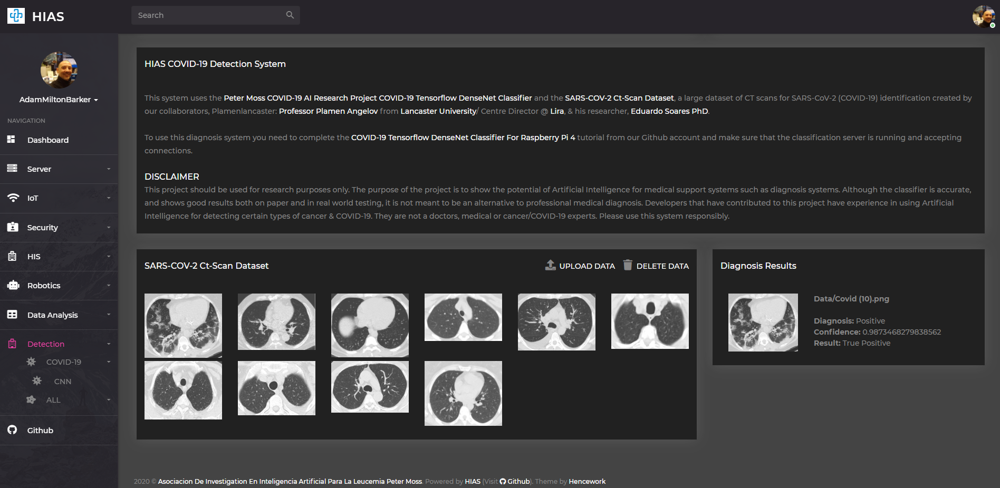

 The HIAS COVID-19 Detection System (CNN) system uses the [COVID-19 Tensorflow DenseNet Classifier](https://github.com/COVID-19-AI-Research-Project/AI-Classification/tree/master/Projects/2 "COVID-19 Tensorflow DenseNet Classifier") project, a Tensorflow 2 DenseNet implementation using the [SARS-COV-2 Ct-Scan Dataset](https://www.kaggle.com/plameneduardo/sarscov2-ctscan-dataset "SARS-COV-2 Ct-Scan Dataset") by our collaborators, Plamenlancaster: [Professor Plamen Angelov](https://www.lancaster.ac.uk/lira/people/#d.en.397371) from [Lancaster University](https://www.lancaster.ac.uk/)/ Centre Director @ [Lira](https://www.lancaster.ac.uk/lira/), & his researcher, [Eduardo Soares PhD](https://www.lancaster.ac.uk/sci-tech/about-us/people/eduardo-almeida-soares). The classifier achieves 92% accuracy at detecting COVID-19 in unseen data.

&nbsp;

# HIAS Data Analysis
The HIAS network hosts a number of AI models that monitor data from local and external sources to make predictions based on the raw data. You can monitor real-time data using the HIAS UI.

## HIAS COVID-19 Data Analysis
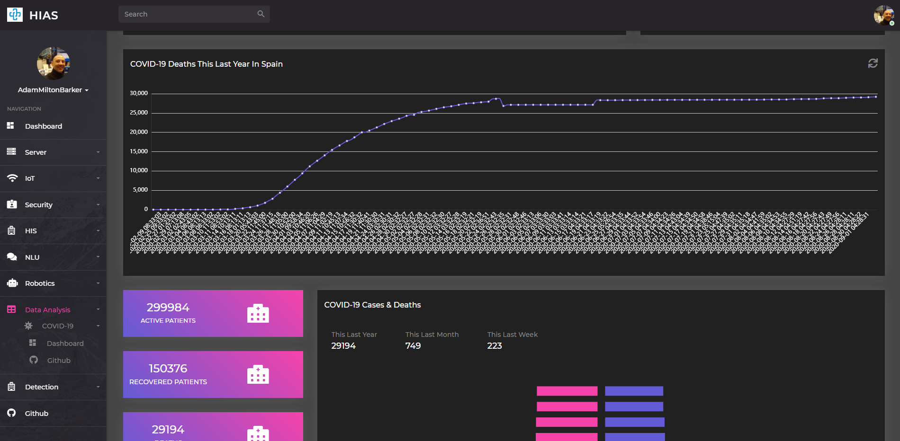

Functionality is now available to set up a basic COVID-19 tracker that powers graphs in the HIAS UI. This system pulls data from the [COVID-19 Data Repository by the Center for Systems Science and Engineering (CSSE) at Johns Hopkins University](https://github.com/CSSEGISandData/COVID-19 "COVID-19 Data Repository by the Center for Systems Science and Engineering (CSSE) at Johns Hopkins University") and displays the stats in the UI.

&nbsp;

# HIAS Facial Recognition API
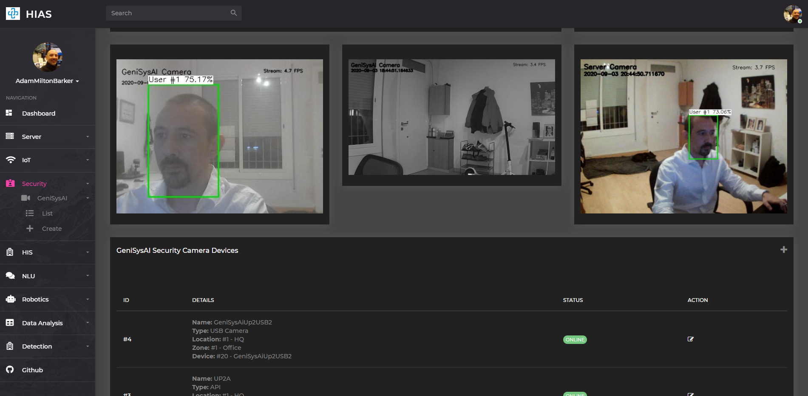

The HIAS facial recognition API is based on [TassAI](https://www.facebook.com/TassAI/ "TassAI"). The API allows for facial identification using authenticated HTTP requests from devices and applications that are authorized to communicate with the HIAS network.

A range of open-source facial recognition systems can be attached to the network and use web and IP cameras attached to devices that process frames from the cameras in real-time, before streaming the processed framed to a local server endpoint.

Multiple TassAI facial recognition devices can be configured. The cameras track known and unknown users and can communicate with the Natural Language Understanding Engines allowing conversations to be triggered based on facial recognition identifications.

&nbsp;

# HIAS Natural Language Understanding Engines
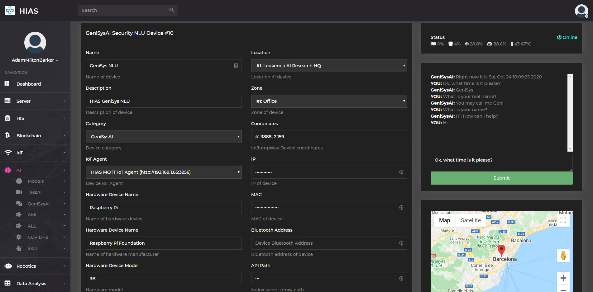

The HIAS UI allows Natural Language Understanding Engines to be connected to the network. These NLUs can be communicated with via the network allowing applications and devices to have realtime spoken interactions with known and unknown users.

&nbsp;

# EMAR / EMAR Mini
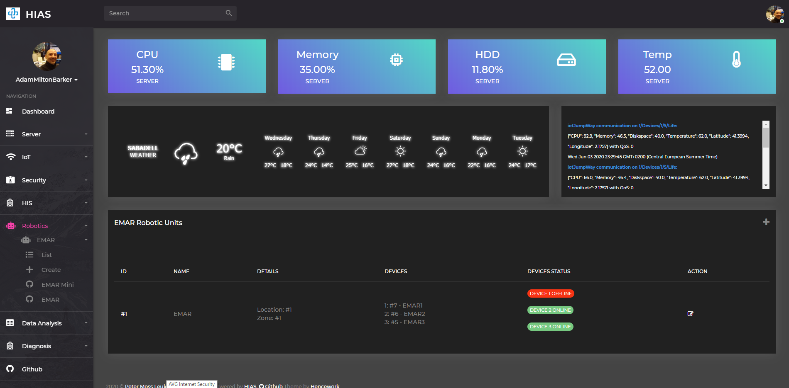
Functionality to update, monitor and control [EMAR](https://github.com/COVID-19-AI-Research-Project/EMAR "EMAR")/[EMAR Mini](https://github.com/COVID-19-AI-Research-Project/EMAR-Mini "EMAR Mini"). These features allow you to create EMAR/EMAR Mini devices, update the settings, monitor the camera streams and send commands to the robotic arm to move it.

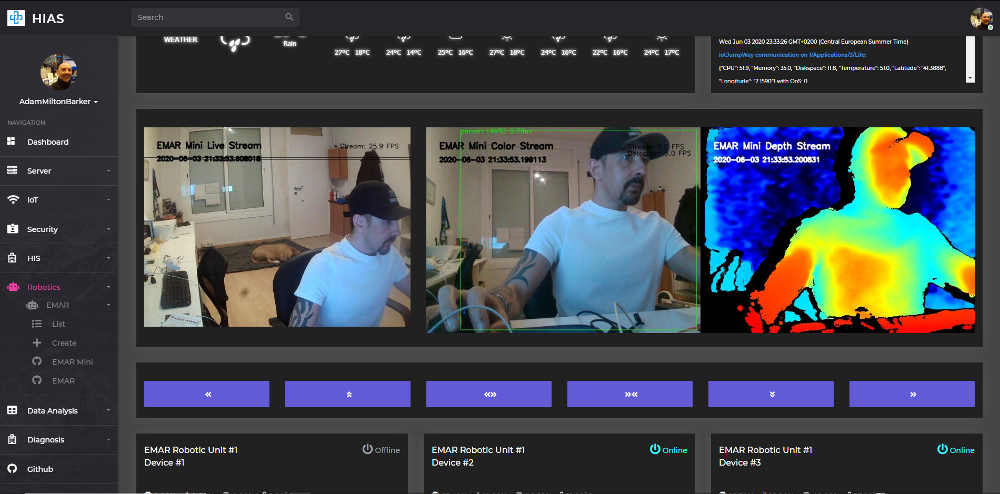

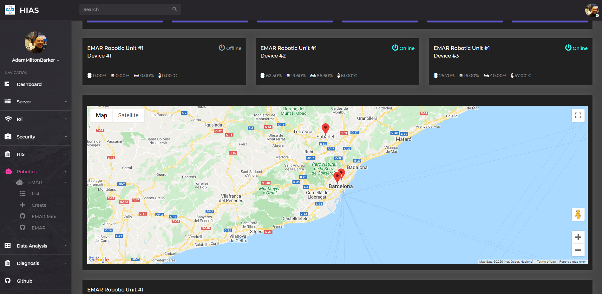

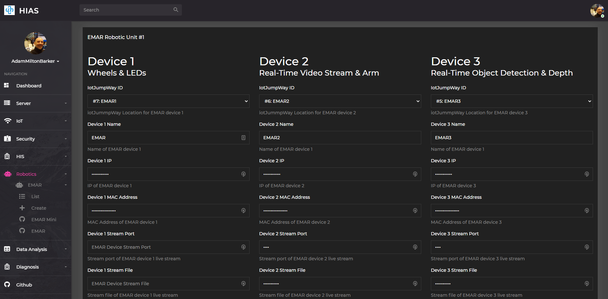

&nbsp;

# Modular Addons
The HIAS network is made up of modular, intelligent devices. Below are some of the completed tutorials that can be used with the HIAS UI. Each project provides the details on how to connect them to the HIAS network, allowing them to controlled and monitored via the UI.

| GITHUB | README | INFORMATION | AUTHOR |
| ----- | ----- | ----------- | ------ |
| [Acute Myeloid & Lymphoblastic Leukemia AI Research Project](https://github.com/AMLResearchProject "Acute Myeloid & Lymphoblastic Leukemia AI Research Project") | [oneAPI Acute Lymphoblastic Leukemia Classifier](https://github.com/AMLResearchProject/oneAPI-ALL-Classifier) |  Uses an Acute Lymphoblastic Leukemia CNN based on the proposed architecture in the [Acute Leukemia Classification Using Convolution Neural Network In Clinical Decision Support System](https://airccj.org/CSCP/vol7/csit77505.pdf) paper, using the [Acute Lymphoblastic Leukemia Image Database for Image Processing dataset](https://homes.di.unimi.it/scotti/all). |  [Adam Milton-Barker](https://www.leukemiaairesearch.com/team/adam-milton-barker "Adam Milton-Barker") |
| [Acute Myeloid & Lymphoblastic Leukemia AI Research Project](https://github.com/AMLResearchProject "Acute Myeloid & Lymphoblastic Leukemia AI Research Project") | [Magic Leap 1 Acute Lymphoblastic Leukemia Detection System](https://github.com/AMLResearchProject/Magic-Leap-1-ALL-Detection-System-2020) | The Acute Lymphoblastic Leukemia Detection System 2020 uses Tensorflow 2 & Magic Leap to provide a mixed reality detection system. Uses the [oneAPI Acute Lymphoblastic Leukemia Classifier](https://github.com/AMLResearchProject/oneAPI-ALL-Classifier). |  [Adam Milton-Barker](https://www.leukemiaairesearch.com/team/adam-milton-barker "Adam Milton-Barker") |
| [COVID-19 AI Research Project](https://github.com/COVID-19-AI-Research-Project "COVID-19 AI Research Project") | [COVID-19 Tensorflow DenseNet Classifier For Raspberry Pi 4](https://github.com/COVID-19-AI-Research-Project/AI-Classification/tree/master/Projects/3 "COVID-19 Tensorflow DenseNet Classifier For Raspberry Pi 4") |  Uses DenseNet and [SARS-COV-2 Ct-Scan Dataset](https://www.kaggle.com/plameneduardo/sarscov2-ctscan-dataset "SARS-COV-2 Ct-Scan Dataset"), a large dataset of CT scans for SARS-CoV-2 (COVID-19) identification created by our collaborators, Plamenlancaster: [Professor Plamen Angelov](https://www.lancaster.ac.uk/lira/people/#d.en.397371) from [Lancaster University](https://www.lancaster.ac.uk/)/ Centre Director @ [Lira](https://www.lancaster.ac.uk/lira/), & his researcher, [Eduardo Soares PhD](https://www.lancaster.ac.uk/sci-tech/about-us/people/eduardo-almeida-soares) |  [Adam Milton-Barker](https://www.leukemiaairesearch.com/team/adam-milton-barker "Adam Milton-Barker") |
| [COVID-19 AI Research Project](https://github.com/COVID-19-AI-Research-Project "COVID-19 AI Research Project") | [Magic Leap 1 COVID-19 Detection System](https://github.com/COVID-19-AI-Research-Project/Magic-Leap-1-Detection-System "Magic Leap 1 COVID-19 Detection System") | The Magic Leap 1 COVID-19 Detection System 2020 uses Tensorflow 2, Raspberry Pi 4 & Magic Leap 1 to provide a spatial computing detection system. Uses the [COVID-19 Tensorflow DenseNet Classifier For Raspberry Pi 4](https://github.com/COVID-19-AI-Research-Project/AI-Classification/tree/master/Projects/3 "COVID-19 Tensorflow DenseNet Classifier For Raspberry Pi 4") |  [Adam Milton-Barker](https://www.leukemiaairesearch.com/team/adam-milton-barker "Adam Milton-Barker") |
| [COVID-19 AI Research Project](https://github.com/COVID-19-AI-Research-Project "COVID-19 AI Research Project") | [COVID-19 Detection System For Oculus Rift](https://github.com/COVID-19-AI-Research-Project/Oculus-Rift-Detection-System "COVID-19 Detection System For Oculus Rift") | The Oculus Rift COVID-19 Detection System 2020 uses Tensorflow 2, Raspberry Pi 4 & Oculus Rift to provide a virtual detection system. Uses the [COVID-19 Tensorflow DenseNet Classifier For Raspberry Pi 4](https://github.com/COVID-19-AI-Research-Project/AI-Classification/tree/master/Projects/3 "COVID-19 Tensorflow DenseNet Classifier For Raspberry Pi 4") |  [Adam Milton-Barker](https://www.leukemiaairesearch.com/team/adam-milton-barker "Adam Milton-Barker") |
| [COVID-19 AI Research Project](https://github.com/COVID-19-AI-Research-Project "COVID-19 AI Research Project") | [EMAR Mini](https://github.com/COVID-19-AI-Research-Project/EMAR-Mini "EMAR Mini") | EMAR Mini is a minature version of [EMAR](https://github.com/COVID-19-AI-Research-Project/EMAR "EMAR"), an open-source Emergency Robot Assistant to assist doctors, nurses and hospital staff during the COVID-19 pandemic, and similar situations we may face in the future. |  [Adam Milton-Barker](https://www.leukemiaairesearch.com/team/adam-milton-barker "Adam Milton-Barker") |
| [Peter Moss Leukemia AI Research](https://github.com/LeukemiaAiResearch "Peter Moss Leukemia AI Research") | [GeniSysAI](https://github.com/LeukemiaAiResearch/GeniSysAI "GeniSysAI") |  HIAS GeniSysAI provides Natural Language Understanding. The projects provided in this repository are based on the original GeniSysAI projects. |  [Adam Milton-Barker](https://www.leukemiaairesearch.com/team/adam-milton-barker "Adam Milton-Barker") |
| [Peter Moss Leukemia AI Research](https://github.com/LeukemiaAiResearch "Peter Moss Leukemia AI Research") | [TassAI](https://github.com/LeukemiaAiResearch/TassAI "TassAI") |  HIAS TassAI provides Facial Recognition security applications for the HIAS network. The projects provided in this repository are based on the original TassAI projects. |  [Adam Milton-Barker](https://www.leukemiaairesearch.com/team/adam-milton-barker "Adam Milton-Barker") |
| [Peter Moss Leukemia AI Research](https://github.com/LeukemiaAiResearch "Peter Moss Leukemia AI Research") | [HIAS NFC Authorization System](https://github.com/LeukemiaAiResearch/HIAS-NFC "HIAS NFC Authorization System") | The HIAS NFC Authorization System is an IoT connected NFC reader that can scan NFC implants, cards and fobs to identify users on the HIAS network. |  [Adam Milton-Barker](https://www.leukemiaairesearch.com/team/adam-milton-barker "Adam Milton-Barker") |
| [Peter Moss Leukemia AI Research](https://github.com/LeukemiaAiResearch "Peter Moss Leukemia AI Research") | [HIAS Miner Node](https://github.com/LeukemiaAiResearch/HIAS-Miner-Node "HIAS Miner Node") | The HIAS Blockchain Miner Nodes are additional nodes for the HIAS Blockchain. These nodes help to create blocks, seal transaction blocks, and also have a full copy of the entire HIAS Blockchain which remain synchronized. |  [Adam Milton-Barker](https://www.leukemiaairesearch.com/team/adam-milton-barker "Adam Milton-Barker") |

&nbsp;

# Acknowledgement
The template used for the UI in this project is a commercial template by  [Hencework](https://hencework.com/ "Hencework"). We have been granted permission from Hencework to use their template in this project and would to thank them for doing so. Please check out their [Portfolio](https://themeforest.net/user/hencework/portfolio "Portfolio") for more examples of their work.

&nbsp;

# Contributing

Peter Moss Leukemia AI Research encourages and welcomes code contributions, bug fixes and enhancements from the Github community.

Please read the [CONTRIBUTING](CONTRIBUTING.md "CONTRIBUTING") document for a full guide to forking our repositories and submitting your pull requests. You will also find information about our code of conduct on this page.

## Contributors

- [Adam Milton-Barker](https://www.leukemiaairesearch.com/team/adam-milton-barker "Adam Milton-Barker") - [Peter Moss Leukemia AI Research](https://www.leukemiaairesearch.com "Peter Moss Leukemia AI Research") Founder & Intel Software Innovator, Sabadell, Spain

&nbsp;

# Versioning

We use SemVer for versioning. For the versions available, see [Releases](releases "Releases").

&nbsp;

# License

This project is licensed under the **MIT License** - see the [LICENSE](LICENSE "LICENSE") file for details.

&nbsp;

# Bugs/Issues

We use the [repo issues](issues "repo issues") to track bugs and general requests related to using this project. See [CONTRIBUTING](CONTRIBUTING.md "CONTRIBUTING") for more info on how to submit bugs, feature requests and proposals.