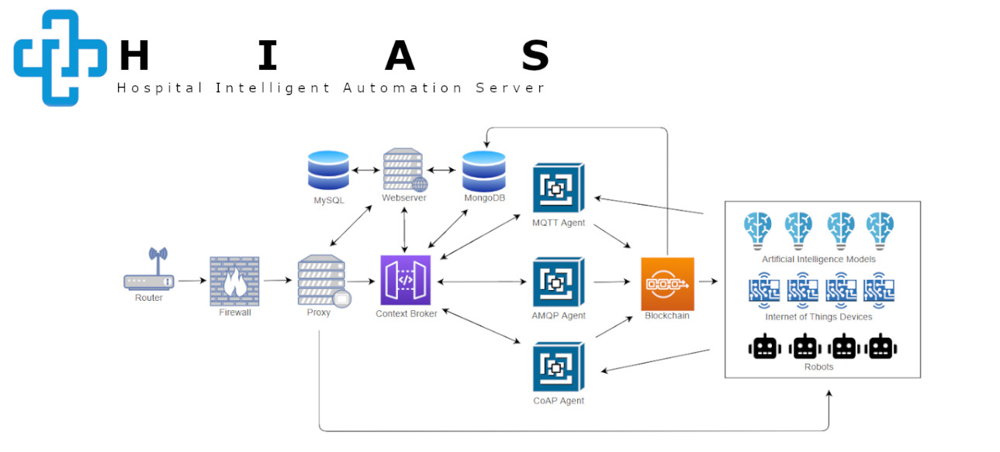
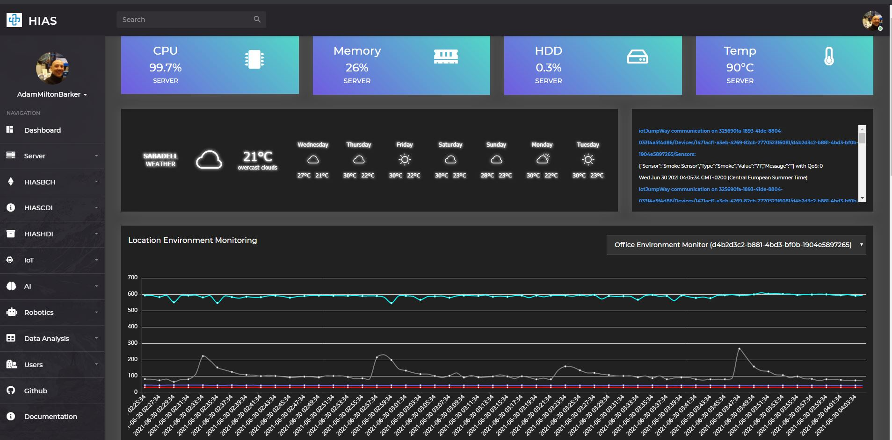
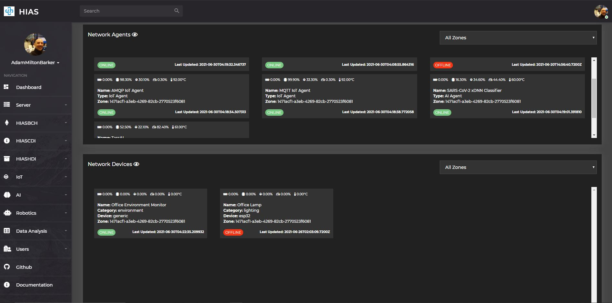

# Asociación de Investigacion en Inteligencia Artificial Para la Leucemia Peter Moss
# HIAS - Hospital Intelligent Automation Server

   

  

&nbsp;

# Introduction

HIAS Core is an open-source Hospital Automation Server designed to control and manage a network of intelligent IoT connected devices and applications. The server hosts a secure UI allowing the provisioning of HIAS devices and applications, managing and controlling the connected devices and applications, and reviewing/utilizing data collected from the network for automation.

Included in HIAS Core is a local MQTT and a local AMQP Broker providing secure machine to machine/application communication. The server also hosts a private Ethereum Blockchain used for permissions and data integrity, a private Context Broker (HIASCDI) based on the NGSI V2 specifications, and a private Historical Broker (HIASHDI). Network data is stored in the Historical and Context Brokers which utilize a private MongoDB database. This means that premises have more control and security when it comes to their hardware, data and storage.

HIAS Core also homes a facial recognition server and Natural Language Understanding Engine that act as a Intelligent Assistant, able to monitor and control devices in the location the server is installed in.

All HIAS network devices run on the local network and are accessible via the internet through the HIAS Core secure reverse proxy or the secure m2m communication brokers. Network devices include AI Agents (Diagnostics, Facial Recognition/Identification, Natural Language Understanding etc), IoT devices (environment monitors, smart electronics etc), Virtual & Mixed Reality devices (Oculus Rift/Magic Leap) and Brain Computer Interfaces. All of these devices produce and consume historical and contextual data which is stored in HIAS Core and used to train AI models used to automate the management and control of HIAS network devices.

HIAS network devices and applications are a range of open-source, modular devices that can be provisioned via the HIAS UI, these devices are completely free, and include:

- Medical diagnostics systems.
- Data analysis systems.
- Computer Vision and Natural Language Understanding systems.
- Virtual and Mixed Reality systems
- Robotics.
- Brain Computer Interfaces.
- Users can also program their own devices and applications and connect them to the network.

&nbsp;

# HIAS 3.0.0 Backware Incompatible

**HIAS 3.0.0 is backward incompatible and requires a completely fresh installation.**

You can download and install the [current version (2.1.0)](https://github.com/AIIAL/HIAS-Core/tree/2.1.0) but please be aware that **3.0.0 requires a completely fresh installation.**.

&nbsp;

# HIAS 3.0.0 Sneak Preview

&nbsp;

# Contributing
The Asociación de Investigacion en Inteligencia Artificial Para la Leucemia Peter Moss encourages and welcomes code contributions, bug fixes and enhancements from the Github community.

## Ways to contribute

The following are ways that you can contribute to this project:

- [Bug Report](https://github.com/AIIAL/HIASCDI/issues/new?assignees=&labels=&template=bug_report.md&title=)
- [Feature Request](https://github.com/AIIAL/HIASCDI/issues/new?assignees=&labels=&template=feature_request.md&title=)
- [Feature Proposal](https://github.com/AIIAL/HIASCDI/issues/new?assignees=&labels=&template=feature-proposal.md&title=)
- [Report Vulnerabillity](https://github.com/AIIAL/HIASCDI/issues/new?assignees=&labels=&template=report-a-vulnerability.md&title=)

Please read the [CONTRIBUTING](CONTRIBUTING.md "CONTRIBUTING") document for a full guide to forking our repositories and submitting your pull requests. You will also find information about our code of conduct on this page.

You can also join in with, or create, a discussion in our [Github Discussions](https://github.com/AIIAL/HIASCDI/discussions) area.

## Contributors

All contributors to this project are listed below.

- [Adam Milton-Barker](https://www.leukemiaairesearch.com/association/volunteers/adam-milton-barker "Adam Milton-Barker") - [Asociación de Investigacion en Inteligencia Artificial Para la Leucemia Peter Moss](https://www.leukemiaresearchassociation.ai "Asociación de Investigacion en Inteligencia Artificial Para la Leucemia Peter Moss") President/Founder & Lead Developer, Sabadell, Spain

&nbsp;

# Versioning
We use [SemVer](https://semver.org/) for versioning.

&nbsp;

# License
This project is licensed under the **MIT License** - see the [LICENSE](LICENSE "LICENSE") file for details.

&nbsp;

# Bugs/Issues
We use the [repo issues](issues "repo issues") to track bugs and general requests related to using this project. See [CONTRIBUTING](CONTRIBUTING.md "CONTRIBUTING") for more info on how to submit bugs, feature requests and proposals.
