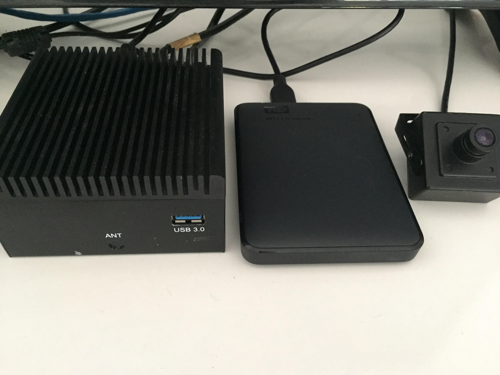

# Peter Moss Leukemia AI Research
## HIAS - Hospital Intelligent Automation System

 

# Introduction

The **Peter Moss Leukemia AI Research HIAS - Hospital Intelligent Automation System** is an open-source HIAS, a Hospital Intelligent Automation System. The system's server powers an intelligent network using a locally hosted, encrypted IoT server and proxy. The server UI provides the capabalities of managing a network of open-soruce intelligent AI/Robotics/VR/AR/Quantum & IoT devices and applications.These devices/applications and databases all run and communicate on the local network. This means that premises have more control and security when it comes to their hardware, data and storage.   

This project will be a proof of concept, and is still a work in progress, however our plan is to work with a local medical/health center or hospital to do a pilot project. 

- **IoT Connectivity:** Local and private MQTT/Websockets broker based on the  [iotJupmWay Broker](https://github.com/iotJumpway/Broker "iotJupmWay Broker").Secure IoT connection to the outside world is is provided via APIs hosted on your server and the [iotJumpWay PaaS](https://www.iotJumpWay.com "iotJumpWay PaaS"), our free Platform as a Service. Visit our Facebook page for more info: [www.facebook.com/iotJumpWay](https://www.facebook.com/iotJumpWay "www.facebook.com/iotJumpWay").
- **Secure Proxy:** The server acts a proxy to servers running on the local network, allowing devices and applications to connect securely to API's that provide access to AI models and other software.
- **Facial Identification Server:** This system provides a facial identification systems based on [tassAI](https://github.com/TASS-AI/Tass-History "tassAI"), an open source project that has evolved since around 2014/2015. The system connects to the server's local camera, process the frames to identify known users and unknown people, and streams the processed frames to a local server that can be accessed to monitor the environment around the server. For more information on tassAI you can check out the [tassAI history repo](https://github.com/TASS-AI/Tass-History "tassAI history repo").  Visit our Facebook page for more info: [www.facebook.com/tassAI](https://www.facebook.com/tassAI "www.facebook.com/tassAI").
- **Natural Language Understanding (NLU) Server:** This system provides a locally hosted Natural Language Understanding server based on [GeniSysAI](https://github.com/GeniSysAI/ "GeniSysAI"). This NLU server allows devices on the network to request intent and entity recognition. The NLU is also accessible to the outside world via the server's proxy which allows API traffic to be routed to the NLU API endpoint. Visit our Facebook page for more info: [www.facebook.com/GeniSysAI](https://www.facebook.com/GeniSysAI "www.facebook.com/GeniSysAI").

- **High grade SSL Encryption:** You will use Let's Encrypt to provide high grade, free encryption for public access to your server. You will also remove insecure TLSv1 & TLSv1.1, your server will have an A+ [Qualys](https://www.ssllabs.com/ssltest/ "Qualys") encryption rating helping to ensure privacy and security when using the HIAS - Hospital Intelligent Automation System.
- **Internet Access:** You will redirect a domain or subdomain to your public IP (Must be static IP). This will be the public access point to your secure network.
- **Server UI:** The server UI provides a control panel to monitor and manage your HIAS network including the [Emergency Assistance Robot](https://github.com/COVID-19-AI-Research-Project/COVID19-Emegency-Assistance-Robot "Emergency Assistance Robot"), the [IoT Devices](https://github.com/COVID-19-AI-Research-Project/COVID19-IoT-Devices "IoT Devices") & AI projects.

&nbsp;

# The HIAS Network

An open-source network of modular intelligent/smart devices, robotics/drones and Artificial Intelligence applications. 

Provides a local IoT broker allowing device to device/device to application communication for data transfer, device management and automation. 

Full Hospital Information System (HIS) / Hospital Management System (HMS).

The core of the network, providing the systems and services required to manage a Hospital Intelligent Automation System. 

## The HIAS UI

The HIAS UI is the central control panel for the server, and all of the modular devices and applications that can be installed on it. The main features of the UI are as follows:

- Manage/monitor the server.
- Manage/monitor IoT devices and applications.
- Manage/monitor the robots.
- Manage/monitor the AI models.
- Manage/monitor the HIS (Hospital Information System) / HMS (Hospital Management System).
- Manage/monitor hospital security.

&nbsp;

## Installation
Installation scripts and tutorials for setting up your HIAS - Hospital Intelligent Automation System & UI are provided. To get started, please follow the installation guides provided below in the order they are given:

| ORDER | GUIDE | INFORMATION | AUTHOR |
| ----- | ----- | ----------- | ------ |
| 1 | [Main Installation Guide](Documentation/Installation/Installation.md "Main Installation Guide") | Primary installation guide covering most of the information needed to do the core installation |  [Adam Milton-Barker](https://www.leukemiaresearchassociation.ai.com/team/adam-milton-barker "Adam Milton-Barker") |
| 2 | [iotJumpWay Installation Guide](Documentation/Installation/iotJumpWay.md "iotJumpWay Installation Guide") | iotJumpWay installation guide covering the information needed to do the iotJumpWay installation |  [Adam Milton-Barker](https://www.leukemiaresearchassociation.ai.com/team/adam-milton-barker "Adam Milton-Barker") |

&nbsp;

# Acknowledgement
The template used for the UI in this project is a commercial template by  [Hencework](https://hencework.com/ "Hencework"). We have been granted permission from Hencework to use their template in this project and would to thank them for doing so. Please check out their [Portfolio](https://themeforest.net/user/hencework/portfolio "Portfolio") for more examples of their work.

&nbsp;

# Contributing

The Peter Moss Acute Myeloid & Lymphoblastic Leukemia AI Research project encourages and welcomes code contributions, bug fixes and enhancements from the Github.

Please read the [CONTRIBUTING](CONTRIBUTING.md "CONTRIBUTING") document for a full guide to forking our repositories and submitting your pull requests. You will also find information about our code of conduct on this page.

## Contributors

- **AUTHOR:** [Adam Milton-Barker](https://www.leukemiaresearchassociation.ai.com/team/adam-milton-barker "Adam Milton-Barker") - [Peter Moss Leukemia AI Research](https://www.leukemiaresearchassociation.ai "Peter Moss Leukemia AI Research") Founder & Intel Software Innovator, Sabadell, Spain

&nbsp;

# Versioning

We use SemVer for versioning. For the versions available, see [Releases](releases "Releases").

&nbsp;

# License

This project is licensed under the **MIT License** - see the [LICENSE](LICENSE "LICENSE") file for details.

&nbsp;

# Bugs/Issues

We use the [repo issues](issues "repo issues") to track bugs and general requests related to using this project. See [CONTRIBUTING](CONTRIBUTING.md "CONTRIBUTING") for more info on how to submit bugs, feature requests and proposals.