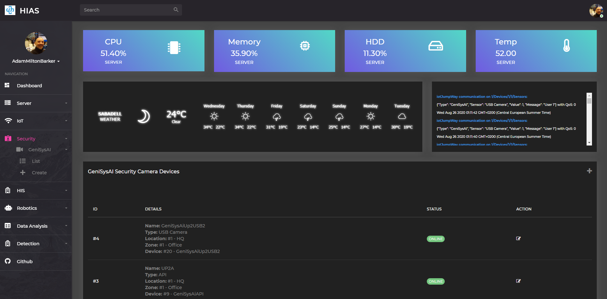
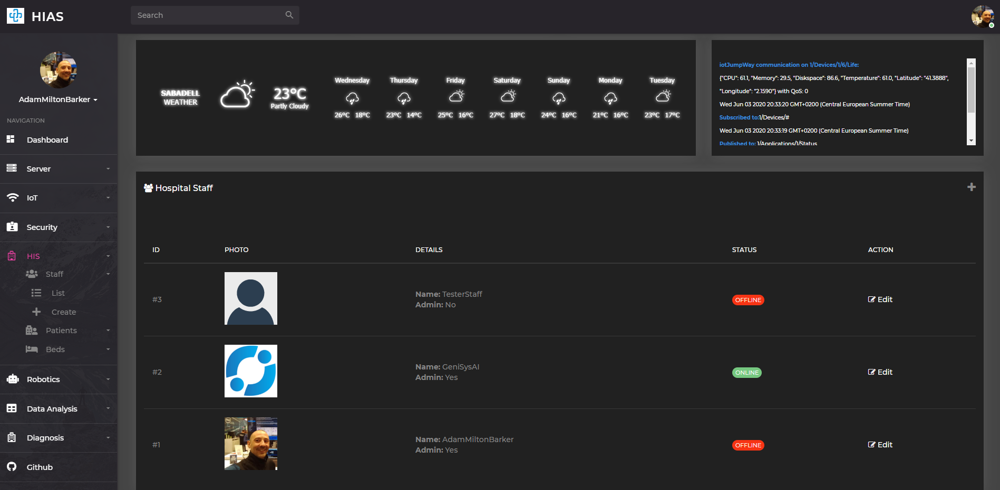

# Peter Moss Leukemia AI Research
## HIAS - Hospital Intelligent Automation System

     

&nbsp;

# Table Of Contents

- [Introduction](#introduction)
- [Key Features](#key-features)
- [HIAS Network Map](#hias-network-map)
- [HIAS UI](#hias-ui)
- [Installation](#installation)
- [Acknowledgement](#acknowledgement)
- [Contributing](#contributing)
    - [Contributors](#contributors)
- [Versioning](#versioning)
- [License](#license)
- [Bugs/Issues](#bugs-issues)

&nbsp;

# Introduction

The **Peter Moss Leukemia AI Research HIAS Network** is an open-source Hospital Intelligent Automation System. The system's server powers an intelligent network using a locally hosted, encrypted IoT server and proxy. 

The server UI provides the capabalities of managing a network of open-soruce intelligent devices and applications. These devices/applications and databases all run and communicate on the local network. This means that premises have more control and security when it comes to their hardware, data and storage.   

__This project is a proof of concept, and is still a work in progress, however our plan is to work with a local medical/health center or hospital to do a pilot project.__

&nbsp;

# Key Features

- **Local Web Server (Complete)** 
    - Locally hosted webserver using NGINX.
- **Proxy (Complete)**
    - Secure access to local devices from the outside world.
- **High Grade SSL Encryption (Complete)** 
    - High grade (A+) encryption for the web server, proxy and network.
- **Server UI (Work In Progress)** 
    - A control panel to monitor and manage your HIAS network.
- **Local IoT Broker (Complete)** 
    - Local and private MQTT/Websockets broker based on the  [iotJumpway Broker](https://github.com/iotJumpway/Broker "iotJumpway Broker").
- **Facial Identification Server (Complete)** 
    - Facial identification systems based on [tassAI](https://github.com/TASS-AI/Tass-History "tassAI").
- **Natural Language Understanding (NLU) Server (In Redevelopment)** 
    - Natural Language Understanding server based on [GeniSysAI](https://github.com/GeniSysAI/ "GeniSysAI").

&nbsp;

# HIAS Network Map
 

&nbsp;

# HIAS UI

The HIAS UI is the central control panel for the server, and all of the modular devices and applications that can be installed on it. 

**COVID-19 data in the screen shot is currently dummy data. One of the HIAS modules will be a data-analysis system which will power this plugin.**

&nbsp;

# HIAS IoT Network

The HIAS IoT network is powered by a new, fully open-source version of the [iotJumpWay](https://www.iotJumpWay.com "iotJumpWay"). The HIAS iotJumpway dashboard is your control panel for managing all of your network iotJumpWay zones, devices, sensors/actuators and applications. The modular systems that we build to be compatible with this network will all create their own iotJumpWay applications etc during installation, you will be able to manage all of these applications and devices through the iotJumpWay dashboard. 

&nbsp;

# HIAS Facial Recognition

The HIAS facial recognition system is based on [tassAI](https://www.facebook.com/TASSNetwork/ "tassAI"). The facial recognition system uses cameras attached to devices on the network and processes frames from the cameras in real-time, before streaming the processed framed to a local server endpoint. Multiple TASS devices can be configured and there will soon be integration with popular IP cameras like Foscam etc.  

&nbsp;

#  HIAS Users

HIAS users can be created using the HIS Staff system. Users can be granted admin privileges allowing them access to further restricted areas of the UI. Each user has a connected iotJumpWay application which will later be used in our HIAS Android application.

&nbsp;

## Installation
Installation scripts and tutorials for setting up your HIAS - Hospital Intelligent Automation System & UI are provided. To get started, please follow the installation guides provided below in the order they are given:

| ORDER | GUIDE | INFORMATION | AUTHOR |
| ----- | ----- | ----------- | ------ |
| 1 | [Main Installation Guide](Documentation/Installation/Installation.md "Main Installation Guide") | Primary installation guide covering most of the information needed to do the core installation |  [Adam Milton-Barker](https://www.leukemiaresearchassociation.ai.com/team/adam-milton-barker "Adam Milton-Barker") |
| 2 | [iotJumpWay Installation Guide](Documentation/Installation/iotJumpWay.md "iotJumpWay Installation Guide") | iotJumpWay installation guide covering the information needed to do the iotJumpWay installation |  [Adam Milton-Barker](https://www.leukemiaresearchassociation.ai.com/team/adam-milton-barker "Adam Milton-Barker") |

&nbsp;

# Acknowledgement
The template used for the UI in this project is a commercial template by  [Hencework](https://hencework.com/ "Hencework"). We have been granted permission from Hencework to use their template in this project and would to thank them for doing so. Please check out their [Portfolio](https://themeforest.net/user/hencework/portfolio "Portfolio") for more examples of their work.

&nbsp;

# Contributing

The Peter Moss Acute Myeloid & Lymphoblastic Leukemia AI Research project encourages and welcomes code contributions, bug fixes and enhancements from the Github.

Please read the [CONTRIBUTING](CONTRIBUTING.md "CONTRIBUTING") document for a full guide to forking our repositories and submitting your pull requests. You will also find information about our code of conduct on this page.

## Contributors

- **AUTHOR:** [Adam Milton-Barker](https://www.leukemiaresearchassociation.ai.com/team/adam-milton-barker "Adam Milton-Barker") - [Peter Moss Leukemia AI Research](https://www.leukemiaresearchassociation.ai "Peter Moss Leukemia AI Research") Founder & Intel Software Innovator, Sabadell, Spain

&nbsp;

# Versioning

We use SemVer for versioning. For the versions available, see [Releases](releases "Releases").

&nbsp;

# License

This project is licensed under the **MIT License** - see the [LICENSE](LICENSE "LICENSE") file for details.

&nbsp;

# Bugs/Issues

We use the [repo issues](issues "repo issues") to track bugs and general requests related to using this project. See [CONTRIBUTING](CONTRIBUTING.md "CONTRIBUTING") for more info on how to submit bugs, feature requests and proposals.