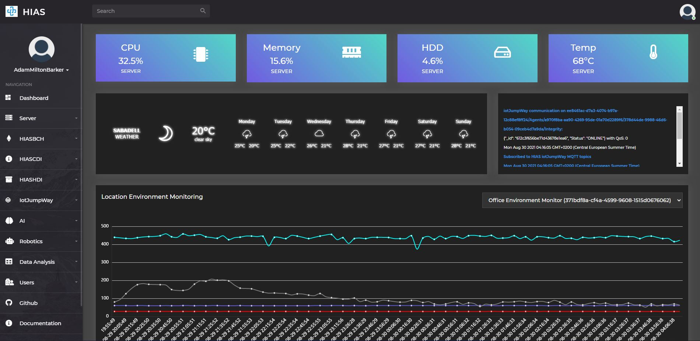
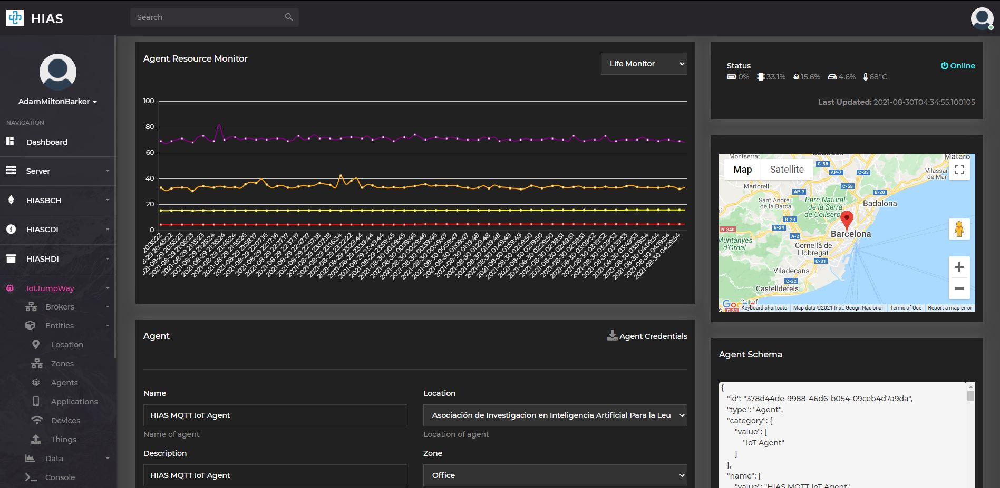

# Asociación de Investigacion en Inteligencia Artificial Para la Leucemia Peter Moss
# HIAS - Hospital Intelligent Automation Server

    

 

  

&nbsp;

# Introduction
HIAS Core is an open-source server designed to control and manage a network of intelligent IoT connected devices and applications.

The goal is to create an open-source platform that can be used by hospitals, clinics, and other medical organizations to control and manage their devices and applications.

The project is a work in progress and remains under development.

HIAS Core is made up of the following primary components:

- [HIASBCH](https://github.com/aiial/hiasbch) - A private Ethereum Blockchain
- [HIASCDI](https://github.com/aiial/hiascdi) - A private NGSI v2 Context Broker
- [HIASHDI](https://github.com/aiial/hiashdi) - A private Historical Data Broker
- iotJumpWay:
    - A Private MQTT Broker
    - A Private AMQP Broker
    - [HIAS MQTT IoT Agent](https://github.com/aiial/hias-mqtt-iot-agent)
    - [HIAS AMQP IoT Agent](https://github.com/aiial/hias-amqp-iot-agent)
    - [HIASBCH MQTT Blockchain Agent](https://github.com/aiial/hiasbch-mqtt-blockchain-agent)

HIAS network devices and applications are a range of open-source, modular devices and applications that can be provisioned via the HIAS UI. All HIAS compatible devices and applications have been developed by our volunteers and are completely open-source and free. These devices and applications currently include:

- Medical diagnostics applications.
- Data analysis applications.
- Computer Vision and Natural Language Understanding.
- Virtual and Mixed Reality applications.
- Robotics.
- Brain Computer Interface applications.

Users can also program their own devices and applications and connect them to the network.

&nbsp;

# HIAS UI

The HIAS UI is the central control panel for the HIAS server and network.

The UI provides the functionality to provision, manage, and monitor the HIAS network.

&nbsp;

# Get Started
To get started follow the official HIAS Core documentation:

- [Installation Guide (Hyper-V)](https://hias.readthedocs.io/en/latest/installation/hyperv/)
- [Installation Guide (Virtual Box)](https://hias.readthedocs.io/en/latest/installation/virtualbox/)
- [Installation Guide (UBUNTU)](https://hias.readthedocs.io/en/latest/installation/ubuntu/)
- [Usage Guide (UBUNTU)](https://hias.readthedocs.io/en/latest/usage/ubuntu/)

&nbsp;

# Contributing
The Asociación de Investigacion en Inteligencia Artificial Para la Leucemia Peter Moss encourages and welcomes code contributions, bug fixes and enhancements from the Github community.

## Ways to contribute

The following are ways that you can contribute to this project:

- [Bug Report](https://github.com/aiial/hias-core/issues/new?assignees=&labels=&template=bug_report.md&title=)
- [Feature Request](https://github.com/aiial/hias-core/issues/new?assignees=&labels=&template=feature_request.md&title=)
- [Feature Proposal](https://github.com/aiial/hias-core/issues/new?assignees=&labels=&template=feature-proposal.md&title=)
- [Report Vulnerabillity](https://github.com/aiial/hias-core/issues/new?assignees=&labels=&template=report-a-vulnerability.md&title=)

Please read the [CONTRIBUTING](CONTRIBUTING.md "CONTRIBUTING") document for a full guide to forking our repositories and submitting your pull requests. You will find information about our code of conduct on the [Code of Conduct page](CODE-OF-CONDUCT.md "Code of Conduct page").

You can also join in with, or create, a discussion in our [Github Discussions](https://github.com/aiial/HIASCDI/discussions) area.

## Contributors

All contributors to this project are listed below.

- [Adam Milton-Barker](https://www.leukemiaairesearch.com/association/volunteers/adam-milton-barker "Adam Milton-Barker") - [Asociación de Investigacion en Inteligencia Artificial Para la Leucemia Peter Moss](https://www.leukemiaresearchassociation.ai "Asociación de Investigacion en Inteligencia Artificial Para la Leucemia Peter Moss") President/Founder & Lead Developer, Sabadell, Spain

&nbsp;

# Versioning
We use [SemVer](https://semver.org/) for versioning.

&nbsp;

# License
This project is licensed under the **MIT License** - see the [LICENSE](LICENSE "LICENSE") file for details.

&nbsp;

# Bugs/Issues
We use the [repo issues](issues "repo issues") to track bugs and general requests related to using this project. See [CONTRIBUTING](CONTRIBUTING.md "CONTRIBUTING") for more info on how to submit bugs, feature requests and proposals.
