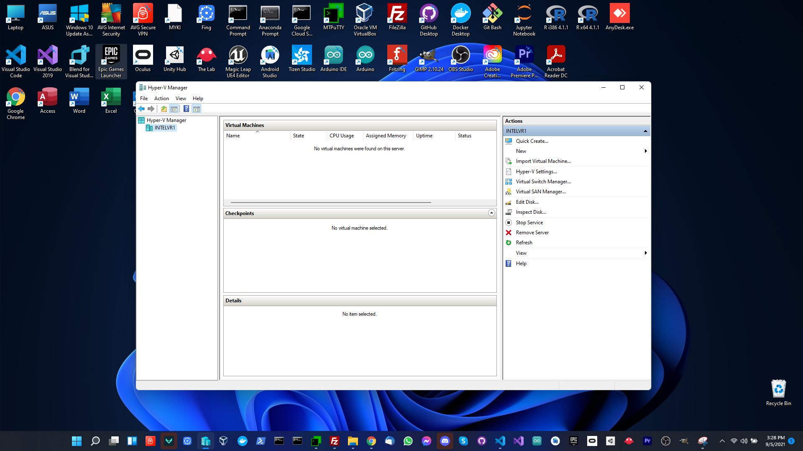
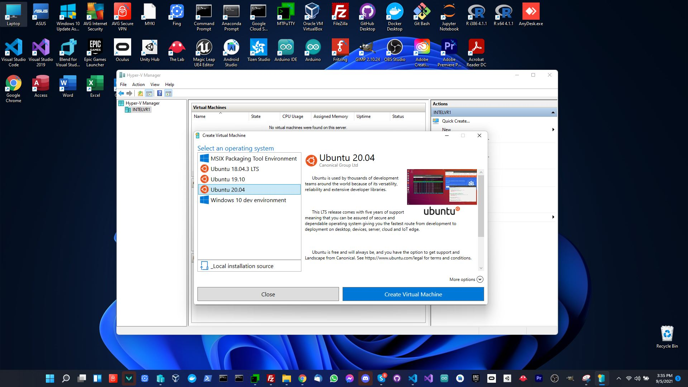
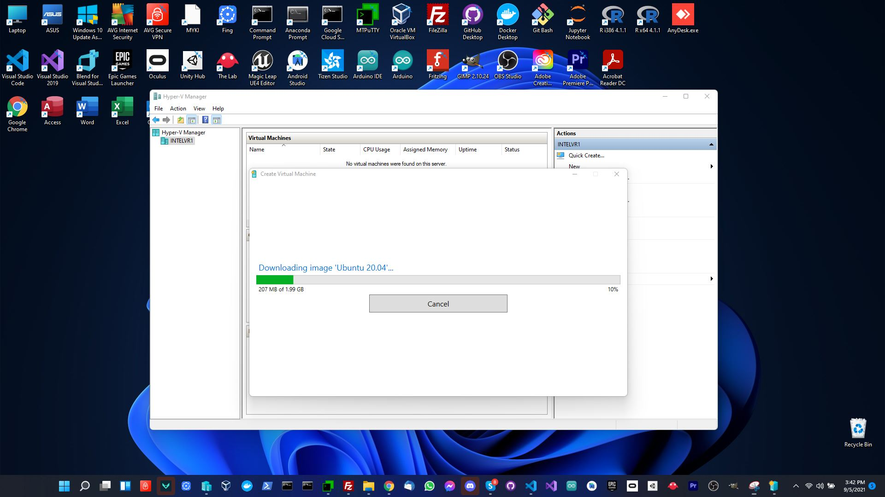
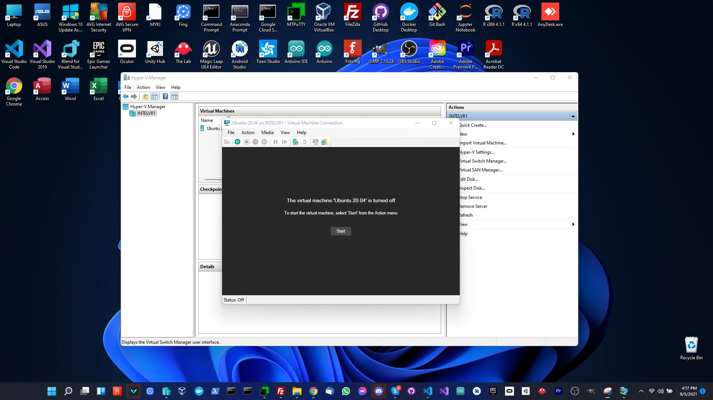
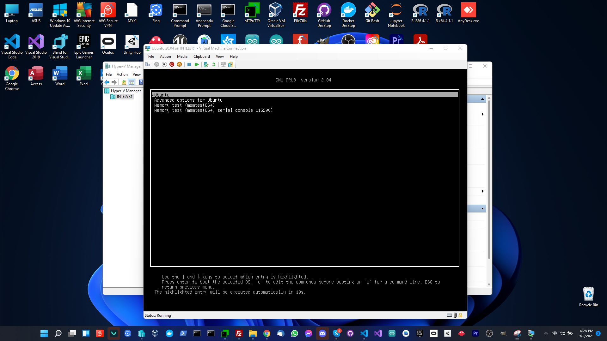
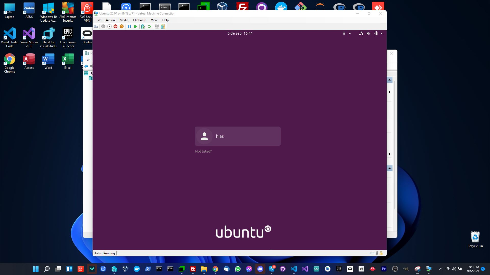
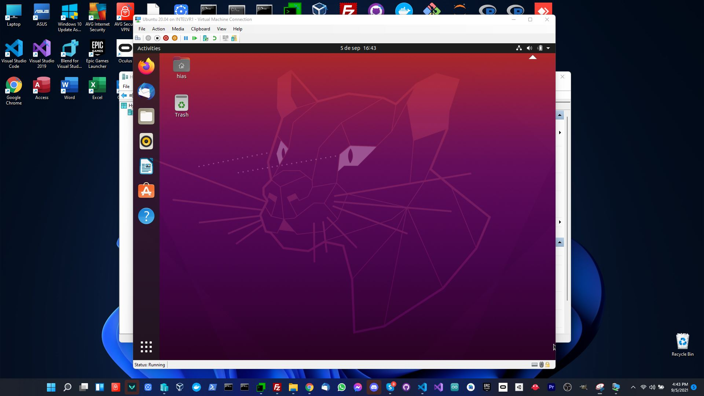

# Hyper-V Installation

This guide will help you set up [Hyper-V](https://docs.microsoft.com/en-us/virtualization/hyper-v-on-windows/quick-start/enable-hyper-v) on Wndows 10 so that you can run HIAS Core on a Virtual Machine.

&nbsp;

# Hyper-V Manager

Open Hyper-V Manager by typing Hyper-V Manager in Windows search.

## Quick Create

Open Hyper-V manager and click on `Action` -> `Quick Create`. Now click on `Ubuntu 20.04` to download Ubuntu 20.04.

Windows will download Ubuntu.

&nbsp;

# Connect

After the virtual machine is created, you can connect to it by clicking on the `Connect` button.

If you encounter an error you may need to disable compression for the virtual hard drive file by navigating to `OS (:c)` -> `Users` -> `Public` -> `Public Documents` -> `Hyper-V` -> `Virtual Hard Disks`, right click `Ubuntu 20.04.vhdx` -> `Properties` -> `Advanced` -> `Compression` and then disable compression.

&nbsp;

# Install Ubuntu

Now complete the Ubuntu installation to continue.

&nbsp;

# Log in to Ubuntu

&nbsp;

# Continue

Now you are ready to continue to the [Ubuntu installation guide](ubuntu.md).

&nbsp;

# Contributing
The Asociación de Investigacion en Inteligencia Artificial Para la Leucemia Peter Moss encourages and welcomes code contributions, bug fixes and enhancements from the Github community.

## Ways to contribute

The following are ways that you can contribute to this project:

- [Bug Report](https://github.com/aiial/hias-core/issues/new?assignees=&labels=&template=bug_report.md&title=)
- [Feature Request](https://github.com/aiial/hias-core/issues/new?assignees=&labels=&template=feature_request.md&title=)
- [Feature Proposal](https://github.com/aiial/hias-core/issues/new?assignees=&labels=&template=feature-proposal.md&title=)
- [Report Vulnerabillity](https://github.com/aiial/hias-core/issues/new?assignees=&labels=&template=report-a-vulnerability.md&title=)

Please read the [CONTRIBUTING](https://github.com/aiial/hias-core/blob/master/CONTRIBUTING.md "CONTRIBUTING") document for a full guide to forking our repositories and submitting your pull requests. You will find information about our code of conduct on the [Code of Conduct page](https://github.com/aiial/hias-core/blob/master/CODE-OF-CONDUCT.md "Code of Conduct page").

You can also join in with, or create, a discussion in our [Github Discussions](https://github.com/aiial/HIASCDI/discussions) area.

## Contributors

All contributors to this project are listed below.

- [Adam Milton-Barker](https://www.leukemiaairesearch.com/association/volunteers/adam-milton-barker "Adam Milton-Barker") - [Asociación de Investigacion en Inteligencia Artificial Para la Leucemia Peter Moss](https://www.leukemiaresearchassociation.ai "Asociación de Investigacion en Inteligencia Artificial Para la Leucemia Peter Moss") President/Founder & Lead Developer, Sabadell, Spain

&nbsp;

# Versioning
We use [SemVer](https://semver.org/) for versioning.

&nbsp;

# License
This project is licensed under the **MIT License** - see the [LICENSE](https://github.com/aiial/hias-core/blob/master/LICENSE "LICENSE") file for details.

&nbsp;

# Bugs/Issues
We use the [repo issues](https://github.com/aiial/hias-core/issues "repo issues") to track bugs and general requests related to using this project. See [CONTRIBUTING](https://github.com/aiial/hias-core/blob/master/CONTRIBUTING.md "CONTRIBUTING") for more info on how to submit bugs, feature requests and proposals.
