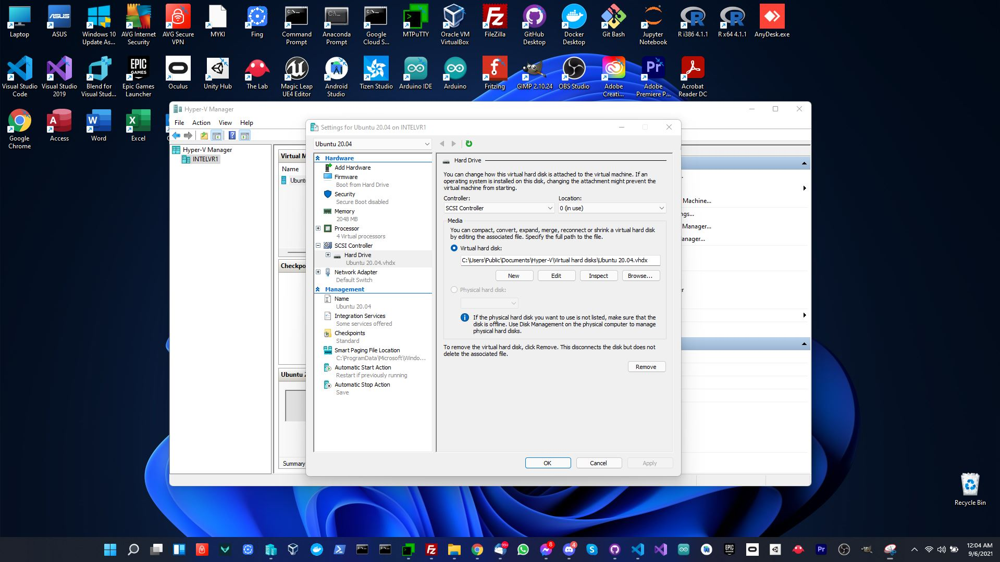
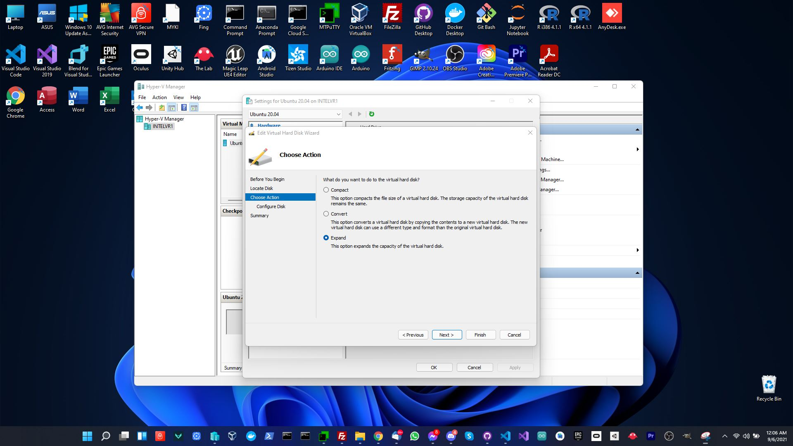
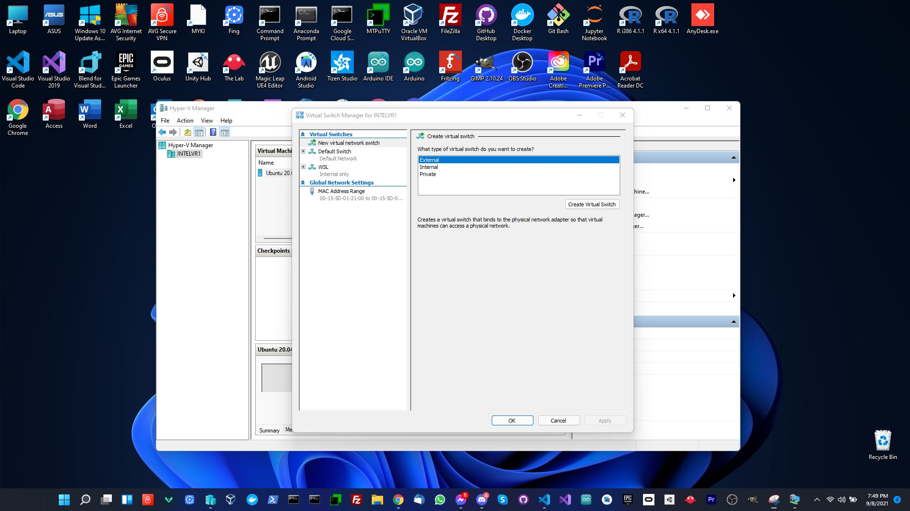
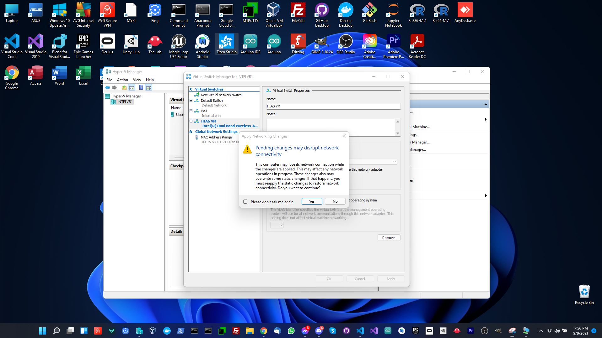

# Installation Guide (Hyper-V)

This guide will help you set up [Hyper-V](https://docs.microsoft.com/en-us/virtualization/hyper-v-on-windows/quick-start/enable-hyper-v) on Wndows 10 so that you can run HIAS Core on a Virtual Machine.

&nbsp;

# Hyper-V Manager


Open Hyper-V Manager by typing Hyper-V Manager in Windows search.

## Quick Create


Open Hyper-V manager and click on `Action` -> `Quick Create`. Now click on `Ubuntu 20.04` to download Ubuntu 20.04.


Windows will download Ubuntu.

&nbsp;

# Connect


After the virtual machine is created, you can connect to it by clicking on the `Connect` button.


If you encounter an error you may need to disable compression for the virtual hard drive file by navigating to `OS (:c)` -> `Users` -> `Public` -> `Public Documents` -> `Hyper-V` -> `Virtual Hard Disks`, right click `Ubuntu 20.04.vhdx` -> `Properties` -> `Advanced` -> `Compression` and then disable compression.

&nbsp;

# Install Ubuntu


Now complete the Ubuntu installation to continue.


&nbsp;

# Log in to Ubuntu


&nbsp;

# Install OpenSSH Server

Use the following command to install OpenSSH Server:

``` bash
sudo apt install openssh-server
```

&nbsp;

# Install net-tools

Use the following command to install net-tools which will allow you to find the IP address of the virtual machine.

``` bash
sudo apt install net-tools
```

Once installed run the following command to find your IP address:

``` bash
ifconfig
```

From the results you are looking for the `inet` address in `eth0`. Using this address you can SSH into the virtual machine.

&nbsp;

# Increase Disk Size


Shutdown the virtual machine and then increase the disk size by right clicking on the VM in the `Virtual Machines` section of Hyper-V Manager and then click on `Settings` -> `SCSI Controller` -> `Hard Drive` -> `Edit`.



Click on `next` to continue, then click `expand` and `next` to continue. Enter the amount you would like to increase the disk size by and click `finish` to finish.

Now log back in to the virtual machine and run the following commands to expand the disk to the new size:

```
sudo apt install cloud-guest-utils
sudo growpart /dev/sda 1
sudo resize2fs /dev/sda1
```

&nbsp;

# Virtual Switch


You need to create a virtual switch to allow it to be accessed from the outside world. To do so, right click on the host and select `Virtual Switch Manager` then click on `Create Virtual Switch`.



Finally choose your network adapter and click `apply`. You could likely have issues with this part however it is a requirement to be able to install HIAS Core on Hyper-V. Unfortunately if you do have issues creating the virtual switch the only solution is trial and error with multiple possible solutions available online, some of which can leave your machine in an usable state.


&nbsp;

# Continue

Now you are ready to continue to the [Ubuntu installation guide](ubuntu.md).

&nbsp;

# Contributing
The Asociación de Investigacion en Inteligencia Artificial Para la Leucemia Peter Moss encourages and welcomes code contributions, bug fixes and enhancements from the Github community.

## Ways to contribute

The following are ways that you can contribute to this project:

- [Bug Report](https://github.com/aiial/hias-core/issues/new?assignees=&labels=&template=bug_report.md&title=)
- [Feature Request](https://github.com/aiial/hias-core/issues/new?assignees=&labels=&template=feature_request.md&title=)
- [Feature Proposal](https://github.com/aiial/hias-core/issues/new?assignees=&labels=&template=feature-proposal.md&title=)
- [Report Vulnerabillity](https://github.com/aiial/hias-core/issues/new?assignees=&labels=&template=report-a-vulnerability.md&title=)

Please read the [CONTRIBUTING](https://github.com/aiial/hias-core/blob/master/CONTRIBUTING.md "CONTRIBUTING") document for a full guide to forking our repositories and submitting your pull requests. You will find information about our code of conduct on the [Code of Conduct page](https://github.com/aiial/hias-core/blob/master/CODE-OF-CONDUCT.md "Code of Conduct page").

You can also join in with, or create, a discussion in our [Github Discussions](https://github.com/aiial/HIASCDI/discussions) area.

## Contributors

All contributors to this project are listed below.

- [Adam Milton-Barker](https://www.leukemiaairesearch.com/association/volunteers/adam-milton-barker "Adam Milton-Barker") - [Asociación de Investigacion en Inteligencia Artificial Para la Leucemia Peter Moss](https://www.leukemiaresearchassociation.ai "Asociación de Investigacion en Inteligencia Artificial Para la Leucemia Peter Moss") President/Founder & Lead Developer, Sabadell, Spain

&nbsp;

# Versioning
We use [SemVer](https://semver.org/) for versioning.

&nbsp;

# License
This project is licensed under the **MIT License** - see the [LICENSE](https://github.com/aiial/hias-core/blob/master/LICENSE "LICENSE") file for details.

&nbsp;

# Bugs/Issues
We use the [repo issues](https://github.com/aiial/hias-core/issues "repo issues") to track bugs and general requests related to using this project. See [CONTRIBUTING](https://github.com/aiial/hias-core/blob/master/CONTRIBUTING.md "CONTRIBUTING") for more info on how to submit bugs, feature requests and proposals.
