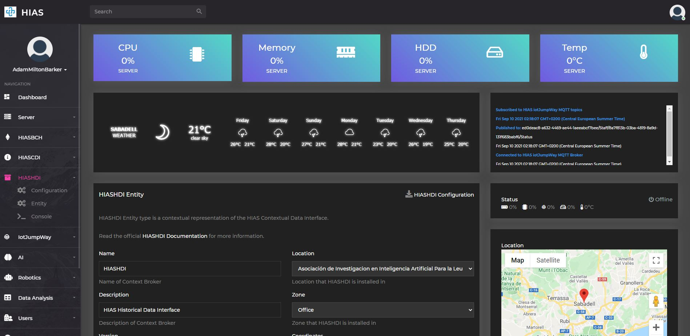
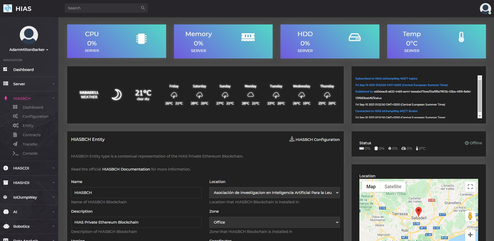

# Installation Guide (Ubuntu)

The following guide will take you through setting up and installing [HIAS Core](https://github.com/aiial/hias-core " HIAS Core").

&nbsp;

# Prerequisites
Before you can continue with this tutorial. Please ensure you have completed all of the following prerequisites.

**__The server installation can be run on an existing installation of Ubuntu, however we recommend using a fresh installation.__**

- **Hyper-V:** If you would like to install your HIAS server on a Virtual Machine, you can use the [Hyper-V](hyperv.md) installation guide before continuing this guide.

- **VirtualBox:** If you would like to install your HIAS server on a Virtual Machine, you can use the [VirtualBox](virtualbox.md) installation guide before continuing this guide.

- **Ubuntu Server 20.04.3 LTS** For this project, the operating system of choice is [Ubuntu Server 20.04.3 LTS](https://ubuntu.com/download/server "Ubuntu Server 20.04.3 LTS"). To get your operating system installed you can follow the [Create a bootable USB stick on Ubuntu](https://tutorials.ubuntu.com/tutorial/tutorial-create-a-usb-stick-on-ubuntu#0 "Create a bootable USB stick on Ubuntu") tutorial.

- **Domain Name:** You need to have your domain already hosted on a hosting account. Edit the DNS zone by adding an A record that points to your public IP, for this you need a static IP or dynamic DNS software that will update the IP in the DNZ Zone each time it changes. This will create a subdomain on your domain that will be used to host your HIAS server.

- **Port Forwarding:** You need to open ports `443`, `80`, `389`, `8883`, `9001` and `15671` on your router pointing to the same ports on your server IP.

&nbsp;

# Remote User
You will create a new user for accessing your server remotely. Use the following commands to set up a new user for your machine. Follow the instructions provided and make sure you use a secure password.

``` bash
sudo adduser YourUsername
```

Now grant sudo priveleges to the user:

``` bash
usermod -aG sudo YourUsername
```

Now open a new terminal and login to your server using the new credentials you set up.

``` bash
ssh YourNewUser@YourServerIP
```

&nbsp;

# SSH Access
Now let's beef up server secuirty. Use the following command to set up your public and private keys. Make sure you carry out this step on your development machine, **not** on your server.

## Tips
- Hit enter to confirm the default file.
- Hit enter twice to skip the password (Optionalm, you can use a password if you like).

``` bash
ssh-keygen
```

You should end up with a screen like this:

``` bash
Generating public/private rsa key pair.
Enter file in which to save the key (/home/YourUser/.ssh/id_rsa):
Enter passphrase (empty for no passphrase):
Enter same passphrase again:
Your identification has been saved in /home/YourUser/.ssh/id_rsa.
Your public key has been saved in /home/YourUser/.ssh/id_rsa.pub.
The key fingerprint is:
SHA256:5BYJMomxATmanduT3/d1CPKaFm+pGEIqpJJ5Z3zXCPM YourNewUser@YourServerIP
The key's randomart image is:
+---[RSA 2048]----+
|.oooo..          |
|o .o.o . .       |
|.+..    +        |
|o o    o .       |
|  .o .+ S . .    |
| =..+o = o.o . . |
|= o =oo.E .o..o .|
|.. + ..o.ooo+. . |
|        .o++.    |
+----[SHA256]-----+
```

Now you are going to copy your key to the server:

``` bash
ssh-copy-id YourNewUser@YourServerIP
```

Once you enter your password for the new user account, your key will be saved on the server. Now try and login to the server again in a new terminal, you should log straight in without having to enter a password.

``` bash
ssh YourNewUser@YourServerIP
```

Finally you will turn off password authentication for login. Use the following command to edit the ssh configuration.

``` bash
sudo nano /etc/ssh/sshd_config
```

Change the following:

```
#PasswordAuthentication yes
```

To:

```
PasswordAuthentication no
```

Then restart ssh:

``` bash
sudo systemctl restart ssh
```

_If you are using ssh to do the above steps keep your current terminal connected._ Open a new terminal, attempt to login to your server. If you can login then the above steps were successful.

The remainder of this tutorial assumes you are logged into your server. From your development machine, connect to your server using ssh or open your local terminal if working directly on your server machine.

``` bash
ssh YourUser@YourServerIP
```

&nbsp;

# Attach Hard-Drive
Now you will attach the hard-drive to your server so that you can use it for the database and file system for your server.

Use the following command to create the **hias** directory which will be the core directory for your HIAS installation.

```
sudo mkdir /hias
```

**IF YOU ARE NOT GOING TO USE AN EXTERNAL HDD YOU CAN SKIP TO THE [Clone the repository](#clone-the-repository) STEP**

First off, make sure you have plugged your hard-drive into the server machine, then use the following commands:

``` bash
sudo fdisk -l
```

For me this gives the following output:

``` bash
Disk /dev/loop1: 93.8 MiB, 98336768 bytes, 192064 sectors
Units: sectors of 1 * 512 = 512 bytes
Sector size (logical/physical): 512 bytes / 512 bytes
I/O size (minimum/optimal): 512 bytes / 512 bytes


Disk /dev/loop2: 93.9 MiB, 98484224 bytes, 192352 sectors
Units: sectors of 1 * 512 = 512 bytes
Sector size (logical/physical): 512 bytes / 512 bytes
I/O size (minimum/optimal): 512 bytes / 512 bytes


Disk /dev/mmcblk0: 58.2 GiB, 62537072640 bytes, 122142720 sectors
Units: sectors of 1 * 512 = 512 bytes
Sector size (logical/physical): 512 bytes / 512 bytes
I/O size (minimum/optimal): 512 bytes / 512 bytes
Disklabel type: gpt
Disk identifier: 077E0353-99FE-4490-AEDA-040F34765A69

Device           Start       End   Sectors  Size Type
/dev/mmcblk0p1    2048   1050623   1048576  512M EFI System
/dev/mmcblk0p2 1050624   3147775   2097152    1G Linux filesystem
/dev/mmcblk0p3 3147776 122140671 118992896 56.8G Linux filesystem


Disk /dev/mmcblk0boot1: 4 MiB, 4194304 bytes, 8192 sectors
Units: sectors of 1 * 512 = 512 bytes
Sector size (logical/physical): 512 bytes / 512 bytes
I/O size (minimum/optimal): 512 bytes / 512 bytes


Disk /dev/mmcblk0boot0: 4 MiB, 4194304 bytes, 8192 sectors
Units: sectors of 1 * 512 = 512 bytes
Sector size (logical/physical): 512 bytes / 512 bytes
I/O size (minimum/optimal): 512 bytes / 512 bytes


Disk /dev/mapper/dm_crypt-0: 56.8 GiB, 60922265600 bytes, 118988800 sectors
Units: sectors of 1 * 512 = 512 bytes
Sector size (logical/physical): 512 bytes / 512 bytes
I/O size (minimum/optimal): 512 bytes / 512 bytes


Disk /dev/mapper/ubuntu--vg-ubuntu--lv: 4 GiB, 4294967296 bytes, 8388608 sectors
Units: sectors of 1 * 512 = 512 bytes
Sector size (logical/physical): 512 bytes / 512 bytes
I/O size (minimum/optimal): 512 bytes / 512 bytes


Disk /dev/sda: 1.4 TiB, 1500267937792 bytes, 2930210816 sectors
Units: sectors of 1 * 512 = 512 bytes
Sector size (logical/physical): 512 bytes / 512 bytes
I/O size (minimum/optimal): 512 bytes / 512 bytes
Disklabel type: gpt
Disk identifier: 1DEAF6E4-963A-42E9-BFB9-00B3CD018497

Device     Start        End    Sectors  Size Type
/dev/sda1   2048 2930208767 2930206720  1.4T Microsoft basic data
```

Here you can see that my 1.5TB hard-drive partition is called **/dev/sda1**. Now you need to find the UUID of the partition:

``` bash
sudo blkid
```

Should give you a similar output to:

``` bash
/dev/mapper/dm_crypt-0: UUID="OLgaQg-GIKS-H7zM-U8iY-z3XQ-3JBS-0QWnk1" TYPE="LVM2_member"
/dev/mapper/ubuntu--vg-ubuntu--lv: UUID="8e379584-4ce3-4bf2-a81f-2cc5cfb919e6" TYPE="ext4"
/dev/mmcblk0p1: UUID="29BD-DE91" TYPE="vfat" PARTUUID="1555a088-82fb-4a55-af71-518011e32c8d"
/dev/mmcblk0p2: UUID="8568e49f-2bc9-4f00-ab65-40a8fe073662" TYPE="ext4" PARTUUID="bcd6fc23-5ce5-4057-bab2-1fced3066285"
/dev/mmcblk0p3: UUID="05355535-ad22-4979-98fd-13e585639c4e" TYPE="crypto_LUKS" PARTUUID="835c6449-5ad8-4993-84a1-f2f25d93eb71"
/dev/loop1: TYPE="squashfs"
/dev/loop2: TYPE="squashfs"
/dev/mmcblk0: PTUUID="077e0353-99fe-4490-aeda-040f34765a69" PTTYPE="gpt"
/dev/sda1: LABEL="Data" UUID="B480DB4580EB0CD4" TYPE="ntfs" PARTLABEL="Elements" PARTUUID="07a78460-f599-4e31-a8ce-0b5b8b03811f"
```

If you look for my partition name, **/dev/sda1**, you will find the UUID. In this case: **B470EB4570EB0CC4**.

Now create a user group and then add the user you want to belong to this group:

``` bash
sudo groupadd hias
sudo usermod -aG YourUsername
```

Now you need to edit **/etc/fstab** and add the rule to mount your hard-drive.

``` bash
sudo nano /etc/fstab
```

And add the following line, make sure your use your own UUID.

```
UUID=YourUUID /hias auto nosuid,nodev,nofail,x-gvfs-show 0 0
```

&nbsp;

# oneAPI Installation
First you will install Intel® OneAPI basekit:

``` bash
wget https://apt.repos.intel.com/intel-gpg-keys/GPG-PUB-KEY-INTEL-SW-PRODUCTS.PUB -O - | sudo apt-key add -
echo "deb https://apt.repos.intel.com/oneapi all main" | sudo tee /etc/apt/sources.list.d/oneAPI.list
sudo apt update
sudo apt install intel-basekit
sudo apt -y install cmake pkg-config build-essential
echo 'source /opt/intel/oneapi/setvars.sh' >> ~/.bashrc
source ~/.bashrc
```

Now you will install Intel® Opimization for Tensorflow from the OneAPI AI Analytics Toolkit:

``` bash
conda create -n hias -c intel intel-aikit-tensorflow
```

Once the installation is complete, activate the Conda environment by running the following command:

``` bash
conda activate hias
```

&nbsp;

# Configuration
You need to add your configuration to [scripts/install.config](https://github.com/aiial/hias-core/blob/master/scripts/install.config). This configuration file will be used throughout the installation process. Update the document with all the values that have comments in below.

```
domain='Your domain name (without the protocol)'
ip='Your server IP address'
mysqlrootpass='A password for the root MySQL account'
mysqldbname='A name for the MySQL database'
mysqldbuser='A name for the MySQL user'
mysqldbpass='A password for the MySQL user'
mysqlphpmyuser='A name for the phpMyadmin user'
mysqlphpmypass='A password for the phpMyadmin user'
mongodbname='A name for the Mongo database'
mongodbadminuser='A name for the Mongo admin user'
mongodbadminpass='A password for the Mongo admin user'
mongodbuser='A name for the Mongo user'
mongodbpass='A password for the Mongo user'
ldapadminpass='A password for the LDAP admin user'
ldapdc1='Your subdomain'
ldapdc2='Your domain name'
ldapdc3='Your domain extension'
hiasbchuser=''
hiasbchpass='A password for the core HIAS Blockchain user'
hiasbchchain='A long random integer'
hiasbchpermissions=''
hiasbchpermissionst=''
hiasbchintegrity=''
hiasbchintegrityt=''
sambaorguser='Samba organization user'
sambaorgpass='Samba organization user password'
sambadevuser='Samba developer user'
sambadevpass='Samba developer user password'
sambapersonaluser='Samba personal user'
sambaperonalpass='Samba personal user password'
enckey='32 character encryption key (256 bit)'
```

&nbsp;

# Clone the repository
Clone the [HIAS Core](https://github.com/aiial/hias-core "HIAS Core") repository from the [Peter Moss MedTech Research Project](https://github.com/aiial "Peter Moss MedTech Research Project") Github Organization.

To clone the repository and install this project, make sure you have Git installed. Now navigate to the home directory on your device using terminal/commandline, and then use the following command.

``` bash
git clone https://github.com/aiial/hias-core.git
```

Once you have used the command above you will see a directory called **HIAS** in your home directory.

``` bash
  ls
```

Using the ls command in your home directory should show you the following.

``` bash
  hias-core
```

The HIAS Core directory is your project root directory for this tutorial.

&nbsp;

# Installation

 Ensuring that your environment is activated and you are in the project root, you can run the following command to install HIAS Core:


``` bash
sh scripts/install.sh
```

## UFW Firewall
First the UFW firewall will be installed. Follow any instructions provided.

## Fail2Ban
Next Fail2Ban will be installed. Follow any instructions provided.

## Group and Certificates Directory
Next a `hiascore` group will be created and a directory to store the server certificates will be created. You do not need to carry out any additional steps.

## Samba
Next Samba will be installed.

- When you see `Press enter to see a dump of your service definitions`, press enter.
- When you see `Creatin Samba organization user` and `New SMB password:`, enter the value you added to `install.config` for `sambaorgpass`.
- When you see `Creatin Samba developers user` and `New SMB password:`, enter the value you added to `install.config` for `sambadevpass`.
- When you see `Creatin Samba personal user` and `New SMB password:`, enter the value you added to `install.config` for `sambaperonalpass`.

## Nginx
Next the Nginx server will be installed and configured.

You can check the Nginx logs by using the following command:

``` bash
cat /var/log/nginx/error.log
```

You can edit the configuration for the NGINX server using the following command:

``` bash
sudo nano /etc/nginx/sites-available/default
```

You can reload the NGINX service using the following command:

``` bash
sudo systemctl reload nginx
```

## Apache Utils
Next Apache Utils will be installed. You do not need to carry out any additional steps.

## Certbot
Next the Let's Encrypt certificate will be installed.

- When asked, enter your preferred email address.
- When asked, agree to the terms of service.
- When asked, choose whether you are willing to share your email address.
- When asked, select the domain name you would like to activate. This should match the value for `domain` in `install.config`.
- Select 2 when asked to redirect insecure requests to HTTPS (443).
- When the certbot cronjob file opens enter `--post-hook "systemctl restart nginx && /home/YourUser/HIAS-Core/scripts/certs.sh"` after `certbot -q renew` replacing `YourUser` with your user.

If the installation was carried out correctly you should now be able to access your website, but only using the secure protocol, 443, ie: https. If you visit your site you should now see the default Nginx page.

## PHP
Next the PHP server will be installed and configured.

## MySQL
Next the MySQL server will be installed and configured.

**Make sure you use the credentials from your config file.**

**Hints:**

- Do not set up VALIDATE PASSWORD plugin
- Use the value you set for `mysqlrootpass` in `install.config` for the root password.
- Remove anonymous users
- Root restricted to local host only if you are not logged in remotely.
- Remove test database

## phpMyAdmin
Next phpMyAdmin will be installed and configured.

- When the GUI opens press `tab` and `enter`.
- The second time the GUI opens hit `enter` on `yes`.
- Use the value you set for `mysqlphpmypass` in `install.config` for the password.

## LDAP
Next the LDAP server will be installed and configured.

- Use the value you set for `ldapadminpass` in `install.config` for the password.
- Do not omit OpenLDAP server configuration.
- Use `domain` value from `install.config` for your DNS domain name.
- Use `ldapdc2` value from `install.config` for your organization name.
- Use `ldapadminpass` value from `install.config` for your admin password.
- If asked, use MDB as database backend.
- Do not remove database when slapd is purged.
- Do move old database.

## MongoDB
Next the MongoDB server will be installed and configured.
When the mongo client opens during installation, you need to follow these steps:

- Enter `db.enableFreeMonitoring()` and `enter` note down the url your are provided.

- Create an admin database and user, replacing **YourAdminUser** and **YourAdminUserPass** with the credentials from your config file.

To do this use the code below, replacing the values with your desired values:

``` bash
use admin
db.createUser(
    {
        user: "YourAdminUser",
        pwd: "YourAdminUserPass",
        roles: [ "root" ]
    }
 )
```

You should see:

```
Successfully added user: { "user" : "username", "roles" : [ "root" ] }

```
- Now create a database and user, change **YourMongoDatabaseName**, **YourMongoDatabaseUser** and **YourMongoDatabasePass** to the credentials from your config file.

```  bash
use YourMongoDatabaseName
db.createUser(
    {
        user: "YourMongoDatabaseUser",
        pwd: "YourMongoDatabasePass",
        roles: [
            { role: "readWrite", db: "YourMongoDatabaseName" }
        ]
    }
)
```

Press `ctrl` + `c` to exit the mongo client.

## SSL Security
Next the SSL security will be increased by updating the allowed protocols. If everything went ok you will see:

``` bash
nginx: the configuration file /etc/nginx/nginx.conf syntax is ok
nginx: configuration file /etc/nginx/nginx.conf test is successful
```

If you visit Qualys SSL Labs you should see your server has an A+ grade

## MQTT Broker
Next the iotJumpWay MQTT Broker will be installed and configured.

## AMQP Broker
Next the iotJumpWay AMQP Broker will be installed and configured.

## HIASBCH
Next the HIAS Blockchain will be installed and configured.

- You will be asked for a password, use the value you set for `hiasbchpass` in `install.config` for the password.
- You will be provided the public address for your key, add this address to `hiasbchuser` in `install.config`.
- You will be provided with the path to your secret key file, note this down in a safe place.
- When prompted enter your public address.

During the installation the geth console will open, you need to follow the [Deploy Smart Contracts With Geth](#deploy-smart-contracts-with-geth) instructions below. Please make sure to follow the instructions provided from the installation script carefully.

### Deploy Smart Contracts With Geth

Start your miner:

```
miner.start(1)
```

At this point you will be inside Geth console and your blockchain will be online. You will need to wait for your DAG to be generated. You will see logs such as **Generating DAG in progress               epoch=0 percentage=42 elapsed=3m31.734s**, when the percentage gets to 100% of epoch 1, your DAG is generated.

To deploy your smart contracts you will need the contents of:

- **/hias/hiasbch/contracts/build/permissions.abi**
- **/hias/hiasbch/contracts/build/permissions.bin**
- **/hias/hiasbch/contracts/build/integrity.abi**
- **/hias/hiasbch/contracts/build/integrity.bin**

First deploy the HIASBCH Permissions Smart Contract.

- Replace `ContentsOfPermissions.abi` with the contents of `/hias/hiasbch/contracts/build/permissions.abi`
- Replace `ContentsOfPermissions.bin` with the contents of `/hias/hiasbch/contracts/build/permissions.bin`. Ensure you leave the trailing `0x`.
- Replace `YourHiasbchAddress` with the address provided to you when you created your core blockchain account.
- Replace `YourHiasbchPassword` with the your core blockchain account password.

```
  var pabi = ContentsOfPermissions.abi
  var pbin = "0xContentsOfPermissions.bin"
  var paddress = "YourHiasbchAddress"
  var ppass = "YourHiasbchPassword"
  personal.unlockAccount(paddress, ppass, 1200)
  var newContract = eth.contract(pabi)
  var deploy = {from:paddress, data:pbin, gas: 5000000 }
  var contractInstance = newContract.new(deploy, function(e, contract){
    if(!e) {
      if(!contract.address){
        console.log("Contract deployment transaction hash: " + contract.transactionHash);
      } else {
        console.log("Contract address: " + contract.address);
      }
    } else {
      console.log(e);
    }
  })
```

Once you have changed the values specified above, paste it into Geth console and hit enter. Keep an eye out for `Contract deployment transaction hash:` and `Contract address:`, when you see them copy them and add them to the configuration file. The value for `hiasbchpermissions` should hold the contract address and `hiasbchpermissionst` contract deployment transaction hash.

Now you need to deploy the HIASBCH Data Integrity Smart Contract.

- Replace `ContentsOfIntegrity.abi` with the contents of `/hias/hiasbch/contracts/build/integrity.abi`
- Replace `ContentsOfIntegrity.bin` with the contents of `/hias/hiasbch/contracts/build/integrity.bin`. Ensure you leave the trailing `0x`.
- Replace `YourHiasbchAddress` with the address provided to you when you created your core blockchain account.
- Replace `YourHiasbchPassword` with the your core blockchain account password.

```
  var iabi = ContentsOfIntegrity.abi
  var ibin = "ContentsOfIntegrity.bin"
  var iaddress = "YourHiasbchAddress"
  var ipass = "YourHiasbchPassword"
  personal.unlockAccount(iaddress, ipass, 1200)
  var newContract = eth.contract(iabi)
  var deploy = {from:iaddress, data:ibin, gas: 5000000 }
  var contractInstance = newContract.new(deploy, function(e, contract){
    if(!e) {
      if(!contract.address){
        console.log("Contract deployment transaction hash: " + contract.transactionHash);
      } else {
        console.log("Contract address: " + contract.address);
      }
    } else {
      console.log(e);
    }
  })
```

Keep an eye out for `Contract deployment transaction hash:` and `Contract address:`, when you see them copy them and add them to the configuration file. The value for `hiasbchintegrity` should hold the contract address and `hiasbchintegrityt` contract deployment transaction hash.

Your Smart Contracts are now deployed and you can stop mining and exit geth:

```
miner.stop()
exit
```

You now need to log directly into your HIAS Core server, start HIASBCH and start mining. Ensuring you are in the `HIAS-Core` directory, use the following command to start HIASBCH:

``` bash
sh components/hiasbch/scripts/startup.sh
```

You will now be in Geth console, use the following command to start your HIASBCH miner for the final time replacing `NumberOfThreads` with the amount of threads you want to use:

``` bash
miner.start(NumberOfThreads)
```

This needs to be running at all times which is why you logged directly into your HIAS Core device. If you do not have your Blockchain running, you will not be able to log in to the HIAS UI and other core components will not be able to function. Now you can go back to your remote terminal to continue the HIAS Core installation.

## HIASCDI
Now HIASCDI will be installed.

## HIASHDI
Now HIASHDI will be installed.

&nbsp;

# Finalize the Installation
Now you need to finalize the installation by visiting the HIAS Core UI and completing the installation form. You can access the HIASCORE UI by visting your subdomain, ie: _http://hias.yourdomain.com_.

## RECAPTCHA
You need a Google reCAPTCHA V2 (I'm not a robot) API key to use the HIAS UI. You can get one for free at [https://www.google.com/recaptcha/admin/create](https://www.google.com/recaptcha/admin/create).

## IPINFO
You need an IPINFO API key to use the HIAS UI. You can get one for free at [https://ipinfo.io/](https://ipinfo.io/).

## Google Maps
You need a Google Maps API key to use the HIAS UI. You can get one for free at [https://developers.google.com/maps/documentation/javascript/get-api-key](https://developers.google.com/maps/documentation/javascript/get-api-key).

## LDAP Check
Before you continue make sure that your LDAP server is running correctly. In terminal enter the following command:

```
ldapwhoami -H ldap://YourSubdomain.YourDomain.YourExtension -x -ZZ
```

If LDAP is working correctly using SSL you should see `anoymous`. If you do not see this, you will need to configure your LDAP server.

**Make sure HIASBCH is running and you have a minor running.**

Once you have completed the installation finalization you will be provided with the credentials you need to log into HIAS UI and configure HIASBCH, HIASCDI and HIASHDI.

&nbsp;

# HIASCDI Configuration
HIASCDI needs to be running for you to be able to login. You need to edit the `components/hiascdi/configuration/credentials.json` file manually and add your HIASCDI credentials.

- iotJumpWay
    - `host` = `domain` value from `install.config`
    - `location` = HIAS Location
    - `zone` = HIAS Zone
    - `un` = HIASCDI User
    - `up` = HIASCDI Password
    - `entity` = HIASCDI Public Key
- server
    - `host` = `domain` value from `install.config`
    - `ip` = `ip` value from `install.config`
- hiascdi
    - `name` = HIASCDI
- mongodb
    - `db` = `mongodbname` value from `install.config`
    - `un` = `mongodbuser` value from `install.config`
    - `up` = `mongodbpass` value from `install.config`

&nbsp;

``` json
{
   "iotJumpWay":{
      "host":"",
      "port":0,
      "location":"",
      "zone":"",
      "entity":"",
      "name":"",
      "un":"",
      "up":"",
      "ipinfo":""
   },
   "server":{
      "host":"",
      "ip":"",
      "port":3524
   },
   "hiascdi":{
      "name":"",
      "version":"v1",
      "endpoint":"hiascdi/v1"
   },
   "mongodb":{
      "host":"localhost",
      "db":"",
      "un":"",
      "up":""
   }
}
```
&nbsp;

# HIASCDI Service

Now you need to create and start the HIASCDI service. You can do this by running the following command:

``` bash
sh components/hiascdi/scripts/service.sh
```

To start the service run the following command:

``` bash
sudo systemctl start HIASCDI.service
```

And finally to check the service status run the following command:

``` bash
sudo systemctl status HIASCDI.service
```
You should see similar to the following:

``` bash
● HIASCDI.service - HIASCDI service
     Loaded: loaded (/lib/systemd/system/HIASCDI.service; enabled; vendor preset: enabled)
     Active: active (running) since Thu 2021-09-09 23:38:58 UTC; 2s ago
   Main PID: 151939 (run.sh)
      Tasks: 2 (limit: 28158)
     Memory: 63.5M
     CGroup: /system.slice/HIASCDI.service
             ├─151939 /bin/bash /home/YourUser/HIAS-Core/components/hiascdi/scripts/run.sh
             └─151940 /home/YourUser/.conda/envs/YourUser/bin/python3 /home/YourUser/HIAS-Core/components/hiashdi/hiashdi.py
```

&nbsp;

# HIASHDI Configuration


You can now login to the HIAS UI to download the configuration file for HIASHDI.  In HIAS UI navigate to `HIASHDI` -> `Entity` and click on the `HIASHDI Configuration` button. Once the file explorer opens, navigate to `components/hiashdi/configuration/` and save the file as `crendentials.json`.

&nbsp;

# HIASHDI Service

Now you need to create and start the HIASHDI service. You can do this by running the following command:

``` bash
sh components/hiashdi/scripts/service.sh
```

To start the service run the following command:

``` bash
sudo systemctl start HIASHDI.service
```

And finally to check the service status run the following command:

``` bash
sudo systemctl status HIASHDI.service
```
You should see similar to the following:

``` bash
● HIASHDI.service - HIASHDI service
     Loaded: loaded (/lib/systemd/system/HIASHDI.service; enabled; vendor preset: enabled)
     Active: active (running) since Fri 2021-09-10 00:49:18 UTC; 763ms ago
   Main PID: 161249 (run.sh)
      Tasks: 2 (limit: 28158)
     Memory: 19.1M
     CGroup: /system.slice/HIASHDI.service
             ├─161249 /bin/bash /home/hias/HIAS-Core/components/hiashdi/scripts/run.sh
             └─161250 /home/hias/.conda/envs/hias/bin/python3 /home/hias/HIAS-Core/components/hiashdi/hiashdi.py
```

&nbsp;

# HIASBCH Configuration


In HIAS UI navigate to `HIASBCH` -> `Entity` and click on the `HIASBCH Configuration` button. Once the file explorer opens, navigate to `components/hiasbch/configuration/` and save the file as `crendentials.json`.

You also need to edit the `components/hiasbch/configuration/config.json` file and add `HIASBCH Private Key` to `agent` -> `proxy` -> `up`.

&nbsp;

# HIASBCH Service

Now you need to create and start the HIASBCH service. You can do this by running the following command:

``` bash
sh components/hiasbch/scripts/service.sh
```

To start the service run the following command:

``` bash
sudo systemctl start HIASBCH.service
```

And finally to check the service status run the following command:

``` bash
sudo systemctl status HIASBCH.service
```
You should see similar to the following:

``` bash
● HIASBCH.service - HIASBCH service
     Loaded: loaded (/lib/systemd/system/HIASBCH.service; enabled; vendor preset: enabled)
     Active: active (running) since Fri 2021-09-10 00:52:21 UTC; 2s ago
   Main PID: 162029 (component.sh)
      Tasks: 2 (limit: 28158)
     Memory: 14.5M
     CGroup: /system.slice/HIASBCH.service
             ├─162029 /bin/bash /home/hias/HIAS-Core/components/hiasbch/scripts/component.sh
             └─162030 /home/hias/.conda/envs/hias/bin/python3 /home/hias/HIAS-Core/components/hiasbch/hiasbch.py
```

&nbsp;

# Continue

Congratulations! Your HIAS Core installation is complete and you are now ready to continue to the [Ubuntu usage guide](../usage/ubuntu.md).

&nbsp;

# Contributing
The Asociación de Investigacion en Inteligencia Artificial Para la Leucemia Peter Moss encourages and welcomes code contributions, bug fixes and enhancements from the Github community.

## Ways to contribute

The following are ways that you can contribute to this project:

- [Bug Report](https://github.com/aiial/hias-core/issues/new?assignees=&labels=&template=bug_report.md&title=)
- [Feature Request](https://github.com/aiial/hias-core/issues/new?assignees=&labels=&template=feature_request.md&title=)
- [Feature Proposal](https://github.com/aiial/hias-core/issues/new?assignees=&labels=&template=feature-proposal.md&title=)
- [Report Vulnerabillity](https://github.com/aiial/hias-core/issues/new?assignees=&labels=&template=report-a-vulnerability.md&title=)

Please read the [CONTRIBUTING](https://github.com/aiial/hias-core/blob/master/CONTRIBUTING.md "CONTRIBUTING") document for a full guide to forking our repositories and submitting your pull requests. You will find information about our code of conduct on the [Code of Conduct page](https://github.com/aiial/hias-core/blob/master/CODE-OF-CONDUCT.md "Code of Conduct page").

You can also join in with, or create, a discussion in our [Github Discussions](https://github.com/aiial/HIASCDI/discussions) area.

## Contributors

All contributors to this project are listed below.

- [Adam Milton-Barker](https://www.leukemiaairesearch.com/association/volunteers/adam-milton-barker "Adam Milton-Barker") - [Asociación de Investigacion en Inteligencia Artificial Para la Leucemia Peter Moss](https://www.leukemiaresearchassociation.ai "Asociación de Investigacion en Inteligencia Artificial Para la Leucemia Peter Moss") President/Founder & Lead Developer, Sabadell, Spain

&nbsp;

# Versioning
We use [SemVer](https://semver.org/) for versioning.

&nbsp;

# License
This project is licensed under the **MIT License** - see the [LICENSE](https://github.com/aiial/hias-core/blob/master/LICENSE "LICENSE") file for details.

&nbsp;

# Bugs/Issues
We use the [repo issues](https://github.com/aiial/hias-core/issues "repo issues") to track bugs and general requests related to using this project. See [CONTRIBUTING](https://github.com/aiial/hias-core/blob/master/CONTRIBUTING.md "CONTRIBUTING") for more info on how to submit bugs, feature requests and proposals.
