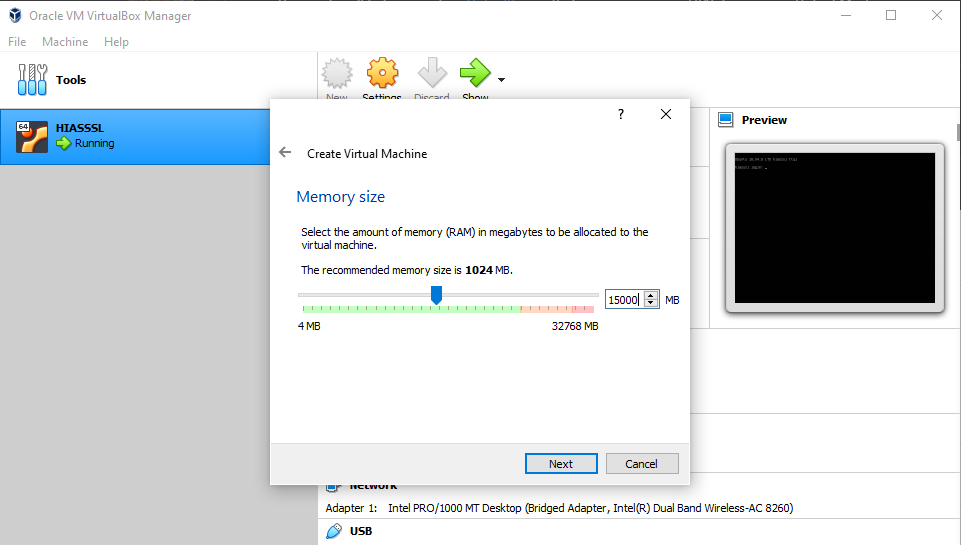
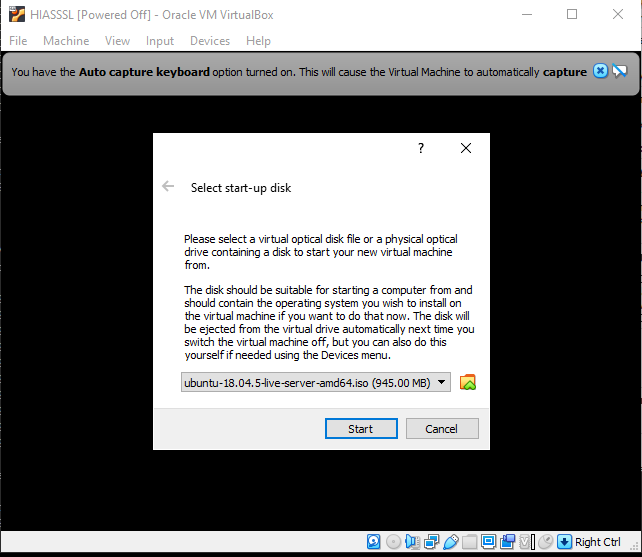

# VirtualBox Installation

This guide will help you set up [VirtualBox](https://www.virtualbox.org/) so that you can run HIAS Core on a Virtual Machine.

# Download
- Before you begin you should [download VirtualBox](https://www.virtualbox.org/wiki/Downloads).

- You will also need to download [Ubuntu Server 20.04 LTS 64 bit](https://releases.ubuntu.com/20.04/).

# Setup
This guide will help you set up VirtualBox for the HIAS Server.

## New VM

Open VirtualBox and click on the **New** button, name your VM and chose Linux and Ubuntu 64 bit in the options.

## New VM Memory

Next chose your memory.

## New VM Disk

Continue through with the default options until you come to **File location and size**. At this point you need to select at least 20GB for your virtual hard disk, then click create.

## New VM Network

Click **Settings** and select **Network**, from here you should select **Bridged Adapter**.

## New VM Image

Click start and you will see the above Window. Choose your Ubuntu iso and click start. From here you will be taken through the Ubuntu install process. Once your VM has started, you can connect to it via SHH for easy management.

&nbsp;

# Continue

Now you are ready to continue to the [Ubuntu installation guide](ubuntu.md).

&nbsp;

# Contributing
The Asociación de Investigacion en Inteligencia Artificial Para la Leucemia Peter Moss encourages and welcomes code contributions, bug fixes and enhancements from the Github community.

## Ways to contribute

The following are ways that you can contribute to this project:

- [Bug Report](https://github.com/aiial/hias-core/issues/new?assignees=&labels=&template=bug_report.md&title=)
- [Feature Request](https://github.com/aiial/hias-core/issues/new?assignees=&labels=&template=feature_request.md&title=)
- [Feature Proposal](https://github.com/aiial/hias-core/issues/new?assignees=&labels=&template=feature-proposal.md&title=)
- [Report Vulnerabillity](https://github.com/aiial/hias-core/issues/new?assignees=&labels=&template=report-a-vulnerability.md&title=)

Please read the [CONTRIBUTING](https://github.com/aiial/hias-core/blob/master/CONTRIBUTING.md "CONTRIBUTING") document for a full guide to forking our repositories and submitting your pull requests. You will find information about our code of conduct on the [Code of Conduct page](https://github.com/aiial/hias-core/blob/master/CODE-OF-CONDUCT.md "Code of Conduct page").

You can also join in with, or create, a discussion in our [Github Discussions](https://github.com/aiial/HIASCDI/discussions) area.

## Contributors

All contributors to this project are listed below.

- [Adam Milton-Barker](https://www.leukemiaairesearch.com/association/volunteers/adam-milton-barker "Adam Milton-Barker") - [Asociación de Investigacion en Inteligencia Artificial Para la Leucemia Peter Moss](https://www.leukemiaresearchassociation.ai "Asociación de Investigacion en Inteligencia Artificial Para la Leucemia Peter Moss") President/Founder & Lead Developer, Sabadell, Spain

&nbsp;

# Versioning
We use [SemVer](https://semver.org/) for versioning.

&nbsp;

# License
This project is licensed under the **MIT License** - see the [LICENSE](https://github.com/aiial/hias-core/blob/master/LICENSE "LICENSE") file for details.

&nbsp;

# Bugs/Issues
We use the [repo issues](https://github.com/aiial/hias-core/issues "repo issues") to track bugs and general requests related to using this project. See [CONTRIBUTING](https://github.com/aiial/hias-core/blob/master/CONTRIBUTING.md "CONTRIBUTING") for more info on how to submit bugs, feature requests and proposals.
