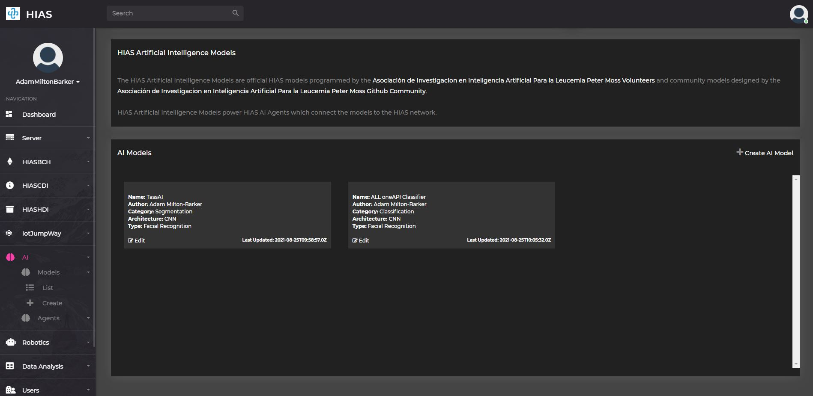
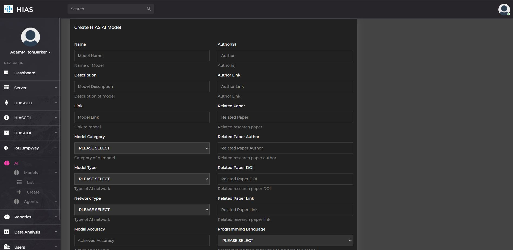
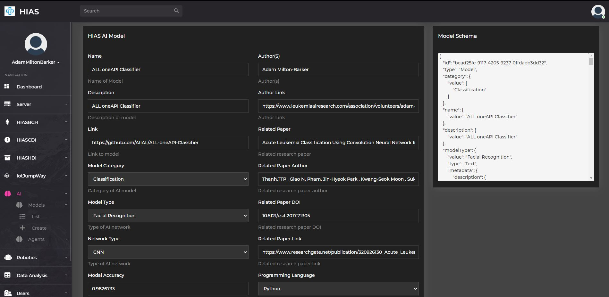
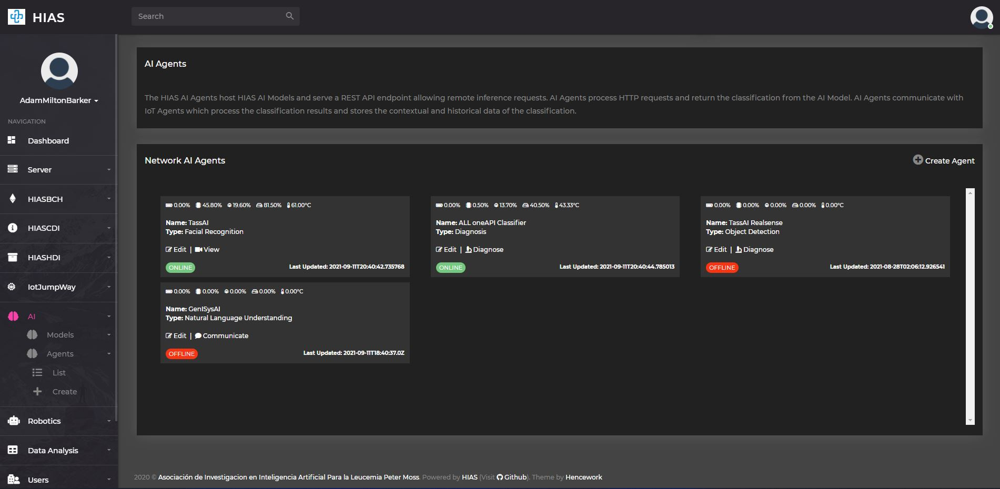
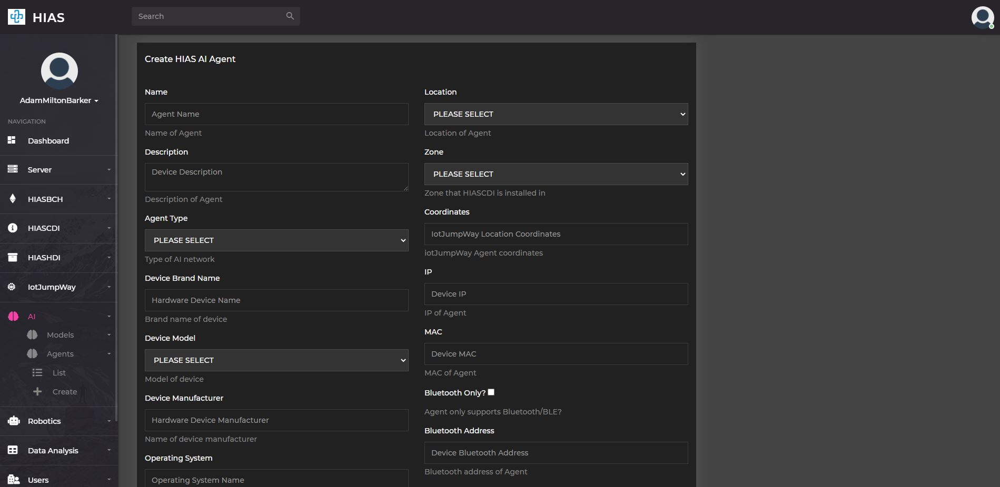
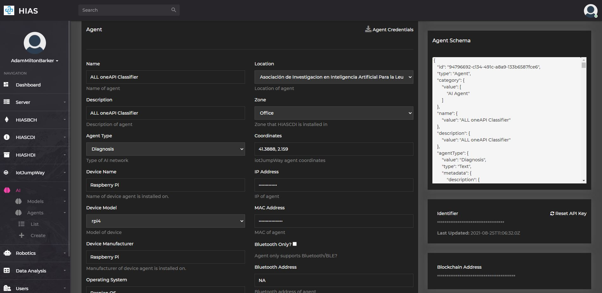
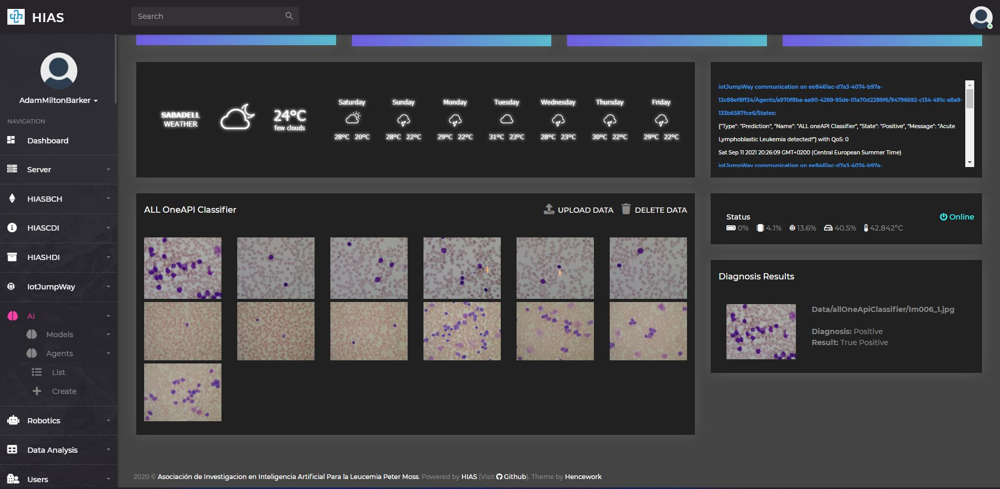
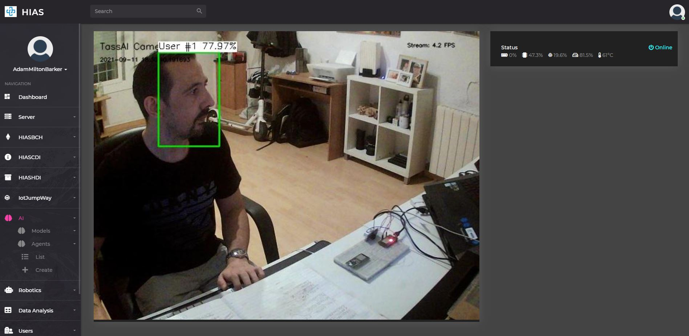
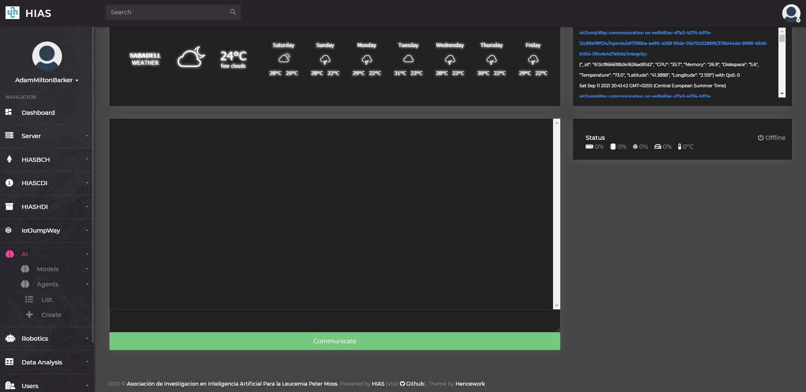

# AI Usage Guide

The following guide will introduce the [HIAS Core](https://github.com/aiial/hias-core " HIAS Core") AI management features.

&nbsp;

# AI Models

The HIAS AI models are a range of open-source models developed by our volunteers and community. Each model has a JSON representation stored in HIASCDI that holds the contextual data for the models. The goal is to create a library of models that can be used by AI users to create AI-enabled devices and applications.

The JSON representations hold information such as the model's name, description, and the model's author; the model's type (e.g. classification, regression, etc.), and the model's input and output data; the model's hyperparameters and attribution for research papers followed/datasets used.

## Create AI Model

To create an AI model, click on the `Create Model` button on the AI models page. This will take you to the create AI model page where you can create a new AI model by filling out the form.

## Edit AI Model

To edit an AI model, click on the `Edit` button on the AI model page. This will take you to the edit AI model page where you can edit the AI model by filling out the form.

&nbsp;

# AI Agents

AI Agents are the physical devies/applications that home the AI Models. The AI Agents are used to train, test and expose the AI Models via a REST API endpoint making themselves accessible to the HIAS Network. AI Agents expose the models locally and are made accessible from the internet securely using a reverse proxy.

From the AI Agents page you can access all AI Agents that are set up on your HIAS network. You can access an interface that allows you to interact with the agent. AI Agents currently supported are Diagnostics, Facial Recognition and Natual Language Understanding.

## Create AI Agent

To create an AI Agent, click on the `Create Agent` button on the AI agents page. This will take you to the create AI agent page where you can create a new AI agent by filling out the form. You need to already have created an AI Model before you create an AI Agent. You can select which model the AI Agent will use by selecting the model from the provided list. The JSON schema from the model will be combined with the AI Agent schema as a result.

## Modify AI Agent

To modify an AI Agent, click on the `Edit` button on the relevant agent on the AI agent page. This will take you to the modify AI agent page where you can modify the AI agent by updating the form.

At the top of the page you will find the agent vitals and current status. Further down the page you will find the form to modify the agent. To the right of this form you will find easy access to the agent credentials, you can also download the credentials using the `Agent Credentials` button.

## Interacting With The AI Agent

From the AI Agents UI there are currently three supported ways of interacting with AI Agents.

### Diagnostics

The diagnostics UI allows you to upload test data to the server and send it to the AI Agent for classification. The images should be labelled with the correct class and the positive and negative labels shoud be provided in the AI Model. Using this information we are able to determine the accuracy of the AI Agent by comparing the classification of the test data with the lables provided in the AI Model.

In the example provided in the screenshot above we are interacting with the [HIAS Acute Lymphoblastic Leukemia oneAPI Classifier](https://github.com/aiial/hias-all-oneapi-classifier " HIAS Acute Lymphoblastic Leukemia oneAPI Classifier").

### Facial Recognition

The facial recognition UI allows you to view the real-time stream from the AI Agent and classify the faces in the stream.

In the example provided in the screenshot above we are interacting with the [HIAS TassAI Facial Recognition](https://github.com/aiial/hias-tassai-facial-recognition " HIAS TassAI Facial Recognition").

### Natural Language Understanding

The natural language understanding UI allows you to send a message to the AI Agent and get the response in real-time.

In the example above we are interacting with the [HIAS GeniSysAI Natural Language Understanding Engine](https://github.com/aiial/hias-genisysai-nlu-engine/)

&nbsp;

# Contributing
The Asociación de Investigacion en Inteligencia Artificial Para la Leucemia Peter Moss encourages and welcomes code contributions, bug fixes and enhancements from the Github community.

## Ways to contribute

The following are ways that you can contribute to this project:

- [Bug Report](https://github.com/aiial/hias-core/issues/new?assignees=&labels=&template=bug_report.md&title=)
- [Feature Request](https://github.com/aiial/hias-core/issues/new?assignees=&labels=&template=feature_request.md&title=)
- [Feature Proposal](https://github.com/aiial/hias-core/issues/new?assignees=&labels=&template=feature-proposal.md&title=)
- [Report Vulnerabillity](https://github.com/aiial/hias-core/issues/new?assignees=&labels=&template=report-a-vulnerability.md&title=)

Please read the [CONTRIBUTING](https://github.com/aiial/hias-core/blob/master/CONTRIBUTING.md "CONTRIBUTING") document for a full guide to forking our repositories and submitting your pull requests. You will find information about our code of conduct on the [Code of Conduct page](https://github.com/aiial/hias-core/blob/master/CODE-OF-CONDUCT.md "Code of Conduct page").

You can also join in with, or create, a discussion in our [Github Discussions](https://github.com/aiial/HIASHDI/discussions) area.

## Contributors

All contributors to this project are listed below.

- [Adam Milton-Barker](https://www.leukemiaairesearch.com/association/volunteers/adam-milton-barker "Adam Milton-Barker") - [Asociación de Investigacion en Inteligencia Artificial Para la Leucemia Peter Moss](https://www.leukemiaresearchassociation.ai "Asociación de Investigacion en Inteligencia Artificial Para la Leucemia Peter Moss") President/Founder & Lead Developer, Sabadell, Spain

&nbsp;

# Versioning
We use [SemVer](https://semver.org/) for versioning.

&nbsp;

# License
This project is licensed under the **MIT License** - see the [LICENSE](https://github.com/aiial/hias-core/blob/master/LICENSE "LICENSE") file for details.

&nbsp;

# Bugs/Issues
We use the [repo issues](https://github.com/aiial/hias-core/issues "repo issues") to track bugs and general requests related to using this project. See [CONTRIBUTING](https://github.com/aiial/hias-core/blob/master/CONTRIBUTING.md "CONTRIBUTING") for more info on how to submit bugs, feature requests and proposals.