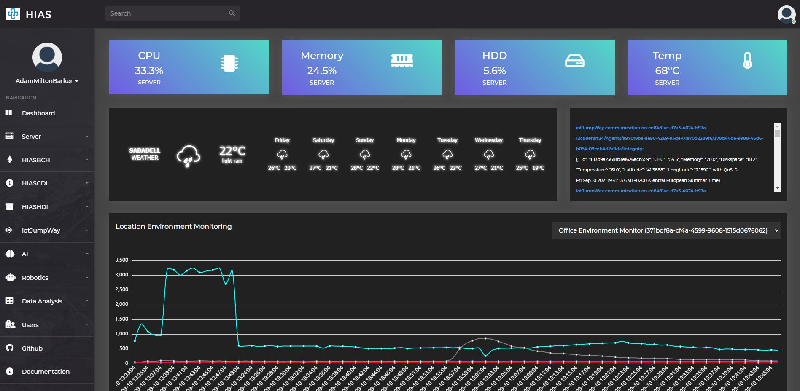
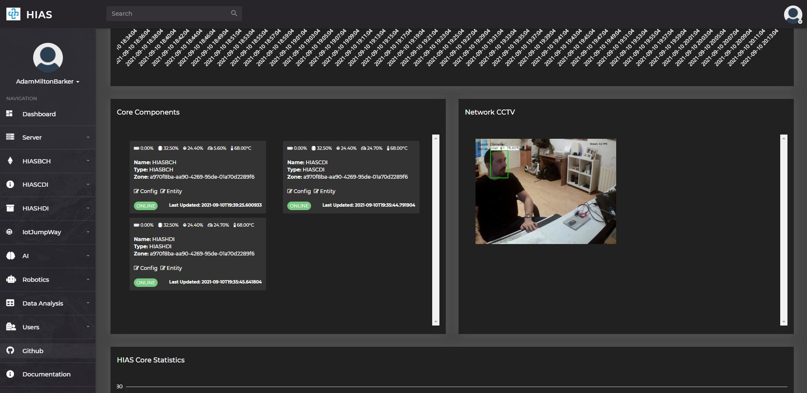
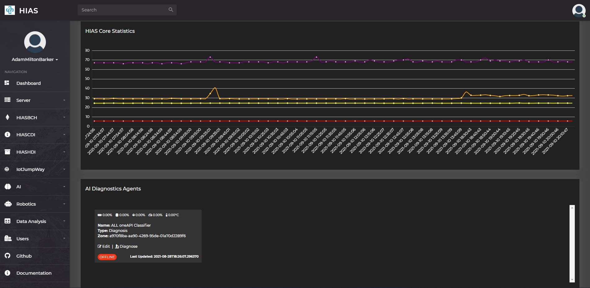
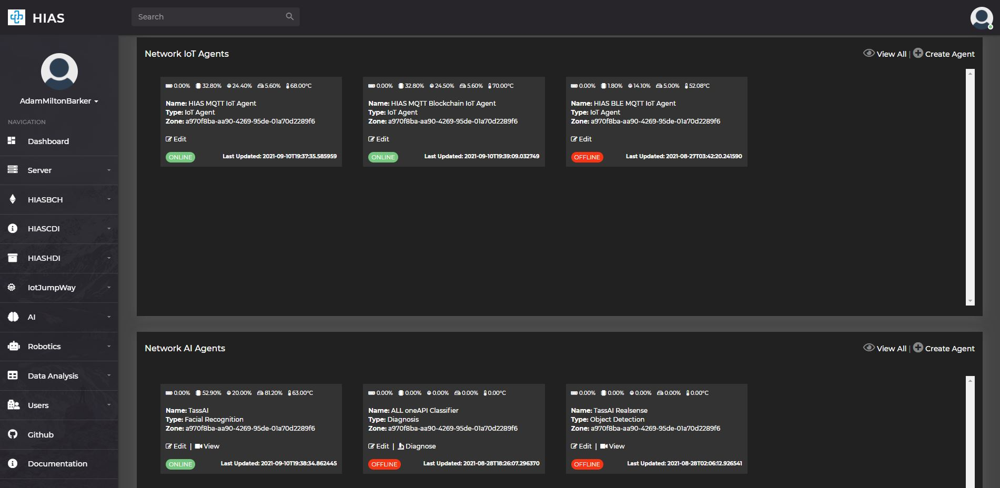
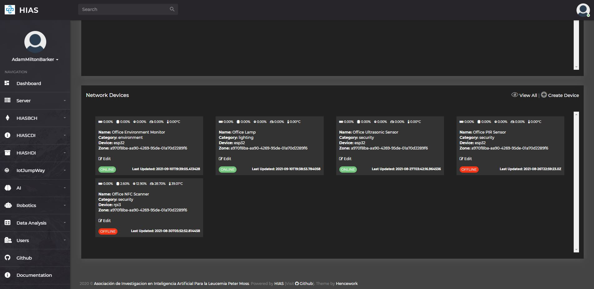

# Dashboard Usage Guide

The following guide will introduce the [HIAS Core](https://github.com/aiial/hias-core " HIAS Core") UI Dashboard.

The HIAS Dashboard provides an overview of the core components, AI Diagnostics Agents, Network IoT Agents, Network AI Agents and Network Devices; as well as statistics from the machine HIAS is intsalled on; and an overview of data from network environment monitors.

At the top of the dashboard you will find the current vital statistics of the machine HIAS is installed on including current CPU, memory and hard drive usage; and machine temperature. This feature is only available once you have a running [HIAS MQTT IoT Agent](https://github.com/aiial/hias-mqtt-iot-agent " HIAS MQTT IoT Agent").

You will also find an overview of data from network environment monitors. This feature is only available once you have a running [HIAS MQTT IoT Agent](https://github.com/aiial/hias-mqtt-iot-agent " HIAS MQTT IoT Agent") and a running [HIAS ESP32 Environment Monitor](https://github.com/aiial/hias-esp32-environment-monitor).

The next section of the dashboard provides information of the core components and provides views for any [HIAS TassAI Facial Recognition](https://github.com/aiial/hias-tassai-facial-recognition " HIAS TassAI Facial Recognition") AI Agents you have connected to your HIAS network.

Next you will find historical vital statistics from the HIAS server. This feature is only available once you have a running [HIAS MQTT IoT Agent](https://github.com/aiial/hias-mqtt-iot-agent " HIAS MQTT IoT Agent").

The next section provides information of all AI Diagnostics Agents you have connected to your HIAS network; including the current status of each agent and the last time it was updated. An example of a HIAS AI Diagnostics Agent is the [HIAS Acute Lymphoblastic Leukemia oneAPI Classifier](https://github.com/aiial/hias-all-oneapi-classifier " HIAS Acute Lymphoblastic Leukemia oneAPI Classifier").

The following section provides information of all IoT Agents you have connected to your HIAS network; including the current status of each agent and the last time it was updated. Examples of a HIAS IoT Agents are the [HIAS MQTT IoT Agent](https://github.com/aiial/hias-mqtt-iot-agent " HIAS MQTT IoT Agent"), the [HIAS MQTT Blockchain Agent](https://github.com/aiial/hias-mqtt-blockchain-agent " HIAS MQTT Blockchain Agent") and the [HIAS MQTT BLE IoT Agent](https://github.com/aiial/hias-mqtt-ble-iot-agent " HIAS MQTT BLE IoT Agent").

The next section provides information of all AI Agents you have connected to your HIAS network; including the current status of each agent and the last time it was updated. Examples of a HIAS AI Agents are the [HIAS TassAI Facial Recognition](https://github.com/aiial/hias-tassai-facial-recognition " HIAS TassAI Facial Recognition") and the [HIAS Acute Lymphoblastic Leukemia oneAPI Classifier](https://github.com/aiial/hias-all-oneapi-classifier " HIAS Acute Lymphoblastic Leukemia oneAPI Classifier").

The final section of the HIAS UI dashboard provides information of all network devices you have connected to your HIAS network; including the current status of each device and the last time it was updated. Examples of a HIAS Network Devices are the [HIAS ESP32 Environment Monitor](https://github.com/aiial/hias-esp32-environment-monitor).

&nbsp;

# Contributing
The Asociación de Investigacion en Inteligencia Artificial Para la Leucemia Peter Moss encourages and welcomes code contributions, bug fixes and enhancements from the Github community.

## Ways to contribute

The following are ways that you can contribute to this project:

- [Bug Report](https://github.com/aiial/hias-core/issues/new?assignees=&labels=&template=bug_report.md&title=)
- [Feature Request](https://github.com/aiial/hias-core/issues/new?assignees=&labels=&template=feature_request.md&title=)
- [Feature Proposal](https://github.com/aiial/hias-core/issues/new?assignees=&labels=&template=feature-proposal.md&title=)
- [Report Vulnerabillity](https://github.com/aiial/hias-core/issues/new?assignees=&labels=&template=report-a-vulnerability.md&title=)

Please read the [CONTRIBUTING](https://github.com/aiial/hias-core/blob/master/CONTRIBUTING.md "CONTRIBUTING") document for a full guide to forking our repositories and submitting your pull requests. You will find information about our code of conduct on the [Code of Conduct page](https://github.com/aiial/hias-core/blob/master/CODE-OF-CONDUCT.md "Code of Conduct page").

You can also join in with, or create, a discussion in our [Github Discussions](https://github.com/aiial/HIASCDI/discussions) area.

## Contributors

All contributors to this project are listed below.

- [Adam Milton-Barker](https://www.leukemiaairesearch.com/association/volunteers/adam-milton-barker "Adam Milton-Barker") - [Asociación de Investigacion en Inteligencia Artificial Para la Leucemia Peter Moss](https://www.leukemiaresearchassociation.ai "Asociación de Investigacion en Inteligencia Artificial Para la Leucemia Peter Moss") President/Founder & Lead Developer, Sabadell, Spain

&nbsp;

# Versioning
We use [SemVer](https://semver.org/) for versioning.

&nbsp;

# License
This project is licensed under the **MIT License** - see the [LICENSE](https://github.com/aiial/hias-core/blob/master/LICENSE "LICENSE") file for details.

&nbsp;

# Bugs/Issues
We use the [repo issues](https://github.com/aiial/hias-core/issues "repo issues") to track bugs and general requests related to using this project. See [CONTRIBUTING](https://github.com/aiial/hias-core/blob/master/CONTRIBUTING.md "CONTRIBUTING") for more info on how to submit bugs, feature requests and proposals.
