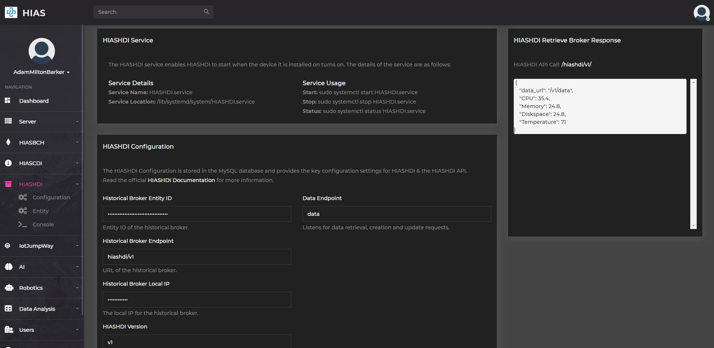
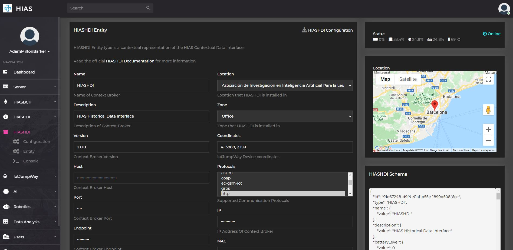
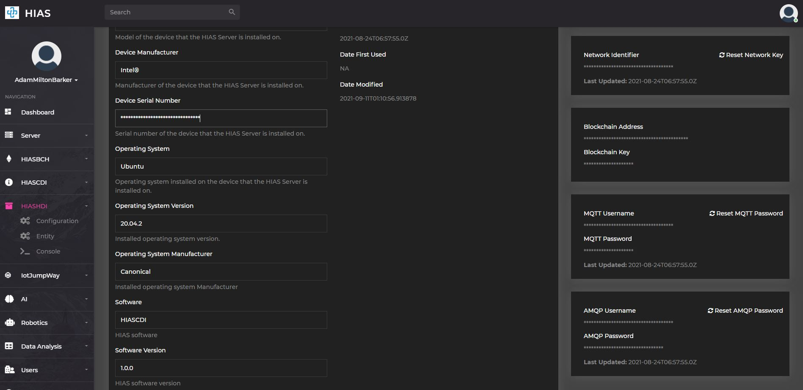
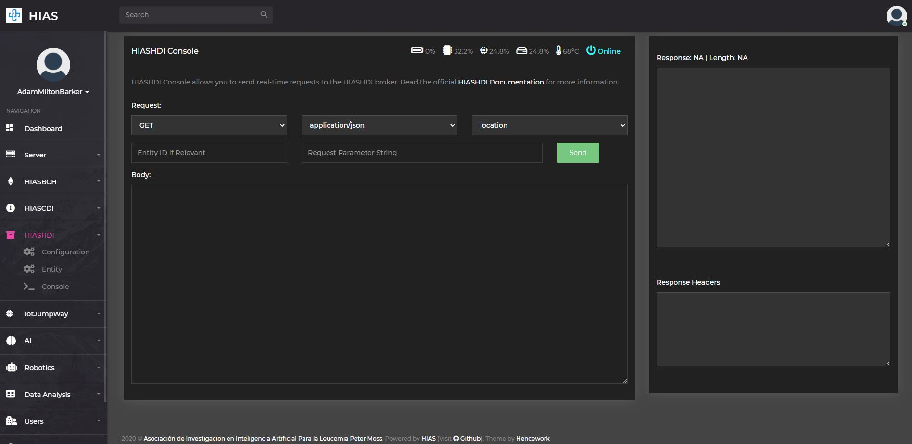

# HIASHDI Usage Guide

The following guide will introduce the [HIAS Core](https://github.com/aiial/hias-core " HIAS Core") HIASHDI management features.

&nbsp;

# Configuration

The HIASHDI configuration manager allows you to update the core configuration for the HIASHDI Historical Data Interface. You will find information about the HIASHDI service along with a form that allows you to update the configuration.

&nbsp;

# Entity Management

The HIASHDI entity page allows you to manage the HIASHDI entity settings. The HIASHDI entity is a JSON representation of the contextual data for HIASHDI. On the left of the page you will find a human readable format of the contextual data for HIASHDI. On the right of the page you will find a JSON format of the contextual data. You can download the HIASHDI credentials file by clicking on the `HIASHDI Configuration` button.

Further down the page to the right you will find easy access to the credentials for HIASHDI. You can reset these credentials using the relevant reset button.

&nbsp;

# HIASHDI Console

The HIASHDI console allows you to interact with the HIASHDI Historical Data Interface. You can use the console to send requests to HIASHDI and receive responses.

&nbsp;

# Contributing
The Asociación de Investigacion en Inteligencia Artificial Para la Leucemia Peter Moss encourages and welcomes code contributions, bug fixes and enhancements from the Github community.

## Ways to contribute

The following are ways that you can contribute to this project:

- [Bug Report](https://github.com/aiial/hias-core/issues/new?assignees=&labels=&template=bug_report.md&title=)
- [Feature Request](https://github.com/aiial/hias-core/issues/new?assignees=&labels=&template=feature_request.md&title=)
- [Feature Proposal](https://github.com/aiial/hias-core/issues/new?assignees=&labels=&template=feature-proposal.md&title=)
- [Report Vulnerabillity](https://github.com/aiial/hias-core/issues/new?assignees=&labels=&template=report-a-vulnerability.md&title=)

Please read the [CONTRIBUTING](https://github.com/aiial/hias-core/blob/master/CONTRIBUTING.md "CONTRIBUTING") document for a full guide to forking our repositories and submitting your pull requests. You will find information about our code of conduct on the [Code of Conduct page](https://github.com/aiial/hias-core/blob/master/CODE-OF-CONDUCT.md "Code of Conduct page").

You can also join in with, or create, a discussion in our [Github Discussions](https://github.com/aiial/HIASHDI/discussions) area.

## Contributors

All contributors to this project are listed below.

- [Adam Milton-Barker](https://www.leukemiaairesearch.com/association/volunteers/adam-milton-barker "Adam Milton-Barker") - [Asociación de Investigacion en Inteligencia Artificial Para la Leucemia Peter Moss](https://www.leukemiaresearchassociation.ai "Asociación de Investigacion en Inteligencia Artificial Para la Leucemia Peter Moss") President/Founder & Lead Developer, Sabadell, Spain

&nbsp;

# Versioning
We use [SemVer](https://semver.org/) for versioning.

&nbsp;

# License
This project is licensed under the **MIT License** - see the [LICENSE](https://github.com/aiial/hias-core/blob/master/LICENSE "LICENSE") file for details.

&nbsp;

# Bugs/Issues
We use the [repo issues](https://github.com/aiial/hias-core/issues "repo issues") to track bugs and general requests related to using this project. See [CONTRIBUTING](https://github.com/aiial/hias-core/blob/master/CONTRIBUTING.md "CONTRIBUTING") for more info on how to submit bugs, feature requests and proposals.

