# iotJumpWay Usage Guide

The following guide will introduce the [HIAS Core](https://github.com/aiial/hias-core " HIAS Core") iotJumpWay management features.

&nbsp;

# Brokers
HIAS currently home two IoT communication brokers: an MQTT broker and an AMQP broker. The MQTT broker is used for all communication between HIAS devices and applications that communicate using the MQTT (MQ Telemetry Transport) machine to machine protocol and HIAS. The AMQP broker is used for all communication between HIAS devices and appications that communicate using the AMQP (Advanced Message Queuing Protocol) machine to machine protocol and HIAS.

## MQTT Broker UI
Coming soon.

## AMQP Broker UI
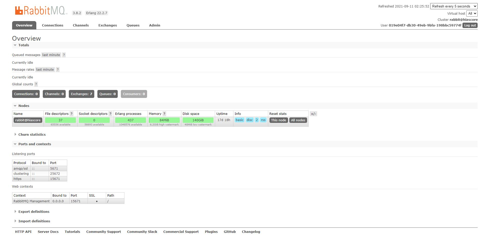

The AMQP broker navigation link will take you to the RabbitMQ Management UI which allows you to manage and monitor the AMQP broker. To use the AMQP broker you first need to set up the [HIAS AMQP IoT Agent](https://github.com/aiial/hias-amqp-iot-agent "HIAS AMQP IoT Agent").

## CoAP Broker UI
Coming soon.

&nbsp;

# Entities
The iotJumpWay network is made up of the core communication brokers and entities incuding the primary location, zones, devices, applications, agents, sensors and actuators (things).

## Location
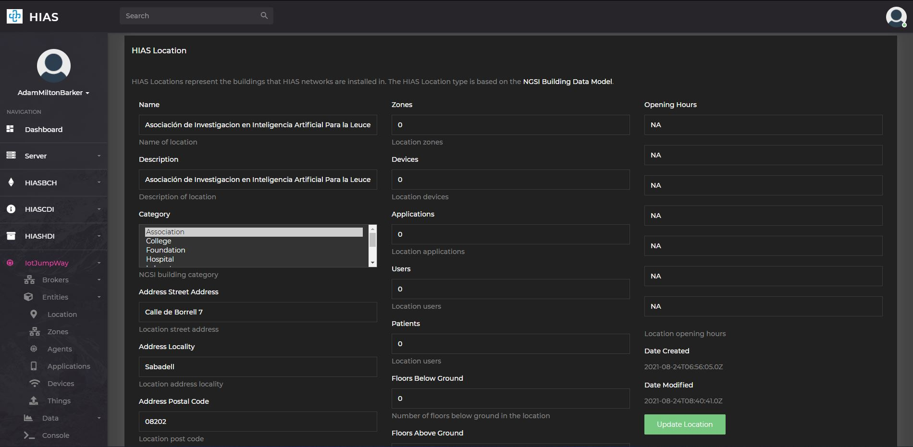

The iotJumpWay location represents the physical location of the HIAS system. The location is the primary entity that is used to manage the HIAS system. On the location entity page you can manage the NGSI v2 entity that represents the iotJumpWay location.

## Zones
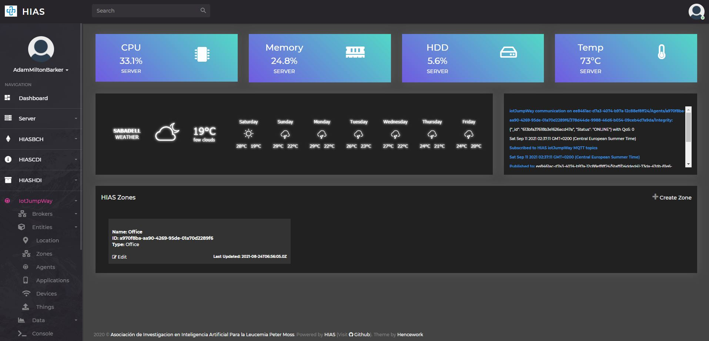

The iotJumpWay zones represent physical areas within the location, ie: rooms. Zones can be home to unlimited IoT/AI Agents and devices. On the zones entities page you can manage existing zones or create new ones.

### Create Zone
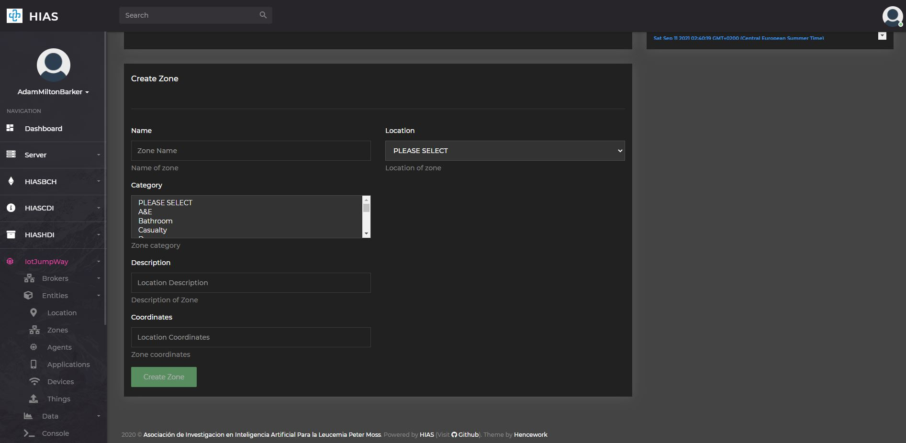

To create a new zone click on the `Create Zone` button on the zones entities page. This will take you to the create zone page where you can create a new zone by filling out the form.

### Modify Zone
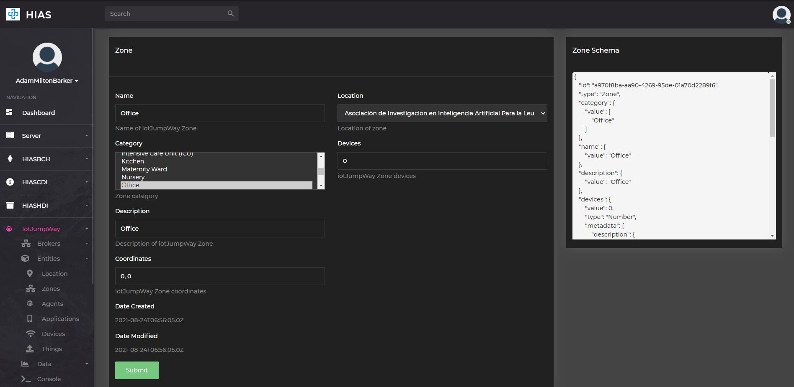

To modify an existing zone click on the `Edit` button on the the relevant zone card in the zones entities page. This will take you to the modify zone page where you can modify the zone by updating the form.

## Agents
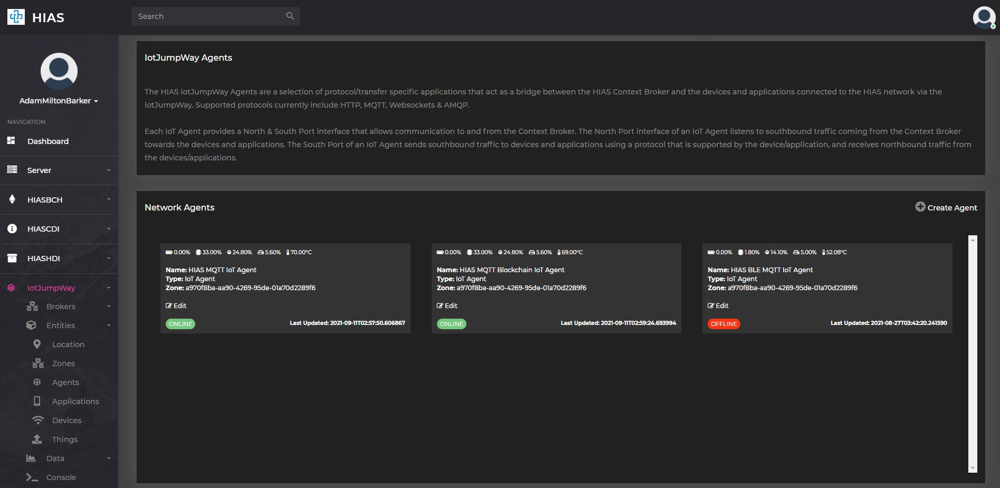

The iotJumpWay IoT Agents are based on the [FIWARE IoT Agents](https://www.fiware.org/developers/catalogue/) and are used to bridge between devices, applications, AI Agents and Robotics and the HIASCDI Contextual Data Interface. Each agent communicates in a specific communication protocol. On the IoT Agents entities page you can manage existing IoT Agents or create new ones.

### Create Agent
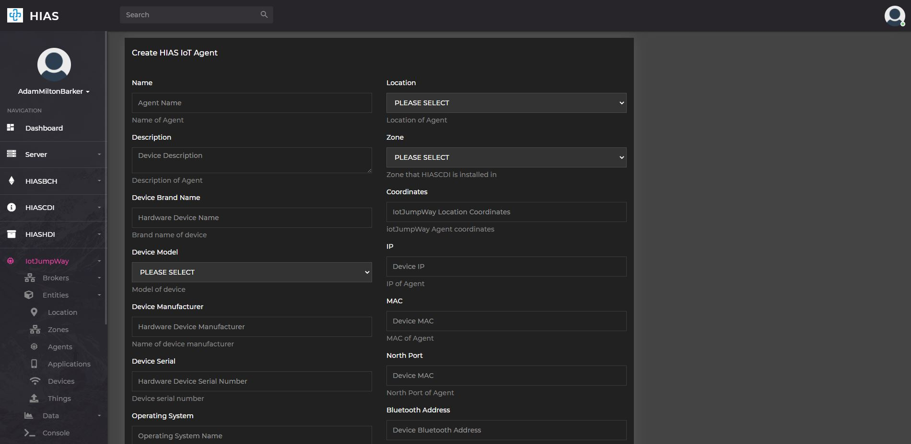

To create a new IoT Agent click on the `Create Agent` button on the IoT Agents entities page. This will take you to the create agent page where you can create a new agent by filling out the form.

### Modify Agent

To modify an existing IoT Agent click on the `Edit` button on the the relevant agent card in the IoT Agents entities page. This will take you to the modify agent page where you can modify the agent by updating the form.

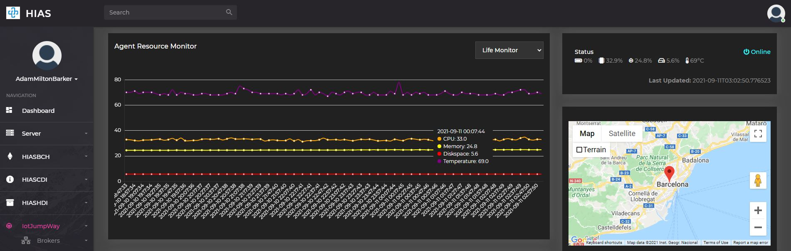

At the top of the page you will find the device vitals and current status.

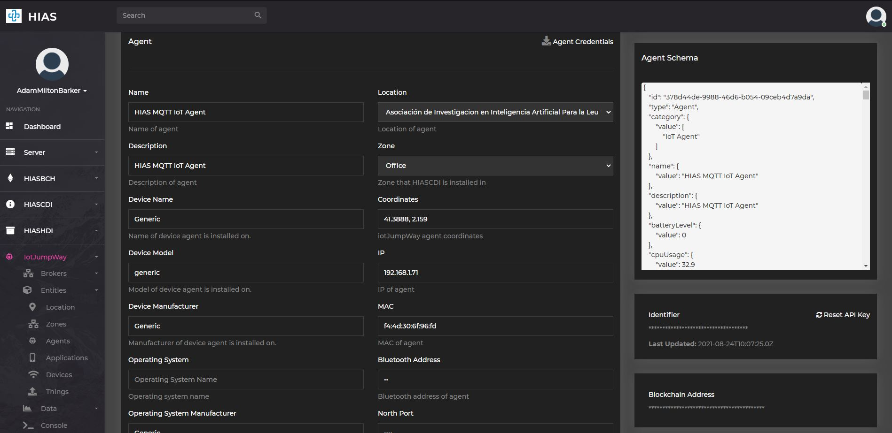

Further down the page you will find the form to modify the agent. To the right of this form you will find easy access to the agent credentials, you can also download the credentials using the `Agent Credentials` button.

# Applications
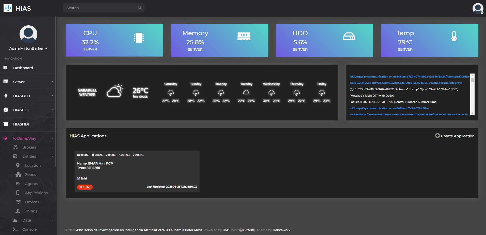

The iotJumpWay applications are custom applications that are connected to the iotJumpWay network. On the applications entities page you can manage existing applications or create new ones.

### Create Application
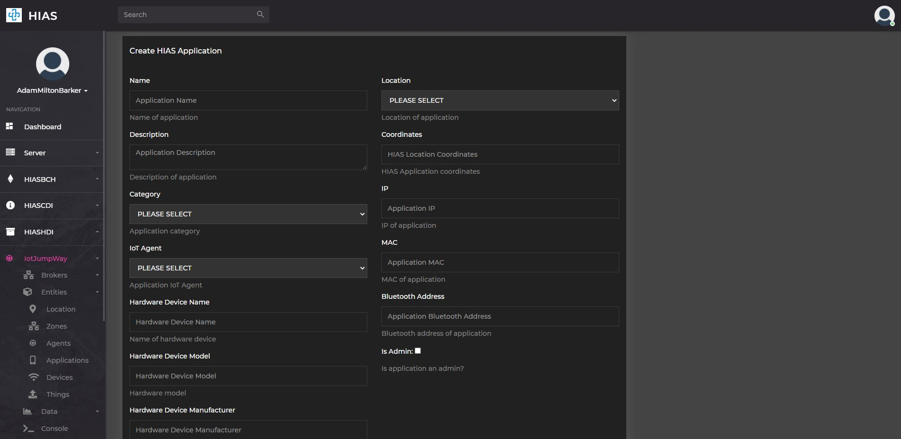

To create a new application click on the `Create Application` button on the applications entities page. This will take you to the create application page where you can create a new application by filling out the form.

### Modify Application
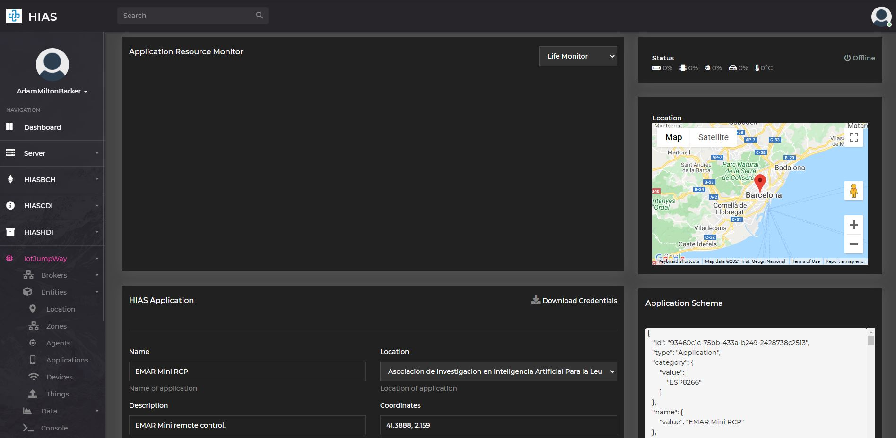

To modify an existing application click on the `Edit` button on the the relevant application card in the applications entities page. This will take you to the modify application page where you can modify the application by updating the form.

Further down the page you will find the form to modify the application. To the right of this form you will find easy access to the application credentials, you can also download the credentials using the `Application Credentials` button.

## Devices
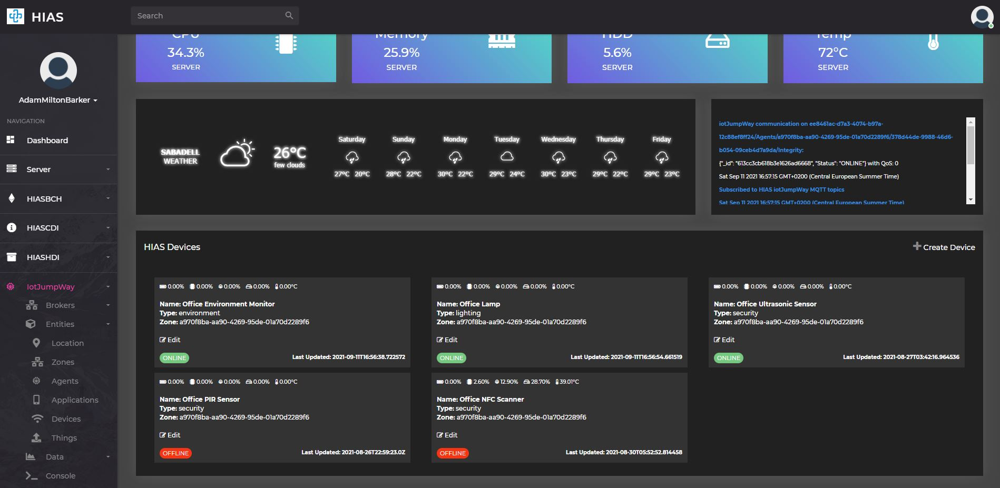

The iotJumpWay devices are the physical devices that are connected to the iotJumpWay network. Devices can be connected to the iotJumpWay network via the MQTT broker or the AMQP broker. On the devices entities page you can manage existing devices or create new ones.

### Create Device
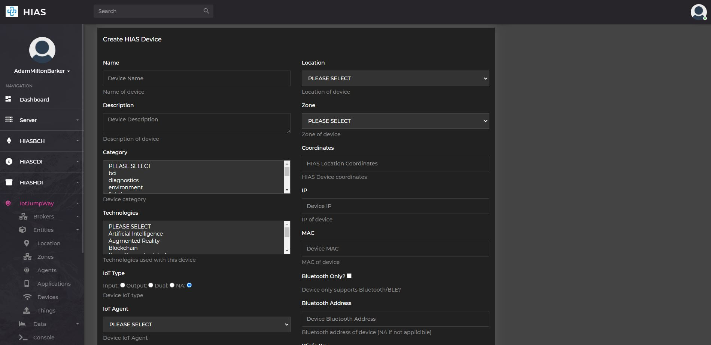

To create a new device click on the `Create Device` button on the devices entities page. This will take you to the create device page where you can create a new device by filling out the form.

### Modify Device
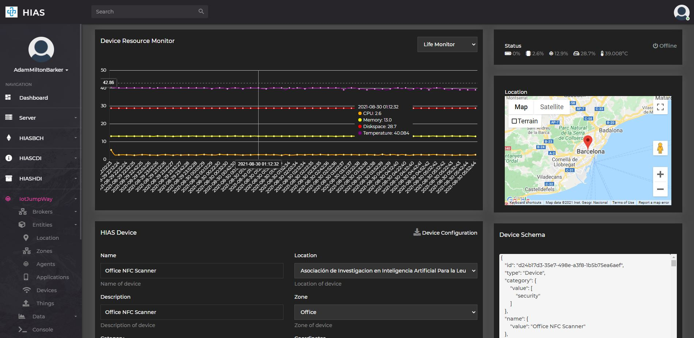

To modify an existing device click on the `Edit` button on the the relevant device card in the devices entities page. This will take you to the modify device page where you can modify the device by updating the form.

Further down the page you will find the form to modify the device. To the right of this form you will find easy access to the device credentials, you can also download the credentials using the `Device Configuration` button.

## Things
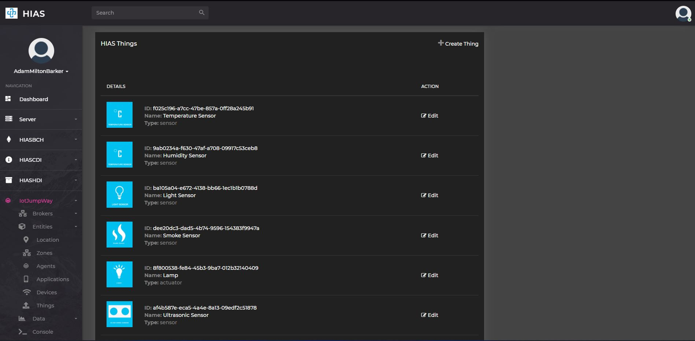
The iotJumpWay things are the physical sensors and actuators that are connected to iotJumpWay devices and applications. On the things entities page you can manage existing things or create new ones.

When things are added to a device or application the entity schema for that thing is added to the device or application schema. The IoT agents update the contextual data for these things ensuring that the device or application schema is up to date with the latest readings from the things.

### Create Thing
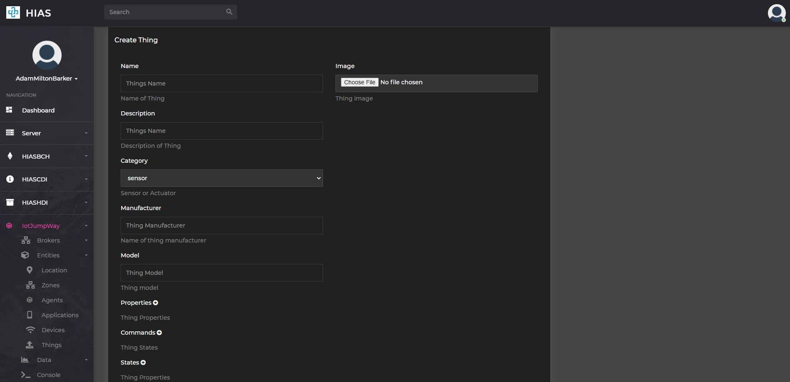

To create a new thing click on the `Create Thing` button on the things entities page. This will take you to the create thing page where you can create a new thing by filling out the form.

### Modify Thing
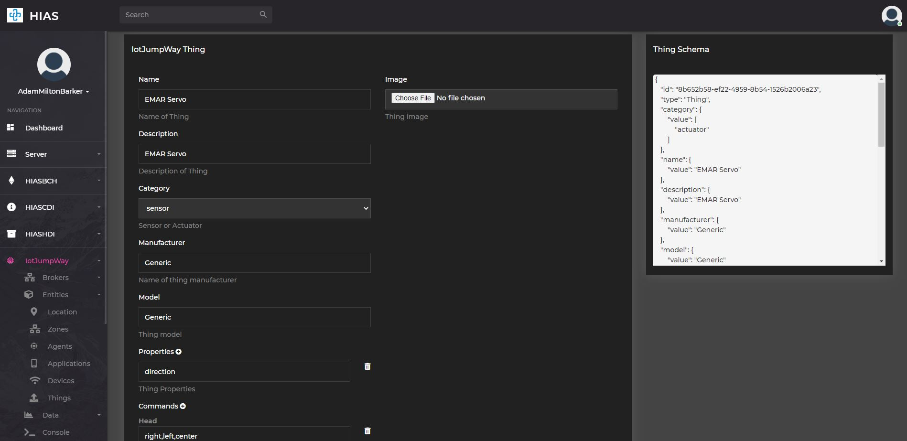

To modify an existing thing click on the `Edit` button on the the relevant thing card in the things entities page. This will take you to the modify thing page where you can modify the thing by updating the form.

&nbsp;

# Data

The iotJumpWay data area provides access to historical data stored in HIASHDI. Data is processed by the IoT Agents and stored in the HIAS Historical Data Broker.

The data homepage includes:

- Entity statuses
- Entity life data
- Entity sensors data
- Entity actuators data
- Entity commands data

In addition to the home page you can navigate further into the data using the navigation menu.

## Data Integrity
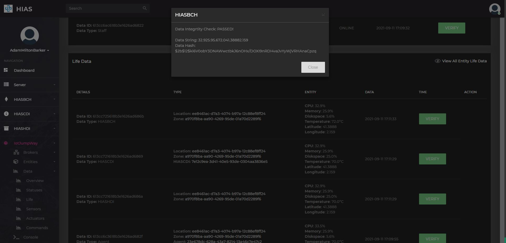

Once IoT Agents have processed the incoming data, the data is sent to the [HIAS MQTT Blockchain Agent](https://github.com/aiial/hias-mqtt-blockchain-agent " HIAS MQTT Blockchain Agent") which then hashes the data and stores an immutable hash of the data in HIASBCH. In the UI we can verify the integrity of the data by recreating the hash and comparing it to the hash stored in HIASBCH.

&nbsp;

# Console
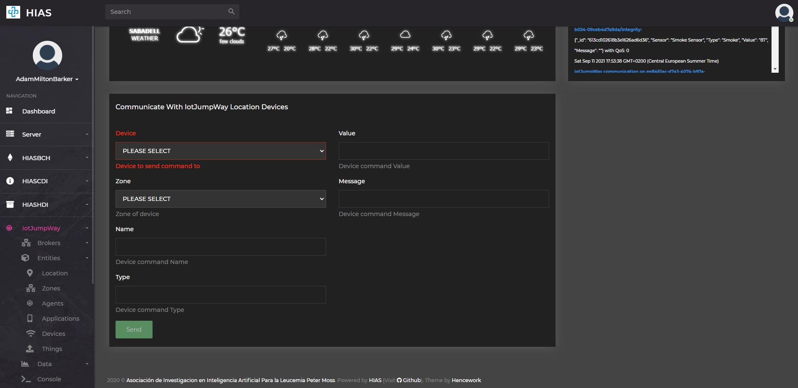

The HIAS iotJumpWay console allows users to interact with iotJumpWay devices connected to the network. The console uses MQTT to send commands to connected devices using the MQTT protocol.

&nbsp;

# Contributing
The Asociación de Investigacion en Inteligencia Artificial Para la Leucemia Peter Moss encourages and welcomes code contributions, bug fixes and enhancements from the Github community.

## Ways to contribute

The following are ways that you can contribute to this project:

- [Bug Report](https://github.com/aiial/hias-core/issues/new?assignees=&labels=&template=bug_report.md&title=)
- [Feature Request](https://github.com/aiial/hias-core/issues/new?assignees=&labels=&template=feature_request.md&title=)
- [Feature Proposal](https://github.com/aiial/hias-core/issues/new?assignees=&labels=&template=feature-proposal.md&title=)
- [Report Vulnerabillity](https://github.com/aiial/hias-core/issues/new?assignees=&labels=&template=report-a-vulnerability.md&title=)

Please read the [CONTRIBUTING](https://github.com/aiial/hias-core/blob/master/CONTRIBUTING.md "CONTRIBUTING") document for a full guide to forking our repositories and submitting your pull requests. You will find information about our code of conduct on the [Code of Conduct page](https://github.com/aiial/hias-core/blob/master/CODE-OF-CONDUCT.md "Code of Conduct page").

You can also join in with, or create, a discussion in our [Github Discussions](https://github.com/aiial/HIASHDI/discussions) area.

## Contributors

All contributors to this project are listed below.

- [Adam Milton-Barker](https://www.leukemiaairesearch.com/association/volunteers/adam-milton-barker "Adam Milton-Barker") - [Asociación de Investigacion en Inteligencia Artificial Para la Leucemia Peter Moss](https://www.leukemiaresearchassociation.ai "Asociación de Investigacion en Inteligencia Artificial Para la Leucemia Peter Moss") President/Founder & Lead Developer, Sabadell, Spain

&nbsp;

# Versioning
We use [SemVer](https://semver.org/) for versioning.

&nbsp;

# License
This project is licensed under the **MIT License** - see the [LICENSE](https://github.com/aiial/hias-core/blob/master/LICENSE "LICENSE") file for details.

&nbsp;

# Bugs/Issues
We use the [repo issues](https://github.com/aiial/hias-core/issues "repo issues") to track bugs and general requests related to using this project. See [CONTRIBUTING](https://github.com/aiial/hias-core/blob/master/CONTRIBUTING.md "CONTRIBUTING") for more info on how to submit bugs, feature requests and proposals.