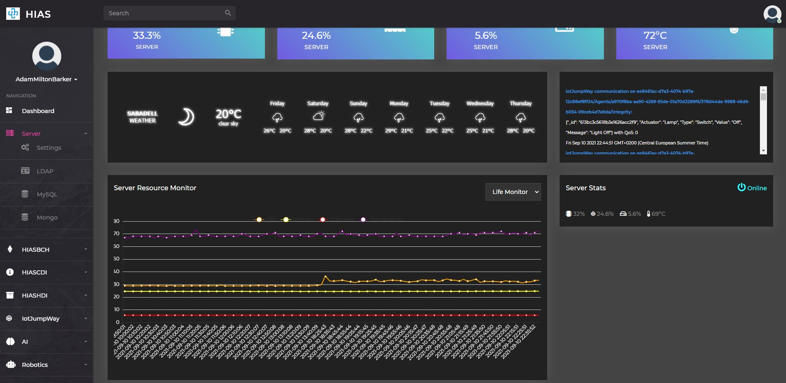
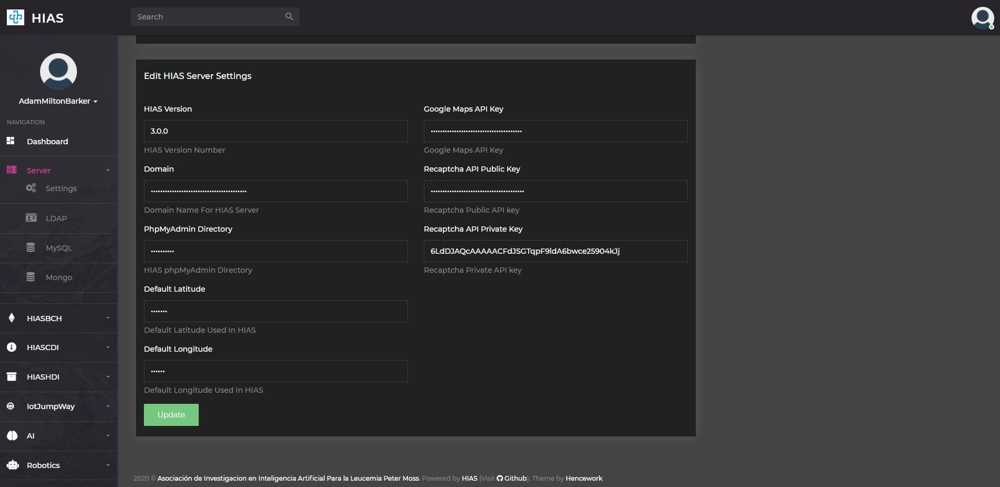
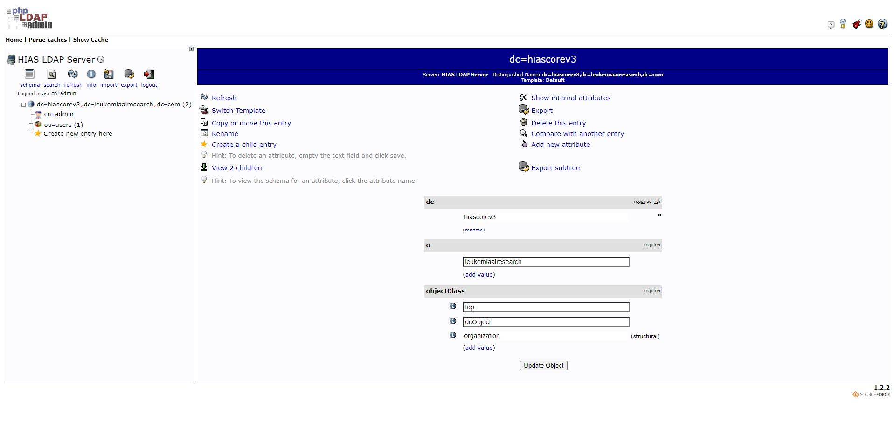
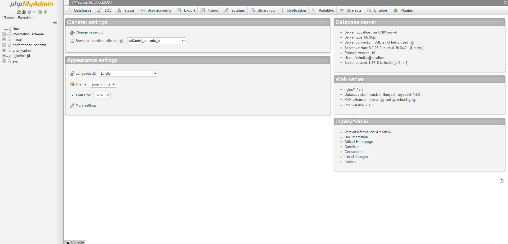
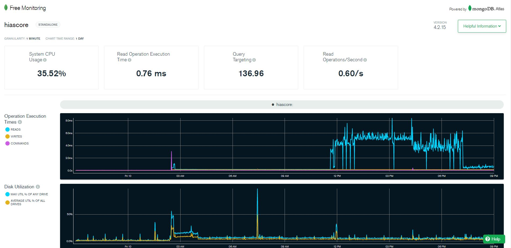

# Server Management Usage Guide

The following guide will introduce the [HIAS Core](https://github.com/aiial/hias-core " HIAS Core") server management features.

The HIAS server management area provides the ability to modify some of the core server settings.

At the top of the page you will find the usual current vital statistics of the machine HIAS is installed on, the weather chart and the iotJumpWay console window; the server resource monitor that provides a historical feed of the HIAS machine vital statistics and along with the current server stats.

&nbsp;

# Settings

The settings area provides the ability to modify core server settings including the domain name, the endpoint for phpMyAdmin, the default latitude and longitude, the Google Maps API key and the Recapthca API keys.

&nbsp;

# LDAP UI

The LDAP UI nagivation link takes you to the [phpldapadmin](https://github.com/leenooks/phpLDAPadmin) UI and allows you to manage your LDAP server.

&nbsp;

# MySQL UI

The MySQL UI nagivation link takes you to the [phpMyAdmin](https://www.phpmyadmin.net/) UI and allows you to manage your MySQL server.

&nbsp;

# MongoDB UI

The MongoDB UI nagivation link takes you to the [phpMyAdmin](https://www.phpmyadmin.net/) UI and allows you to monitor your MongoDB server. To use this feature you need to update the URL in the **Includes/LeftNav.php** file to point to the MongoDB UI.

&nbsp;

# Contributing
The Asociación de Investigacion en Inteligencia Artificial Para la Leucemia Peter Moss encourages and welcomes code contributions, bug fixes and enhancements from the Github community.

## Ways to contribute

The following are ways that you can contribute to this project:

- [Bug Report](https://github.com/aiial/hias-core/issues/new?assignees=&labels=&template=bug_report.md&title=)
- [Feature Request](https://github.com/aiial/hias-core/issues/new?assignees=&labels=&template=feature_request.md&title=)
- [Feature Proposal](https://github.com/aiial/hias-core/issues/new?assignees=&labels=&template=feature-proposal.md&title=)
- [Report Vulnerabillity](https://github.com/aiial/hias-core/issues/new?assignees=&labels=&template=report-a-vulnerability.md&title=)

Please read the [CONTRIBUTING](https://github.com/aiial/hias-core/blob/master/CONTRIBUTING.md "CONTRIBUTING") document for a full guide to forking our repositories and submitting your pull requests. You will find information about our code of conduct on the [Code of Conduct page](https://github.com/aiial/hias-core/blob/master/CODE-OF-CONDUCT.md "Code of Conduct page").

You can also join in with, or create, a discussion in our [Github Discussions](https://github.com/aiial/HIASCDI/discussions) area.

## Contributors

All contributors to this project are listed below.

- [Adam Milton-Barker](https://www.leukemiaairesearch.com/association/volunteers/adam-milton-barker "Adam Milton-Barker") - [Asociación de Investigacion en Inteligencia Artificial Para la Leucemia Peter Moss](https://www.leukemiaresearchassociation.ai "Asociación de Investigacion en Inteligencia Artificial Para la Leucemia Peter Moss") President/Founder & Lead Developer, Sabadell, Spain

&nbsp;

# Versioning
We use [SemVer](https://semver.org/) for versioning.

&nbsp;

# License
This project is licensed under the **MIT License** - see the [LICENSE](https://github.com/aiial/hias-core/blob/master/LICENSE "LICENSE") file for details.

&nbsp;

# Bugs/Issues
We use the [repo issues](https://github.com/aiial/hias-core/issues "repo issues") to track bugs and general requests related to using this project. See [CONTRIBUTING](https://github.com/aiial/hias-core/blob/master/CONTRIBUTING.md "CONTRIBUTING") for more info on how to submit bugs, feature requests and proposals.
